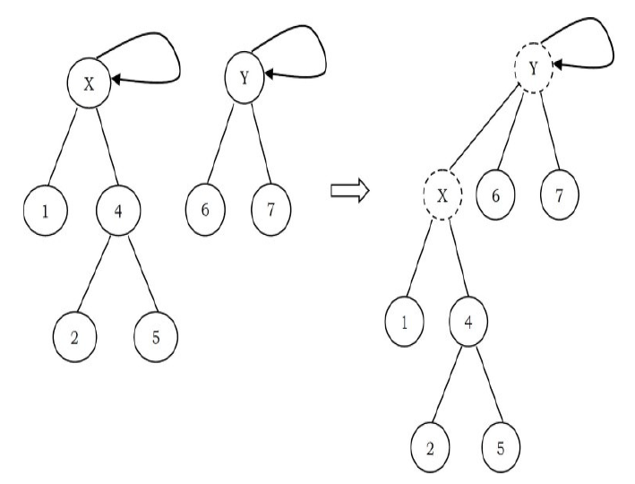
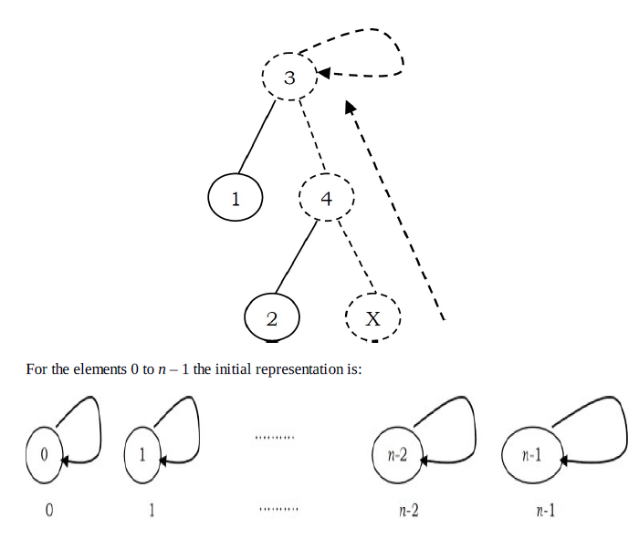
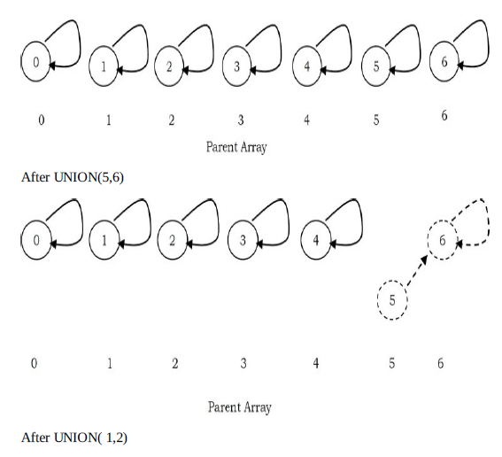
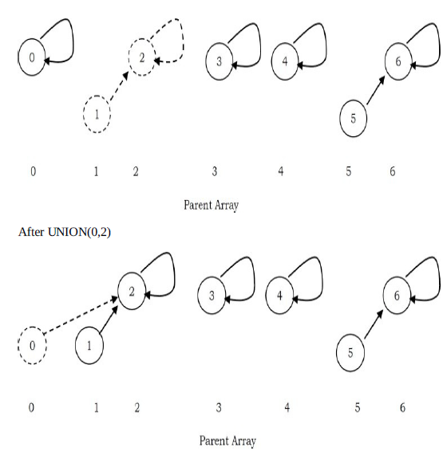
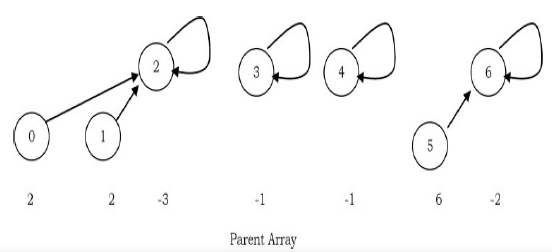
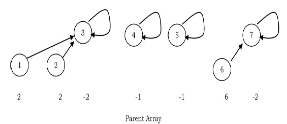

# Disjoint sets ADT

## Introduction

In this chapter, we will represent an important mathematics concept: sets. This means how to represent a group of elements which do not need any order. The disjoint sets ADT is the one used for this purpose. It is used for solving the equivalence problem. It is very simple to implement. A simple array can be used for the implementation and each function takes only a few lines of code. Disjoint sets ADT acts as an auxiliary data structure for many other algorithms (for example, Kruskal's algorithm in graph theory). Before starting our discussion on disjoint sets ADT, let us look at some basic properties of sets.

## Equivalence relation and equivalence classes

For the discussion below let us assume that 5 is a set containing the elements and a relation R is defined on it. That means for every pair of elements in a,b ∈ 5, a R b is either true or false. If a R b is true, then we say a is related to b, otherwise a is not related to b. A relation R is called an equivalence relation if it satisfied the following properties:

- Reflexive: For every element a ∈ S.aR a is true.
- Symmetric: For any two elements a, b ∈ S, if a R b is true then b R a is true
- Transitive: For any three elements a, b, c ∈ S, if a R b and b R c are true then a R c is true

As an example, relations ≤ or ≥ on a set of integers are not equivalence relation. They are reflexive and transitive but not symmetric

Similarly, rail connectivity is an equivalence relation. This relation is reflexive because any location is connected to itself. If there is connectivity from city a to city b, then city b also has connectivity to city a, so the relation is symmetric. Finally, if city a is connected to city b and city b is connected to city c, then city a is also connected to city c.

The equivalence class of an element a ∈ S is a subset of S that contains all the elements that are related to a. Equivalence classes create a partition of S. Every member of S appears in exactly one equivalence class. To decide if a R b, we just need to check whether a and b are in the same equivalence class (group) or not.

In the above example, two cities will be in same equivalence class if they have rail connectivity. If they do not have connectivity then they will be part of different equivalence classes.

Since the intersection of any two equivalence classes is empty, the equivalence classes are sometimes called disjoint sets. IN the subsequenct setcions, we will try to see the operations that can be performed on equivalence classes. The opssible operations are:

- Creating an equivalence class (making a set)
- Finding the equivalence class name (find)
- Combining the equivalence classes (union)

## Disjoint sets ADT

To manipulate the set elements we need basic operations defined on sets. In this chapters, we concentrate on the following set operaitons:

- makeset(x): creates a new set containing a single element X.
- union(x,y): creates a new set containing the elemnets X and Y in their unin and deletes the sets containing the elemnets X and Y.
- find(x): returns the name of the set containing the element X.

## Applications

Disjoint sets ADT have many application and a few of them are:

- To represent network connectivity
- Image processing
- To find least common ancestor
- To define equivalence of finite state automata
- Krushkal's minimum spanning tree algorithm
- In game algorithms

## Tradeoffs in implementing disjoint sets ADT

Let us see the possibilities for implementing disjoint set operations. Initially, assume the input elements are a collection of n sets, each with one element. That means, initial representation assumes all relations are false. Each set has a different element, so that Si ∩ Sj= ф. THis makes the sets disjoint.

To add the relation a R b (union), we first need to check whether a and b are already related or not. This can be verified by performing FINDs on both a and b and chekcing whether they are in the same equivalence class (set) or not.

If they are not, then we play UNION. This operation merges the two equivalence classes containing a and b into a new equivalence class by creating a new set Sk = Si ∪ Sj and deletes Si and Sj. Basically there are two ways to implement the above find/union operation:

- Fast FIND implemented
- Fast UNION operation implementation

## Fast FIND implementation

In this method, we use an array. As an example, in the representation below the array contains the set name for each element. For simplicity, let us assume that all the elements are numnenred sequentially from 0 to n-1.

In the example below, element 0 has the set name 3, element 1 has the set name 5, and so on. With this representation FIND takes only O(1) since for any element we can find the set name by accessing its array location in constant time.

In this representation, to perform UNION(a,b) we need to scan the complete array and change all i's to j. This takes O(n)

A sequence of n-1 unions takes O(n^2) time in the worst case. if there are O(n^2) FIND operations, this performance is fine, as the average time complexity is O(1) for each UNION or FIND operation. If there are fewer FINDs, this complexity is not acceptable.

## Fast UNION implementaiton

In this and subsequenct sections, we will discuess the faster UNINON implementations and its variants. THere are different ways of implementating this approach and the following is a list of a few of them

- Fast UNION implementations (slow FIND)
- Fast UNION implementations (quick FIND)
- Fast UNION implementations with path compression

## Fast UNION implementation (slow FIND)

As we have discussed, FIND operation returns the same answer if and only if they are in the same set. In representing disjoint sets, our main objective is to give a differnet set name for each group. In general we do not care about the name of the set. One possibility for implementating the see is tree as each element has only one root and we can use it as the set name.

**How are these represented?** One possibility is using an array: for each element keep the root as its set name. But with this representation, we will have teh same problem as that of FIND array implementation. To solve this problem, instead of sorting the root we can keep the parent of the element. Therefore, using an array which stores the parent of each element solves our problem.

To differentiate the root node, let us assume its parent is the same as that of the element in the array. Based on this representation, MAKESET, FIND, UNION opreaetions can be defined as:

- (X): Creates a new set containing a single element X and in the array update the parent of X as X. That means root (set name) of X is X.
- UNION(X,Y): Replaces the two sets containing X and Y by their union and in the array updates the parent of X as Y. 
- FIND(X): Returns the name of the set containing the element X. We keep on searching for X's set name until we come to the root of the tree.



To perform a UNION on two sets, we merge the two trees by making the root of one tree point to the root of the other. Intial configuration for the elements 0 to 6.




One important thing to observe here is, UNION operation is changing the root's parent only but not for all the elements in the sets. Due to this, the time complexity of UNION operation is O(1). A Find(X) on the element X is performed by returning the root of the tree containing X. The time to perform this operaiton is proportional to the depth of the node representing X.

Using this method, it is possible to create a tree of depth n-1. The worst case running time of a FIND is O(n) and m consecutive FIND operations take O(mn) time in the worst case.

**MAKESET**
```c
void makeset(int S[],int size){
    for(int i=size-1;i>=0;i--) S[i]=i;
}
```

**FIND**
```c
int FIND(int S[],int X){
    if(X>=0 && X<size) return -1;
    if(S[X]==X) return X;
    else return FIND(S,S[X]);
}
```

**UNION**
```c
void UNION(int S[],int size,int root1,int root2){
    if(FIND(S,size,root1)==FIND(S,size,root2)) return;
    if(!((root1>=0 && root1<size) && (root2>=0 && root2<size))) return;
    S[root1]=root2;
}
```

## Fast UNION implementation (quick FIND)

The main problem with the previous approach is that, in the worst case we are getting the skew trees and as a result the FIND operation is taking O(n) time complexity. These are two ways to improve it:

- UNION by size (also called UNION by weight): Make the smaller tree a subtree of the larger tree.
- UNION by height (also called UNION by rank): Make the tree with less height a subtree of the tree with more height

## UNION by size

In the earlier representation, for each element i we have stored i (in the parent array) for the root element and for other elements we have stored the parent of i. But in this approach we store negative of the size of the tree (that means, if the size of the tree is 3 then store -3 in the parent array for the root element). For the previous example (after UNION(0,2)), the new representation will look like:



**MAKESET**
```c
void MAKESET(int S[],int size){
    for(int i=size-1;i>=0;i--) S[i]=-1;
}
```

**FIND**
```c
int FIND(int S[],int size,int X){
    if(X>=0 && X<size) return -1;
    if(S[X]==-1) return X;
    else return FIND(S,S[X])
}
```

**UNION by size**

```c
void UNIONbySize(int S[],int size,int root1,int root2){
    if((FIND(S,size,root)==FIND(S,size,root2)) && FIND(S,size,root)!=-1) return;
    if(S[root2]<S[root1]){
        S[root1]=root2;
        S[root2]+=S[root1];
    }else{
        S[root2]=root1;
        S[root1]+=S[root2];
    }
}
```

Note: There is no change in FIND operation implementaiton

**UNION by height (UNION by rank)**



