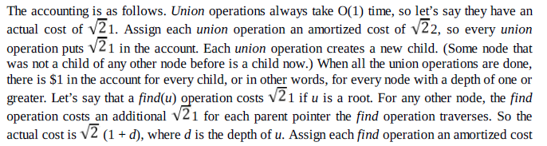
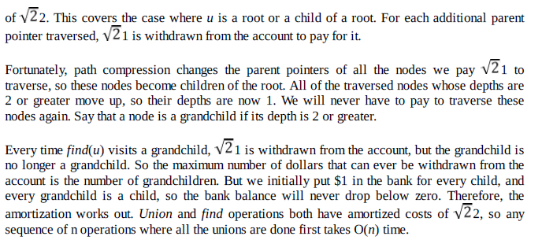

# Disjoint Sets: Problems & Solutions

### Q1. Consider a list of cities c1,c2,...,cn. Assume that we have a relation R such that, for any i,j,R(ci,cj) is 1 if cities ci and cj are in the same state and 0 otherwise. If R is stored as a table, how much space does it require?

R must have an entry for every pair of cities. There are Θ(n2) of these.

### Q2. For Q1, using a disjoint sets ADT, give an algorithm that puts each city in a set such that ci and cj are in the same set if any only if they are in the same state.

```c
for(i=1;i<=n;i++){
    MAKESET(ci);
    for(j=1;j<=i-1;j++){
        if(R(ci,cj)){
            UNION(c1,cj);
            break;
        }
    }
}
```

### Q3. For Q1, when the cities are stored in the disjoint sets ADT, if we are given two cities ci and cj, how do we check if they are in the same state?

Cities ci and cj are in the same state if the only if FIND(ci)=FIND(cj)

### Q4. For Q1, if we use linked-lists with UNION by size to implement the union-find ADT, how much space do we use to store the cities?

There is one node per city, so the space is Θ(n).

### Q5. For Q1, if we use trees with UNION by rank, what is the worst-case running time of the algorithm from Q2?

Whenever we do a UNION in the algorithm from Q2, the second argument is the a tree of size 1. Therefore, all trees have height 1, so each union takes O(1). The worst-case running time is then Θ(n^2).

### Q6. If we use trees without union-by-rank, what is the worst-case running time of the algorithm from Q2, Are there more worst-case scenarios than Q5?

Because of the special case of the unions, union-by-rank does not make a difference for our algorithm.

### Q7. With the quick-union algorithm we know that a sequence of n operations can take slightly more than linear time in the worst case. Explain why if all the finds are done before all the uninons, a sequence of n operations is guaranteed to take O(n) time.

If the find operations are performed first, then the find operations take O(1) time each because every item is the root of its own tree. No item has a parent, so finding the set an item is in takes a fixed number of oeprations. Union operations always take O(1) time. Hence, a sequence of n operations with all the finds before the unions takes O(n) time.

### Q8. With reference to Q7, explain why if all the unions are done before all the finds, a sequence of n operations is guaranteed to take O(n) time.

This problem requires amoritzed analysis. Find operations can be expsnive, but this expensive find operation is balanced out by lots of cheap union operations.


