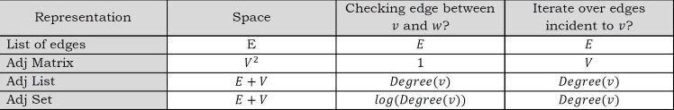
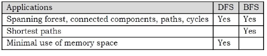
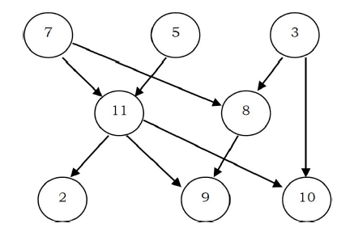

# Graph algorithms

## Introduction

In the real world, many problems are represented in terms of objects and connections between them. For example, in an airline route map, we might be interested in quesitons like: "What's the fastest way to go from Hyderabad to New York?" or "What is the chepaest way to go fro Hyderabad to New York?". To answer these questions we need information about connects (airline routes) between objects (towns). Graphs are data structures used for solving these kinds or problems.

## Glossary

**Graph**: A graph is a pair (V,E), where V is a set of nodes, called vertices and E is a collection of pair of vertices, called edges.
- Vertices and edges are positions and store elements
- Definitions that we use:
  - Directed edge:
    - ordered pair of vertices (u,v)
    - first vertex u is the origin
    - second vertex v is the destination
  - Undirected edge:
    - unordered pair of vertices (u,v)
  - Directied graph:
    - all the edges are directed
  - Undirected graph:
    - all the edges are undirected
- When an edge connects two vertices, the verticles are said to be adjacent to each other and edge is indicent on both vertices.
- A graph with no cycles is called a tree.
- A self loop is an edge that connects a vertex to itself.
- Two edges are parallel if they connect the same pair of vertices
- The degree of a vertex is the number of edges incident on it.
- A subgraph is a subset of a graph's edges that form a graph.
- A path in a graph in a sequence of adjacent vertices. Simple path is a path with no repeated vertices.
- A cycle is a path where the first and last vertices are the same. A simple cycle is a cycle with no repeated vertices or edges.
- We say that one vertex is connected to another if there is a path that contains both of them.
- A graph is connected if there is a path from every vectex to every other vextex.
- If a graph is not connected then it consists of set of connected compoenents.
- A directed acyclic graph [DAG] is a directed graph with no cycles. 
- A forest is a disjoint set of trees.
- A spanning tree of a connected graph is a subgraph that contains all of that graph's vertices and is a single tree. A spanning forest of a graph is the union of spanning tree of its connected components.
- A bipartite graph is a graph whose vertices can be divided into two sets such that that all edges connnect a vertex in one set with a vertex in the other set. 
- In weighted graphs integers are assigned to each edge to represent distance or costs.
- Graph will all edges present are called complete graphs.
- Graphs with relatively few edges are called sparse graphs.
- Graphs with relatively few of the possible edges mixxing are called dense.
- Directed weighted graphs arre sometimes called network.
- We will denote the number of vertices in a given graph by |V|, and the number of edges by |E|. Note that E can range anywhere from 0 to (|V|(|V|-1))/2. This is because each node can connect to every other node.

## Application of graphs

- Representing relationships between compoenents in electronic circuits
- Transportation networks: Highway network, flight network
- Computer networks: Local area network, internet, web
- Databases: For representing ER diagrams in databases, for representing dependency of tables in databases.

## Graph representation

As in other ADTs, to manipulate graphs we need to represent them in some useful form. basically, there are three ways of doing this:

- Adjacency matrix
- Adjacency list
- Adjacency set

## Adjacency Matrix
### Graph Declaration for Adjacency Matrix

First, let us look at the componenets of the graph data structure. To represent graphs, we need the number of vertices, the number of edges and also their interconnections. So, the graph can be declared as:

```c
struct graph{
  int V;
  int E;
  int **adj; // Since we need two dimensional matrix
}
```

### Description

In this method, we use a matrix with size V x V. The values of matrix are boolean. Let us assume the matrix is Adj. The value Adj[u,v] is set to 1 if there is an edge from vertex u to vertex v and 0 otherwise.

In the matrix, each edge is represented by two bits for undirected graphs. That means, an edge from u to v is represented by 1 value in both Adj[u,v] and Adj[u,v]?. To save time, we can process only half of their symmetric matrix. Also, we can assume that there is an "edge" from each vertex to itself. So, Adj[u,v] is set to 1 for all vertices.

If the graph is a directed graph then we need to mark only one entry in the adjacency matrix. As an example, consider the directed graph below.


The adjacency matrix for this graph can be given as:


Now,let us concentrate oon the implementation. To read a graph, one way is to first read the vertex names and then read pairs of vertex names (edges). The code below reads an undirected graph.

```c
struct Graph*adjMatrixOfGraph(){
  int i,u,v;
  struct Graph*G=(struct Graph*)malloc(sizeof(struct Graph));
  if(G==NULL) return;
  scanf("Number of vertices: %d,Number of edges:%d",&G->V,&G->E);
  G->Adj=malloc(sizeof(G->V * G->V));
  for(u=0;u<G->V;u++) for(v=0;v<G->V;v++) G->Adj[u][v]=0;
  for(i=0;i<G->E;i++){
    scanf("Reading Edge: %d %d",&u,&v);
    G->Adj[u][v]=1;
    G->Adj[v][u]=1;
  }
  return G;
}
```

The adjacency matrix representation is good if the graphs are dense. The matrix requires O(V^2) bits of storage and O(V^2) time for initialization.If the number of edges is proportional to V^2,then there is no problem because V^2 steps are required to read the edges. If the graph is sparse, the initialization of the matrix dominates the running time of the algorithm as it takes O(V^2).

## Adjacency List
### Graph Declaration for Adjacency List

In this representation all the vertices connected to a vertex v are listed on an adjacency list for that vertex v. This can be easily implemented with linked lists. That means, for each vertex v we use a linked list and list nodes represents the connections between v and other vertices to which v has an edge.

The total number of linked lists is equal to the number of vertices in the graph. The graph ADT can be declared as:

```c
struct Graph{
  int V;
  int E;
  int *Adj; //head pointers to linked list
}
```

### Description

Considering the same example as that of the adjacency matrix, the adjacency list representation can be given as:


Since vertex A has an edge for B and D, we have added them in the adjacency list for A. The same is the case with other vertices as well.

```c
struct ListNode{
  int vertexNumber;
  struct ListNode*next;
}
struct Graph*adjListOfGraph{
  int i,x,y;
  struct ListNode*temp;
  struct Graph*G=(struct Graph*)malloc(sizeof(struct Graph));
  if(G==NULL) return;
  scanf("Number of the vertics: %d, Number of edges: %d",&G->V,&G->E);
  G->Adj=malloc(G->V * sizeof(struct ListNode));
  for(i=0;i<G->V;i++){
    G->Adj[i]=(struct ListNode*)malloc(sizeof(struct ListNode));
    G->Adj[i]->vertexNumber=i;
    G->Adj[i]->next=G->Adj[i];
  }
  for(i=0;i<E;i++){
    scanf("Reading Edge: %d %d",&x,&y);
    temp=(struct ListNode*)malloc(sizeof(struct ListNode));
    temp->vertexNUmber=y;
    temp->next=G->Adj[x];
    G->Adj[x]->next=temp;
    temp=(struct ListNode*)malloc(sizeof(struct ListNode));
    temp->vertexNumber=y;
    temp->next=G->Adj[y];
    G->Adj[y]->next=temp;
  }
  return G;
}
```

For this representation, the order of edges in the input is important. This is because they determine the order of the vertices on the adjacency lists. The same graph can be represented in many different ways in an adjacency list. the order in which edges appear on the adjacency list affects the order in which edges are processed by algorithms.

### Disadvantages of Ajacency Lists

Using adjacency list representation we cannot perform some operations efficiently. As an example. consider the case of deleting a node. IN adjacency list representation, it is not enough if we simply delete a node from the list representaiton, if we delete a node from the adjacency list then that is enough. For each node on the adjacency list of that node specifies another vertex. We ened to search other nodes linked list also for deleting it. This problem can be solved by linking the two list nodes that correspond to a particular edge and making the adjacency lists doubly linked. But all these extra links are risky to process.

## Adjacency Set

It is very much similar to adjacency list but instead of using Linked lists, disjoint sets are used. For more details refer to disjoint set chapter.

### Comparison of Graph Representations

Directed and undirected graphs are represented with the same structures. For directed graphs, everything is the same, except that each edge is represented just once. An edge from x to y is represented by a 1 value in Adj[x][y] in the adjacency matrix, or by adding y on x's adjacency list. For weighted graphs, everything is the same, except fill the adjacency matrix with weights instead of boolean values.



## Graph Traversals

To solve problems on graphs, we need a mechanism for traversing the graphs. Graph traversal algorithms are also called graph search algorithms. Like tree traversal algorithms, graph search algorithms can be thought of as starting at some source vertex in a graph and "searching" the graph by going through the edges and marking the vertices. Now, we will disucess two such algorithms for traversing the graphs.
- Depth First Search
- Breadth First Search

### Depth First Search [DFS]

DFS algorithm works in a manner similar to preorder traversal of the trees. Like preorder traversal, internally this algorithms also uses stack.

Let us consider the following example. Suppose a person is trapped inside a maze. To come out from that maze, the person visits each path and each intersection. Let us say the person uses two colors of paint to mark the intersections already passed. When discovering a new intersection, it is marked grey, and he continues to go deeper.

After reaching a "dead end" the person knows that there is no more unexplored path from the grey intersection, which now is completed, and he marks it with black. This "dead end" is either an intersection which has already been marked grey or black, or simply a path that does not lead to an intersection.

The intersections of the maze are the vertices and the paths between the intersections are the edges of the graph. The process of returning from the "dead end" is called backtracking. we are trying to go away from the starting vertex into the graph as deep as posisble, until we have to backtrack to the proceding grey vertex. In DFS algorithm, we encounter the folowing types of edges.

- Tree edge: encounter new vertex
- Back edge: from descendent to ancestor
- Forward edge: from ancestor to descendent
- Cross edge: between a tree or subtrees.

For most algorithms boolean classification, unvisited/visited is enough. That means, for some problems we need to use three colors, btu for our discussion two colors are enough.

false -> vertex is unvisited
true -> vertex is visited

Initially all vertices are marked unvisited (false). The DFS algorithm start at a vertex u in the graph. By starting at vertex u it considers the edges from u to other vertices. If the edge leads to an already visited vertex, then backtrack to current vertex u. If an edge leads to an unvisited vertex, then go to that vertex and start processing from that vertex. That means the new vertex becomes thec rurent vertex. Follow this process untill we reach the dead-end. At this point start backtracking.

The process terminates when backtracking leads back to the start vertex. The algorithm based on this mechanism is given below: assume visited[] is a global array.

```c
int visited[G->V];
void DFS(struct Graph*G,int u){
  visited[u]=1;
  for(int v=0;v<G->V;v++){
    for each unvisited adjacent node v of u{
      DFS(G,v);
    }
  }
}
void DFSTraversal(struct Graph*G){
  for(int i=0;i<G->V;i++) visited[i]=0;
  for(int i=0;i<G->V;i++) if(!visited[i]) DFS(G,i);
}
```

As an example, consider the following graph. We can see that sometimes an edge leads to an already discovered vertex. These edges are called back edges, and the other edges are called tree edges because deleting the back edges from the graph generates a tree.

The final generated tree is caleld the DFS tree and the other in which the vertices are processed is called DFS numbers of the vertices. In the graph below, the gray color indicates that the vertex is visited. We need to see when the visited tbale is updated.


From the above diagrams, it can be seen that DFS traversal creates a tree and we call such tree a DFS tree. The above algorithm works even if the given graph has conencted componenets.

The time complexity of DFS is O(V+E), if we use adjacency lists for representing the graphs. This is ebcause we are starting at a vertex and processing the adjacent nodes only if they are not visited. SImilarly, if an adjacency matrix is used for a graph represnetation, then all edges adjacent to a vertex can't be found efficiently, and this gives O(V^2) complexity.

### Applications of DFS

- Topological sorting
- Finding connected components
- Finding articulation points of the graph
- finding strongly connected componenets
- Solving puzzles such as mazes

### Breath First Search [BFS]

The BSF algorithm works similar to leve-order traversal of the trees. Like level-order traversal, BFS also uses queues. In fact, level-order traversal got inspired from BFS. BFS works level by leve. Initially, BFS starts at a given vertex, which is at level 0. In the first stage it visits all vertices at level 1. In the second stage, it visits all vertices at the second level. These new vertices are the ones which are adjacent to level 1 vertices.

BFS continues this process until all the levels of the graph are completed. Generaly queue data structure is used for storing the vertices of a level.

As similar to DFS, assume that intially all vertices are marked unvisited (false). Vertices that have been processed and removed from the queue are marked visited (true). We use a queue to represent the visited set as it will keep the vertices in the order of when they were first visited. The implementation for the above discussion can be given as:

```c
void BFS(struct Graph*G,int u){
  int v;
  struct Queue*Q=createQueue();
  EnQueue(Q,u);
  while(!isEmptyQueue(Q)){
    u = DeQueue(Q);
    Process u;
    Visited[s]=1;
    if(!visited[v] && G->adj[u][v])
    for each unvisited adjacent node v of u{
      EnQueue(Q,u);
    }
  }
}
void BFSTraversal(struct Graph*G){
  for(int i=0;i<G->V;i++) visited[i]=0;
  for(int i=0;i<G->V;i++) if(!visited[i]) BFS(G,i);
}
```

As an example, let us consider the same graph as that of the DFS example. The BFS traversal be shown as:


Time complexity of BFS is O(V+E) if we use adjacency lists for representing the graphs, and O(V^2) foro adjacency matrix representation.

### Application of BFS

- Finding all connnect compoennets in a graph
- Finding all nodes within one connected componenets
- Finding the shortest path between two nodes
- Testing a graph for bipartiteness

### Comparing DFS and BFS

Comparing BFS and DFS, the big advantage of DFS is that it has much lower memory requirements than BFS because it's not required to store all the child pointers at each level. Depending on the data and what we are looking for, either DFS and BFS can be advantageous. For example, in a family tree if we are looking for somone who;s still alive and if we assume the person would be at bottom of the tree, then DFS is a better choice. BFS would take a very long time to reach that last leve.

The DFS algorithm finds the goal faster. Now if we were looking for a family membry who died a very long time ago, then that person would be closer to the top of the tree. In this case, BFS finds faster than DFS. So, the advantages of either vary depending of the data and what we are looking for.

DFS is related to preorder traversal of a tree. Like preorder traversal, DFS visits each node bfeore its children. THe BFS algorithm works similar to leve-order traversal of the tree.

If someone asks whether DFS is better of DFS is better, the answer depends on the type of problem that we are trying to solve. BFS visits each level one at time, and if we know the solution we are searching for is at a low depth, then BFS is good. DFS is a better choice if the solution is at maximum depth. The below table shows the differences betweeen DFS and BFS in terms of their application.



## Topological Sort

Topological sort is an ordering of vertices in a directed acyclic graph [DAG] in which each node comes before all nodes to which it has outgoing edges. As an example, consider the course prerequisite structure at universities. A directed edge (v,w) indicates that course v must be compelted before course w. Topological ordering for this example is the sequence which does not voilate the prerequiste requirement. every DAG may have one or more topological orderings. Topological sort is not possible if the graph has a cycle, since for two vertices v and w on thec ycle, v preceds w and w preceds v.

Topological sort has an interseting property. All pairs of consecutive vertices in the sorted order are connected by edges; then these edges form a directed Hamiltonian path in the DAG. If a hamiltonian path exists, the topological sort order is unique. If a topological sort does not form a hamiltonian path, DAG can have two or more topological orderings. In the graphbelow: 7,5,3,11,82,9,10 and 3,5,7,8,11,2,9,10 are both topological orderings.



Initially, indegree is computed for all vertices ,starting with the vertices which are having indegree 0. That means consider the vertices which do not have any prerequisite. To keep track of vertices which indegree zero we can use a queue.

All vertices of indegree 0 are placed on queue. While the queue is not empty, a vertex v is removed, and all edges adjacent to v have their indegrees decreamented. A vertex is put on the queue as soon as its indegree falls to 0. The topological ordering is the order in which the vertices DeQueue.

The time complexity of this algorithm is O(|E|+|V|) if adjacency lists are used.

```c
void TopologicalSort(struct Graph*G){
  struct Queue*Q=createQueue();
  int counter=0;
  int v,w;
  for(v=0;v<G->V;v++) if(indegree[v]==0) EnQueue(Q,v);
  while(!isEmptyQueue(Q)){
    v=DeQueue(Q);
    topologicalOrder[v]=++counter;
    for each w adjacent to v
      if(--indegree[w]==0) EnQueue(Q,w);
  }
  if(counter!=G->V) printf("grpah has cycle");
  deleteQueue(Q);
}
```

Total running time of topological sort is O(V+E)
Note: THe topological sorting problem can be solved with DFS. Refer to the problems section for the algorithm

### Applications of topological sorting
- Representing course prerequisites
- Detecting deadlocks
- Pipeline of computing jobs
- Checking for symbolic link loop
- Evaluatning formulae in spreadsheet

## Shortest path algorithms

Let us consider the other important problem of a graph. Given a graph G=(V,E) and a distinguished vertex s,we need to find the shortest path from s to every other vertex in G. There are variations in the shortest path algorithms which depends on the type of the input graph and are given below.

### Variations of shortest path algorithms
- Shortest path in unweighted graph
- Shortest path in weighed graph
- Shortest path in weighted graph with negative edges

### Applications of shortest path algorithms
- Finding fastest way to go from one place to another
- Finding cheapest way to fly/send data from one city to another

### Shortest path in weighted graph

Let s be the input vertex from which we want to find the shortest path to all other vertices. Unweighted graph is a special case of the weighted shortest-path problem, with all edges a weight of 1. The algorithm is similar to BFS and we need to use the following data structures:

- A distance table with three columns (each row corresponds to a vertex):
  - Distance from source vertex
  - Path - contains the name of the vertex through which we get the shortes distance.
- A queue is used to implement breath-first search. It contains vertices whose distance from the source node has computed and their adjacent vertices are to be examined.

As an example, consider the following graph and its adjacency list representation


The adjacency list for this grpah is:


Let s=C. The distance from C to C is 0. Initially, distances to all other nodes are not computed, and we initialize the second column in the distance table for all vertices with -1 as below.


#### Algorithm

```c
void unweightedShortestPath(struct Graph*G,int s){
  struct Queue*Q=createQueue();
  int v,w;
  EnQueue(Q,s);
  for(int i=0;i<G-V;i++) distance[i]=-1;
  distance[s]=0;
  while(!isEmptyQueue(Q)){
    v=DeQueue(Q);
    for each w adjacent to v
      if(distance[w]==-1){
        distance[w]=distance[v]+1;
        path[w]=v;
        EnQueue(Q,w);
      }
  }
  deleteQueue(Q);
}
```

Runnting time: O(|E|+|V|), if adjacency lists are used. In for loop, we are checking the outgoing edges for a given vertex and the sum of all examined edges in the while loop is equal to the number of edges which gives O(|E|).

if we use matrix representation the complexity is O(V^2), because we need to reach an entire row in the matrix of length |V| in order to find the adjacenct verties for a given vertex.

### Shortest path in weighted graph [Dijkstra's]

A famous solution for the shortest path problem was developed by Dijkstra. Dijkstra's algorithm is a generalization of the BFS algorith. The regular BFS algorithm cannot solve the shortest path problem as it cannot guarantee that the vertex at the front of the queue is the vertex closest to source s.

Before going to code let us understand how the algorithm works. As in unweighted shortest path algorithm, here too we use the distance tbale. The algoithm works by keeping the shortest distance of vertex v from the source in the distance table. The value distance[v] holds the distance from s to v. The shortest distance of the source to itself is zero. The distance table for all other vertices is set to -1 to indicate that those vertices are not alrleady processed.


After the algorithm finishs the distance table will have the shortest distance from source s to each other vertex v. To simplify the understanding of Dijkstra's algorithm, let us assume that the given vertices are maintained in two sets. Initially the first set contains only the source element and the second set contains all the remaining elements. After the kth iteration, the first set contains k vertices which are closest to the soruce. These k vertices are the ones for which we have already computed the shortest distances from source.

#### Notes on Dijksta's algorithm
- It uses greedy method: Always pick the next closest vertex to the source.
- It uses priority queue to store unvisited vertices by distance from s.
- It does not work with negative weights.

#### Difference between unweighted shortest path and dijkstra's algorithm

1. To represent weights in the adjacency list, each vertex contains the weights of the edges
2. Instead of ordinary queue we use priority queue and the vertex with the smallest distance is selected for processing.
3. The distance to a vertex is calculated by the sum of the weights of the edges on the path from the source to that vertex
4. We update the distances in case the newly computed distance is smaller than the old distance which we have already computed.

```c
void dijkstra(struct Graph*G,int s){
  struct PriorityQueue*PQ=createPQ();
  int v,w;
  EnQueue(PQ,s);
  for(int i=0;i<G->V;i++) distance[i]=-1;
  distance[s]=0;
  while(!isEmptyQueue(PQ)){
    v=deleteMin(PQ);
    for all adjacent vertices w of v{
      computer new distance d=distance[v]+weight[v][w];
      if(distance[w]==-1){
        distance[w]=new distance d;
        insert w in the priority queue with priority d;
        path[w]=v;
      }
      if(distnace[w]>new distance d){
        distance[w]=new distance d;
        update priority of vertex w to be d;
        path[w]=v;
      }
    }
  }
}
```

The above algorithm can be better understood through an example, which will explain each step that is taken and how distance is calculated. The weighted graph below has 5 vertices from A-E.

The value between the two vertices is known as the edge cost between two vertices. For example the edge cost between A and C is 1. Dijkstra's algorithm can be used to find the shortest path from source A to the remaining vertices in the graph.


initially the distance table is:


After the first step, from vertex A, we can reach B and C. So in the distacen table we update the reachability of B and C with their costs and same is shown below.


Now, let us select the minimum distance among all. The minimum distance vertex is C. That means, we have to reach other vertices from these two vertices (A and C). For example, B can be reached from A and also from C. In this case we have to select the one which gives the lowest cost. Since reaching B through C is giving the minimum cost (1+2), we update the distance table for vertex B with cost 3 and the vertex from which we got this cost as C.


The only vertex remaining is E. To reach E, we have to see all the paths through which we can reach E and select the one which gives the minimum cost. We can see that if we use B as the intermediate vertex through C we get the minimum cost.


The final minimum cost tree which Dijkstra's algorithm generates is:


#### Performance

In Dijkstra's algorithm, the efficiency depends on the number of deleteMins (V deleteMins) and updates for priority queues (E updates) that are used. If a standard binary heap is used then the compelxity is O(ElogV).

The term ElogV comes from E updates (each update takes logV) for the standard heap. If the set used is an array then complexity is O(E+V^2)

#### Disadvantages of Dijkstra's algorithm

- As discussed above, the major disadvantage of the algorithm is that it does a blind search, thereby wasting time and necessary resources.
- Another disadvantage is that it cannot handle negative edges. This leads to acyclic graphs and most often cannot obtain the right shortest path.

#### Relatives of Dijkstra's algorithm

- The Bellman-Ford algorithm computes single-source shortest paths in a weighted digraph. It uses the same concept as that of Dijkstra's algorithm that can handle negative edges as well. It has more running time than Dijkstra's algorithm
- Prime's algorithm finds a minimum spanning tree for a connect weighted graph. It implies that a subset of edges that form a tree where teh ttoal weight of all the edges in the tree is minimized.

### Bellman-Ford algorithm

If the graph has negative edge costs, then Dijkstra's algorithm does not work. The problem is that once a vertex u is declared known, it is possible that from some other, unknown vertex v there is a path back to u that is very negative. In such a case taking a path from s to v back to u is better than going from s to u without using v. A combination of Dijkstra's algorithm and unweighted algorithms will solve the problem. Initialize the queue with s. Then, at each stage we DeQueue a vertex v. We find all vertices W adjacent to v such that,

`distance to v + weight (v,w) < old distance to w`

We update w old distance and path, and place w on a queue if it is not already there. A bit can be set for each vertex to indicate presence in the queue. We repeat the process until the queue is empty.

```c
void bellmanFordAlgo(struct Graph*G,int s){
  struct Queue*Q=createQueue();
  int v,w;
  EnQueue(Q,s);
  distnace[s]=0;
  while(!isEmptyQueue(Q)){
    v=DeQueue(Q);
    for all adjacent vertices w of v{
      computer new distance d=distance[v]+weight[v][w];
      if(old distance to w>new distance d){
        distance[v]=distance to v+weigh[v][w];
        path[w]=v;
        if(w is there in queue) EnQueue(Q,w);
      }
    }
  }
}
```

This algorithm works if there are no negative-cost cycles. Each vertex can DeQueue at most |V| times, so the running time is O(|E|*|V|) if adjacency lists are used.

### Overview of shortest path algorithms

- Shortest path in unweighted graph [Modified BFS] => `O(|E|+|V|)`
- Shortest path in weighted graph [Dijkstra's] => `O(|E|log|V|)`
- Shortest path in weight graph with negative edges [Bellman - Ford] => `O(|E|*|V|)`
- Shortest path in weighted acyclic graph => `O(|E|+|V|)`

## Minimal spanning tree

The spanning tree of a graph is a subgraph that contains all the vertices and is also a tree. A graph may have many spanning trees. As an example, consider a graph with 4 vertices as shown below. Let us assume that the corners of the graph are vertices.


For this simple graph, we can multiple spanning trees as shown below.


The algorithm we will discuss now is minimum spanning tree in an undirected graph. We assume that the given graphs are weighted graphs. If the graphs are unweighted graphs then we can still use the weighted graph algorithms by treating all weights as equal. A minimum spanning tree of an undirected graph G is a tree formed from graph edges that connect all the vertices of G with minimum total cost (weights). A minimum spanning tree exists only if the graph is connceted. THere are two famous algorithms for this problem:
- Prim's algorithm
- Kruskal's algorithm

### Prim's algorithm

Prim's algorithm is almost the same as Dijkstra's algorithm. As in Dijkstra's algorithm, in Prim's algorithm we keep the values distance and paths in the distance table. The only exception is that since the definition of distance is different, the updating statement also changes a little. The update statement is similar than before.

```c
void prims(struct Graph*G,int s){
  struct PriorityQueue*PQ=createPQ();
  int v,w;
  EnQueue(PQ,s);
  distance[s]=0;
  while(!isEmptyQueue(PQ)){
    v=deleteMin(PQ);
    for all adjacent vertices w of v{
      compute new distance d= distance[v]+weight[v][w];
      if(distance[w]==-1){
        distance[w]=weight[v][w];
        insert w in the priority queue with priority d
        path[w]=v;
      }
      if(distance[w]>new distance d){
        distance[w]=weight[v][w];
        udpate priority of vertex w to be d;
        path[w]=v;
      }
    }
  }
}
```

The entire implementation of this algorithm is identical to that of dijkstra's algorithm. The running is O(V^2) without heaps [goods for dense graphs], and O(ElogV) using binary heaps [good for sparse graphs].

### Kruskal's algorithm

The algorithm starts with V different trees. While constructing the minimum spanning tree, every time Krushkal's algorithm selects an edge that has minimum weight and then adds that edge if it doesn't create a cycle. So, initially there are |V| single-node trees in the forest. Adding an edge merges two trees into one. When the algorithm is completed, there will be only one tree, and that is the minimum spanning tree. There are two ways of implementing krushkal's algorithm:
- By using Disjoint sets: Using UNION and FIND operations
- By using priority queue: Maintains weights in priority queue

The appropriate data structure is the UNION/FIND algorithm. Two vertices belong to the same set if and only if they are connected in the current spanning forest. Each vertex is initially in its own set. If u and v are in the same set, the edge is rejected because it forms a cycle. Otherwise, the edge is accepted, and a UNION is performed on the two sets containing u and v. As an example, consider the following graph.


Now let us perform Krushkal's algorithm on this graph. We always select the edge which has minimum weight.


From the above graph, the edges which have minimum weight are: AD and BE. From these two we can select one of them and let us assume that we select AD.


DF is the next edge that has the lowest cost (6)


BE now has the lowest cost and we sleect it (dotted lines indicate selected edges)


Next, AC and CE have the low cost of 7 and we select AC


Then we selcet CE as its cost is 7 and it does not form a cycle


The next low cost edges are CB and EF. But if we select CB, then it forms a cycle. So we discard it. This is also the case with EF. So we should not select those two. And the next low cost is 9 (BD and EG). Selecting BD forms a cycle so we discard it. Adding EG will not form a cycle and therefore with this edge we complete all vertices of the graph.

```c
void kruskal(struct Grpah*G){
  S=phi; // At the end S will contains the edges of minimum spanning trees
  for(int v=0;v<G->V;v++) MakeSet(v);
  sort edges of E by increasing weights w;
  for each edge (u,v) in E{
    if(FIND(u) not equal to FIND(V)){
      S=UNION(S,{u,v});
      UNION(u,v);
    }
  }
  return S;
}
```

The worst-case running time of this algorithm is O(ELogE), which is dominated by the heap operations. That means, since we are consructing the heap with E edges, we need O(ElogE) time to do that.