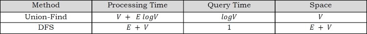
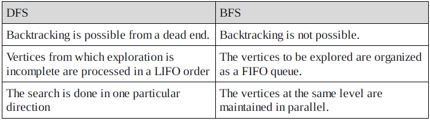
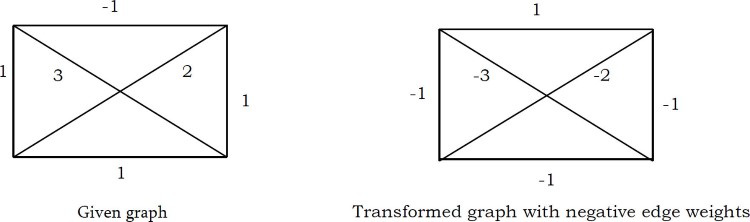
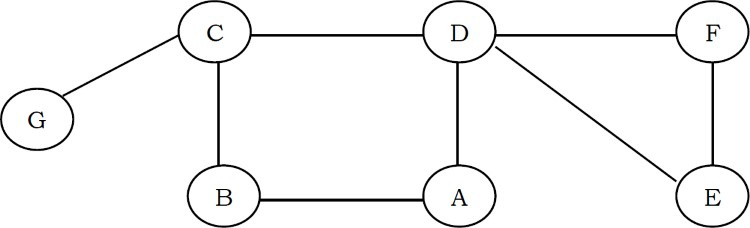
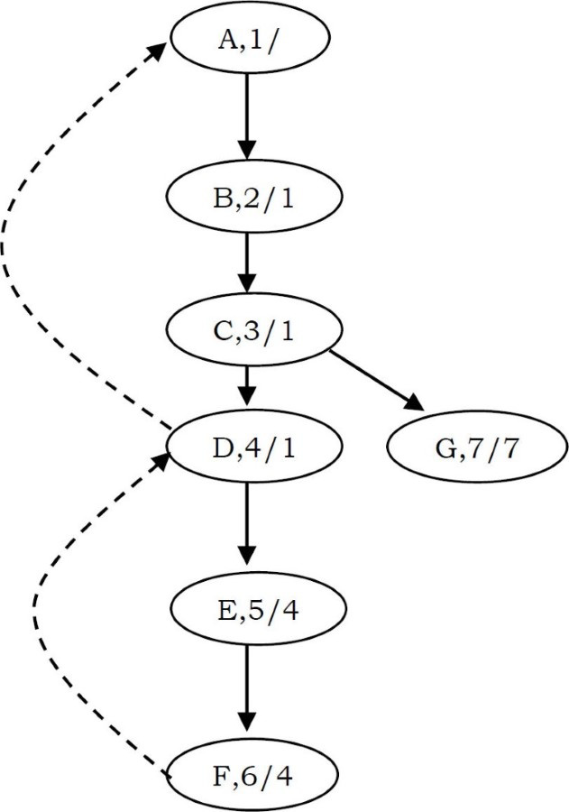

# Graph algorithms: Problem & Solution

### Q1. In an undirected simple graph with n vertices, what is the maximum number of edges? Self-loops are not allowed.

Since every node can connect to all other nodes, the first node can connect to n-1 nodes. The second node can connect to n-2 nodes [since one edge is already there from the first node]. The total number of edges is: 1+2+3+...+n = (n(n+1))/2 edges

### Q2. How many difference adjaceny matrices does a graph with n vertices and E edges

It's equal to the number of permutations of n elements, i.e. n!

### Q3. How many different adjacency lists does a graph with n vertices have?

It's equal to the number of permutations of edges i.e. , E!

### Q4. Which undirected graph representation is most appropriate for determining whether or not a vertex is isolated (is not connected to any other vertex)?

Adjacency list. If we use the adjacency matrix, then we need to check the complete row to determine whether that vertex has edges or not. By using the adjacency list, it is very easy to check, and it can be done just chekcing whether that vertex has NULL for next poitner or not [NULL indicates that the vertex is not connected to any other vertex.]

### Q5. For checking whether there is a path from source s to target t which one is best between disjoint sets and DFS?

The table below shows the comparision between disjoint sets and DFS. The entries in the table represent the case for any pair of nodes (for s and t)



### Q6. what is the maximum number of edges a directed graph with n vertices can have and still not contain a directed cycle?

The number is V(V-1)/2. Any directed graph can have at most n^2 edges. However, since the graph has no cycles it cannot contain a self loop, and for any pair x,y of vertices, at most one edge from (x,y) and (y,x) can be included. Therefore the number of edges can be at most (V^2 - V)/2 as desired. It is possible to achieve V(V-1)/2 edges. Label n nodes 1,2...n and add an edge (x,y) if and only if x < y. This graph has the appropriate number of edges and cnanot contain a cycle.

### Q7. How many simple directed graphs with no parallel edges and self-loops are possible in terms of V?

(V)(V-1). Since, each vertex can connected to V-1 vertices without self-loops.

### Q8. What are the differences between DFS and BFS?



### Q9. Earlier in this chapter, wediscussed minimum spanning tree algorithms. Now, give an algorithm for finding the maximum-weight spanning tree in a graph.



Using the given graph, construct a new graph with the same nodes and edges. But isntead of using the same weights, take the negative of their weights. That means, weight of an edge = negative of weight of the corresponding edge in the give graph. Now, we can use existing minimum spanning tree algorithms on this ewn graph. As a result, we will get the maximum-weight spanning tree in the original one.

### Q10. Give an algorithm for checking whether a given graph G has simple path from source s to destination D. Assume the graph G is represented using the adjacent matrix.

```c
struct Graph{
    int V;
    int E;
    int **adjMatrix;
}
```

For each vertex call DFS and check whether the current vertex is the same as the destination vertex or not. If they are the same, then return 1. Otherwise, call the DFS on its unvisted neighbors. One important thing to note here is that, we are calling the DFS algorithm on vertices which are not yet visited.

```c
void hasSimplePath(struct Graph*G,int s,int d){
    int t;
    visited[s]=1;
    if(s==d) return 1;
    for(t=0;t<G->V;t++)
        if(G->adjMatrix[s][t] && !visited[t])
            if(DFS(G,t,d))
                return 1;
    return 0;
}
```

Time comexplity: O(E). In the above algorithm, for each node, since we are not calling DFS on all of its neighbors
Space complexity: O(V)

### Q11. Count simple paths for a given graph G has simple path from source s to destination d? Assume the graph is represented using the adjacent matrix.

Similar to the discussion in Q10, start at one node and call DFS on that node. As a result of this call, this visits all the ndoes that it can reach in the given graph. That means it visits all the nodes of the connected compoenents of that node. If there are any nodes that have not been visited, then again start at one of those nodes and call DFS.

Before ths first DFS is each connected compoenents, increment the connected compoennets count. Continue this process until all of the graph nodes are viisted. As a result, at the end we will get the total number of connected compoenents. The implementation based on this logic is given below:

```c
void countSimplePath(struct Graph*G,int s,int d){
    int t;
    visited[s]=1;
    if(s==d){
        count++;
        visited[s]=0;
        return;
    }
    for(t=0;t<G->V;t++){
        if(G->adjMatrix[s][t] && !visited[t]){
            DFS(G,t,d);
            visited[t]=0;
        }
    }
}
```

### Q12. All pairs shortest path problem: Find the shortest graph distances between every pair of vertices in a given graph. Let us assume that the given graph does not have negative edges.

The problem can be solved using n applications of Dijkstra's algorithm. That means we apply Dijkstra's algorithm on each vertex of the given graph. This algorithm does not work if the graph has edges with negative weights

### Q13. In Q12, how do we solve the all pairs shortest path problem if the graph has edges with negative weights?

This can be solved by using the Floyd-Warshall algorithm. This algorithm also works in the case of weighted graph where the edges have negative weights. This algorithm is example of dynamic programming

### Q14. DFS application: cut vertex or articulation points

In an undirected graph, a cut vertex is a vertex, and if we remove it, then the graph splits into two disconnected componenets. As an example, consider the following figure. Removal of the "D" vertex divides the graph into two connected compoenetns ({E,F} & {A,B,C,G})

Similarly, removal of the "C" vertex divides the graph into ({G} and {A,B,D,E,F}). For this graph, A and C are teh cut vertices.



DFS provides a linear-time algorithm O(n) to find all cut vertices in a connected graph. Starting at any vertex, call a DFS and number the nodes as they are visited. For each vertex v, we call this DFS number dfsnum(v). The tree generated with DFS traversal is called DFS spanning tree. Then, for every vertex v in the DFS spanning tree, we compute the lowest-numbered vertex, which we clal low(v), that is reachable from v by taking zero or more tree edges and then possibly one back edge (in that order).

Based on the above discussion, we need the following informaiton for this algorithm: the dfsnum of each vertex in the DFS tree, and for each vertex v, the lowest depth of neighbors of all descendants of vin the DFS tree, called the low.

The dfssum can be computed during DFS. The low of v can be computed after visiting all descendants of v as the minimum of the dfssum of all neighors of v and the low of all children of v in the DFS tree.



The root vertex is a cut vertex if and only if it has at least two children. A non-root vertex u is a cut vertex if and only if there is a son v of u such that low(v)>dfsnum(u). This property can be tested once the DFS is returned from every child of u, and if true, u separates the grpah into different bi-connected compoenents. This can be represented by computing one bi-connected compoenent out of every such v, and then erasing the sub-tree of v from the tree.

For the given graph, the DFS tree with dfsnum/low can be given as shown in the figure below. The implementation for the above discussion is:

```c
int adjMatrix[256][256];
int dfsnum[256],num=0,low[256];
void cutVertices(int u){
    low[u]=dfsnum[u]=num++;
    if(adjMatrix[u][v] && dfsnum[v]==-1){
        cutVertices(v);
        if(low[v]>dfsnum(u)) printf("Cut vertex:%d",u);
    }
}
```