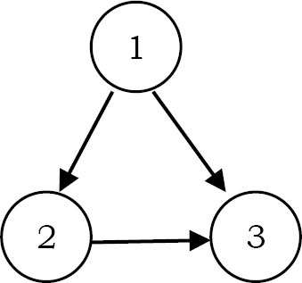
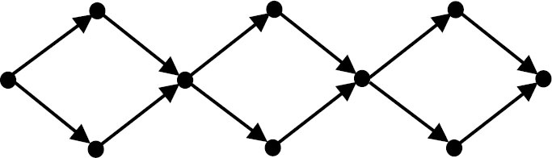

# Graph algorithms: Problem & Solution

### Q1. In an undirected simple graph with n vertices, what is the maximum number of edges? Self-loops are not allowed.

Since every node can connect to all other nodes, the first node can connect to n-1 nodes. The second node can connect to n-2 nodes [since one edge is already there from the first node]. The total number of edges is: 1+2+3+...+n = (n(n+1))/2 edges

### Q2. How many difference adjaceny matrices does a graph with n vertices and E edges

It's equal to the number of permutations of n elements, i.e. n!

### Q3. How many different adjacency lists does a graph with n vertices have?

It's equal to the number of permutations of edges i.e. , E!

### Q4. Which undirected graph representation is most appropriate for determining whether or not a vertex is isolated (is not connected to any other vertex)?

Adjacency list. If we use the adjacency matrix, then we need to check the complete row to determine whether that vertex has edges or not. By using the adjacency list, it is very easy to check, and it can be done just chekcing whether that vertex has NULL for next poitner or not [NULL indicates that the vertex is not connected to any other vertex.]

### Q5. For checking whether there is a path from source s to target t which one is best between disjoint sets and DFS?

The table below shows the comparision between disjoint sets and DFS. The entries in the table represent the case for any pair of nodes (for s and t)


### Q6. what is the maximum number of edges a directed graph with n vertices can have and still not contain a directed cycle?

The number is V(V-1)/2. Any directed graph can have at most n^2 edges. However, since the graph has no cycles it cannot contain a self loop, and for any pair x,y of vertices, at most one edge from (x,y) and (y,x) can be included. Therefore the number of edges can be at most (V^2 - V)/2 as desired. It is possible to achieve V(V-1)/2 edges. Label n nodes 1,2...n and add an edge (x,y) if and only if x < y. This graph has the appropriate number of edges and cnanot contain a cycle.

### Q7. How many simple directed graphs with no parallel edges and self-loops are possible in terms of V?

(V)(V-1). Since, each vertex can connected to V-1 vertices without self-loops.

### Q8. What are the differences between DFS and BFS?


### Q9. Earlier in this chapter, wediscussed minimum spanning tree algorithms. Now, give an algorithm for finding the maximum-weight spanning tree in a graph.


Using the given graph, construct a new graph with the same nodes and edges. But isntead of using the same weights, take the negative of their weights. That means, weight of an edge = negative of weight of the corresponding edge in the give graph. Now, we can use existing minimum spanning tree algorithms on this ewn graph. As a result, we will get the maximum-weight spanning tree in the original one.

### Q10. Give an algorithm for checking whether a given graph G has simple path from source s to destination D. Assume the graph G is represented using the adjacent matrix.

```c
struct Graph{
    int V;
    int E;
    int **adjMatrix;
}
```

For each vertex call DFS and check whether the current vertex is the same as the destination vertex or not. If they are the same, then return 1. Otherwise, call the DFS on its unvisted neighbors. One important thing to note here is that, we are calling the DFS algorithm on vertices which are not yet visited.

```c
void hasSimplePath(struct Graph*G,int s,int d){
    int t;
    visited[s]=1;
    if(s==d) return 1;
    for(t=0;t<G->V;t++)
        if(G->adjMatrix[s][t] && !visited[t])
            if(DFS(G,t,d))
                return 1;
    return 0;
}
```

Time comexplity: O(E). In the above algorithm, for each node, since we are not calling DFS on all of its neighbors
Space complexity: O(V)

### Q11. Count simple paths for a given graph G has simple path from source s to destination d? Assume the graph is represented using the adjacent matrix.

Similar to the discussion in Q10, start at one node and call DFS on that node. As a result of this call, this visits all the ndoes that it can reach in the given graph. That means it visits all the nodes of the connected compoenents of that node. If there are any nodes that have not been visited, then again start at one of those nodes and call DFS.

Before ths first DFS is each connected compoenents, increment the connected compoennets count. Continue this process until all of the graph nodes are viisted. As a result, at the end we will get the total number of connected compoenents. The implementation based on this logic is given below:

```c
void countSimplePath(struct Graph*G,int s,int d){
    int t;
    visited[s]=1;
    if(s==d){
        count++;
        visited[s]=0;
        return;
    }
    for(t=0;t<G->V;t++){
        if(G->adjMatrix[s][t] && !visited[t]){
            DFS(G,t,d);
            visited[t]=0;
        }
    }
}
```

### Q12. All pairs shortest path problem: Find the shortest graph distances between every pair of vertices in a given graph. Let us assume that the given graph does not have negative edges.

The problem can be solved using n applications of Dijkstra's algorithm. That means we apply Dijkstra's algorithm on each vertex of the given graph. This algorithm does not work if the graph has edges with negative weights

### Q13. In Q12, how do we solve the all pairs shortest path problem if the graph has edges with negative weights?

This can be solved by using the Floyd-Warshall algorithm. This algorithm also works in the case of weighted graph where the edges have negative weights. This algorithm is example of dynamic programming

### Q14. DFS application: cut vertex or articulation points

In an undirected graph, a cut vertex is a vertex, and if we remove it, then the graph splits into two disconnected componenets. As an example, consider the following figure. Removal of the "D" vertex divides the graph into two connected compoenetns ({E,F} & {A,B,C,G})

Similarly, removal of the "C" vertex divides the graph into ({G} and {A,B,D,E,F}). For this graph, A and C are teh cut vertices.


DFS provides a linear-time algorithm O(n) to find all cut vertices in a connected graph. Starting at any vertex, call a DFS and number the nodes as they are visited. For each vertex v, we call this DFS number dfsnum(v). The tree generated with DFS traversal is called DFS spanning tree. Then, for every vertex v in the DFS spanning tree, we compute the lowest-numbered vertex, which we clal low(v), that is reachable from v by taking zero or more tree edges and then possibly one back edge (in that order).

Based on the above discussion, we need the following informaiton for this algorithm: the dfsnum of each vertex in the DFS tree, and for each vertex v, the lowest depth of neighbors of all descendants of vin the DFS tree, called the low.

The dfssum can be computed during DFS. The low of v can be computed after visiting all descendants of v as the minimum of the dfssum of all neighors of v and the low of all children of v in the DFS tree.


The root vertex is a cut vertex if and only if it has at least two children. A non-root vertex u is a cut vertex if and only if there is a son v of u such that low(v)>dfsnum(u). This property can be tested once the DFS is returned from every child of u, and if true, u separates the grpah into different bi-connected compoenents. This can be represented by computing one bi-connected compoenent out of every such v, and then erasing the sub-tree of v from the tree.

For the given graph, the DFS tree with dfsnum/low can be given as shown in the figure below. The implementation for the above discussion is:

```c
int adjMatrix[256][256];
int dfsnum[256],num=0,low[256];
void cutVertices(int u){
    low[u]=dfsnum[u]=num++;
    if(adjMatrix[u][v] && dfsnum[v]==-1){
        cutVertices(v);
        if(low[v]>dfsnum(u)) printf("Cut vertex:%d",u);
    }
}
```

### Q15. Let g be a connected graph of order n. What is the maximum number of cut-verices that G can contain?

n-2. As an example, consider the following graph. In the graph below, except for the vertices 1 and n, all the remaining vertices are cut vertices. This is because removing 1 and n vertices does not split into two. This is a case where we can get teh maximum number of cut vertices.


### Q16. DFS Application: Cut bridges or cut edges

Let g be a connected graph. An edge uv in G is called a bridge of G is G-uv is disonnected.

As an example, consider the following graph.


In the above graph if we remove the edge uv then the graph splits into two compoenents. For this grpah, uv is a bridge. The discussion we had for cut vertices holds good for bridges also. The only change is, instead of printing the vertex, we give the edge. The main observaitn is that an ed ge(u,v) cannot be a bridge if it is a prat of a cycle If (u,v) is not part of a cycle, then it is a bridge

We can detect cycles in DFS by the rpesence of back edges, (u,v) is a bridge if and only if none of v and v's children has a back edge to u or any of u's ancestors. To detcet whether any of v's children has a back edge to u's parent, we can use a similar idea as above to see what is the smallest dfsnum reachable from the subtree rooted at v.

```c
int dfsnum[256],num=0,low[256];
void bridges(struct Graph*G,int u){
    low[u]=dfsnum[u]=num++;
    for(int v=0;G->V;++v){
        if(G->adjMatrix[u][v] && dfsnum[v]==-1){
            cutVertices(v);
            if(low[v]>dfsnum(u))
                print (uv) as bridge
            low[u]=min(low[u],low[v]);
        }else low[u]=min(low[u]dfsnum[v]);
    }
}
```

### Q17. DFS Application: Discuess Euler Circuits

Before discussin this problem let us see the terminology:
- Eulerian tour - a path that contains all edges without repetition
- Eulerian circuit - a path that contains all edges without repeition and starts and ends in the same vertex
- Eulerian graph - a graph that contains an Eulerian circuit
- Even vertex: a vertex that has an even number of incident edges
- Odd vertex: a vertex that has an odd number of incident edges.

Euler circuit: For a given graph we have to reconstruct the circuits using a pen, drawing each line exactly once. We should not lift the pen from the paper while drawing. That means, we must find a path in the grpah that visits every edge exactly once and this problem is called an Euler path or Euler circuit problem. This puzzle has a ismple solution based on DFS.

An Euler circuit exists if and only if the grpah is connected and the number of neighbors of each vertex is even. Strat with any node, select any untraversed outoging edge, and follow it. Repeat until there are no more reminaing unselected outgoing edges. For example, consider the fololwing graph: A legal Eular circuit of this graph is 0 1 3 4 1 2 3 4 2 0.


If we start at vertex 0, we can select the edge to vertex 1, then select the edge to vertex 2, then select the edge to vertex 0. THere are now no remianing unchosen edges from vertex 0:


We now have a circuit 0,1,2,0 that does not traverse every edge. So, we pick some other vertex that is on that circuit, say vertex 1. We then do another depth first search of the remaining edges. Say we choose the edge to node 3, then 4, then 1. Again we are stuck. There are no more unchosen edges from node 1. We now splice this path 1,3,4,1 into the old path 0,1,2,0 to get: 0,1,3,4,1,2,0. The unchosen edges now look like this:


We can pick yet another vertex to start another DFS. if we pick vertex 2, and splice the path 2,3,5,4,2, then we get the first circuit 0,1,3,4,1,2,3,5,4,2,0

A similar problem is to find a simple cycle in an undirected grpah that visits every vertex. This is known as Hamiltonian cycle problem. Althought it seems almost identical to the euler circuit problem, no efficient algorithm for it is known.

**Notes:**
- A connected undirected graph is Eulerian if and only if every graph vertex has an even degree, or exactly two vertices with an odd degree.
- A directed graph is Eulerian if it is strongly connected and every vertex has an equal in and out degree

**Application:** A postman has to visit a set of streets in order to deliver mails and packages. He needs to find a path that starts and ends at the post-office, and that through each street (edge) exactly once. This way the postman will deliver mails and packages to all the necessary streets, and at the same time will spend minimum time/effort on the road.

### Q18. DFS Application: Finding strongly connected compoenents.

This is another application of DFS. In a directed graph, two verties u and v are strongly connected if and only if there exists a path from u to v and there exists a path from v to u.

The strong connectedness is an equivalence relation.

- A vertex is strongly connected with itself
- If a veretx u is strongly connected to a vertex v,then v is strongly connected to u
- If a vertex u is strongly connected to a vertex v, and v is strongly connected to a vertex x then u is strongly connected to x.

What this says is,for a given directed graph we can divide it into strongly connected compoennets. This problem can be solved by performing two depth-first searchs. With two DFS searches we can test whether a given directed graph is strongly connected or not. We can also produce the subsets of vertices that are strongly connected.

**Algorithm**
- Perform DFS on given graph G.
- Number vertices of given graph G according to a post-order traversal of depth-frist spanning forest.
- Construct graph G_r by reversing all edges in G.
- Perform DFS on G_r: Always start a new DFS at the highest-numbered vertex
- Each tree in the resulting depth-furst spanning forst corresponds to a strongly-connected compoenents.

**What this algorithm works?**
Let us consider two vertices, v and w. if they are in the same strongly connected compoenent, then there are paths from v to W and from w to v in the original graph G, and hence also in G_r. If two vertices v and w are not in the same depth-first spanning tree of G_r, clearly they cannot be in the same strongly connected compoenents. As an example, consider the graph shown below on the left. Let us assume this graph is G.


Now, as per the algorithm, performing DFS on this G graph gives the following diagram. The dotted line from C to A indicates a back edge.

Now, performing post order traversal on this tree gives: D,C,B and A.


Now reverse the given graph G and call it G_r and at the same time assign postorder numbers to the vertices. The reversed graph G_r will look like:


The last step is performing DFS on this reversed graph G_r. While doing DFS, we need to consider the vertex which has the lasgest DFS number. So, first we start at A and with DFS we go to C and then B. At B, we cannot move further. This says that {A,B,C} is a strongly connected componenet. Now the only reminaing element is D and we end our second DFS at D. So the connected compoenents are: {A,B,C} and {D}


The implementation based on this discussion can be shown as:


### Q19. Count the number of connected components of graph G which is represented in the adjacent matrix

This problem can be solved with one extra counter in DFS.


Time complexity: Same as that of DFS and it depends on miplementation. With adjacency matrix the complexity is O(|E|+|V|) and with adjacency matrix the complexity is O(|V|^2)?

### Q20. Can we solve the Q19, using BFS?


### Q21. Let us assume that G(V,E) is an undirected graph. Give an algorithm for finding a spanning tree which takes O(|E|) time complexity.

The test for a cycle can be donein constant time, by marking vertices that have been added to the set S. An edge will introduce a cycle, if both its vertices have already been marked.

**Algorithm:**
```c
S={};
for each edge e subset of E{
    if(adding e to S doesnt form a cycle){
        add e to S;
        mark e;
    }
}
```

### Q22. Is there any other way of solving?

Yes. We can run BFS and find the BFS tree for teh graph. Then start at the root element and keep moving to the next levels and at the same time we have to consider the nodes in the next level only once. That means, if we have a node with multiple input edges then we should consider only one of them; otherwise they will form a cycle.

### Q23. Detecting a cycle in an undirected graph

An undirected graph is acyclic if and only if a DFS yiels no back edges, edges (u,v) where v has already been discovered and is an ancestor of u.
- Execute DFS on the graph
- If there is a back edge - the graph has a cycle

If the graph does not contain a cycle, then |E|<|V| and DFS cost O(|V|). If the graph contains a cycle, then a back edge is discovered after 2|V| steps at most.

### Q24. Detecting a cycle in DAG



Cycle detection on a graph is different than on a tree. This is because in a graph, a node can have multiple parents. In a tree, the algorithm for detecting a cycle is to do a depth first search, marking nodes as they are encountered. If a previously marked node is seen again, then a cycle exists. This won't work on a graph. Let us consider the graph shown in the figure below. If we use a tree cycle detection algorithm, then it will report the wrong result. That means that this graph has a cycle in it. but the given graph does not have a cycle in it. This is because node 3 will be seen twice in a DFS starting at node 1.

The cycle detection algorithm for trees can easily be modified to work for graphs. The key is that in a DFS of an acyclic graph, a node whose descendants have all been visited can be seen again without implying a cycle. But, if a node is seen for the second time before all its descendants have been visited, then there must be a cycle. Can you see why this is? Suppose there is a cycle containing node A. this means that A must be reachable from one of its descendants. So when the DFS is visiting that descendant, it will see A again, before it has finished visiting all of A's descendants. So there is a cycle, in order to detect cycles. we can modify the depth first search.

```c
int detectCycle(struct Graph*G){
    for(int i=0;i<G->V;i++){
        visited[s]=0;
        predecessor[i]=0;
    }
    for(int i=0;i<G->V;i++){
        if(!visited[i] && hasCycle(G,i)) return 1;
    }
    return false;
}

int hasCycle(struct Graph*G,int u){
    visited[u]=1;
    for(int i=0;i<G->V;i++){
        if(G->adj[s][i]){
            if(predecessor[i]!=u && visited[i]) return 1;
            else{
                predecessor[i]=u;
                return hasCycle(G,i);
            }
        }
    }
    return 0;
}
```

### Q25. Given a directed acyclic graph, give an algirthm for finding its depth.

If it is an undirected graph, we can nuse the simple unweighted shortest path algirthm. We just need to return the highest number among all distances. For directed acyclic graph, we can solve by following the similar approach which we used for finding the depth in trees. In trees, we hav esolved this problem using level order traversal.

```c
int depthInDAG(struct Graph*G){
    struct Queue*Q;
    int counter;
    int v,w;
    Q=createQueue();
    counter=0;
    for(v=0;v<G->V;v++)
        if(indegree[v]==0)
            EnQueue(Q,v);
    EnQueue(Q,'$');
    while(!isEmptyQueue(Q)){
        v=DeQueue(Q);
        if(v=='$'){
            counter++;
            if(!isEmptyQueue(Q))
                EnQueue(Q,'$');
        }
        for each w adjacent to v
            if(--indegree[w]==0)
                EnQueue(Q,w);
    }
    deleteQueue(Q);
    return counter;
}
```

### Q26. How many topological sorts of the following dag are there?



If we observe the above graph there are three stages with 2 vertices. In the early discussion of this chapter, we saw that topological sort picks the elements with zero indegree at any point of time. At each of the two vertices stages, we can first process either the top vertex or the bottom vertex. As a result, at each of these stages we have two possibilities. So the total number of possibilities is the multiplication of possibilities at each stage and that is, 2x2x2=8.

### Q27. Unique topological ordering: Design an algorithm to determine whether a directed graph has a unique topological ordering

A directed graph has a unique topological ordering if and only if there is a directed edge between each pair of consecutive vertices in the topological order. This can also be defined as: a directed graph has a unique topological ordering if and only if it has Hamiltonian path. If the digraph has multiple topological orderins, then a second topological order can be obtained by swapping a pair of consecutive vertices.

### Q28. Let us consider the prerequisites for courses at IITB. Suppose that all prerequisites are mandatory, every course is offered every semester, and there is no limit to the number of courses we can take in one semester. We would like to know the minimum number of semesters required to complete the major. Describe the data structure we would use to represent this problem, and outline a linaer time algorithm for solving it.

Use a directed acyclic graph (DAG). The vertices represent course and the edges represent the prerequisite relation between courses at IITB. It is a DAG, because the prerequisite relation has no cycles.

The number of semesters required to complete the major is one more than the longest path in the dag. THis can be calculated on the DFS tree recursively in linear time. The longest path out of the vertex x is 0 if x has outdegree 0, otherwise it is 1+max {longest path out of y|(x,y) is an edge of G}

### Q29. At a university let's say IITB, there is a list of courses along with their prerequisites. That means, two lists are given: <br> A-Courses list <br> B-prerequisites: B contains couples (x,y) where x,y are subset of A indicating that source x can't be taken before course y.

Let us consider a student who wants to take only one course in a semester. Desgin a schedule for this student.

A = {C-lang, DS, OD, CO, Algorithms, Design patterns, Programming}
B = {(C-lang,CO),(OS,CO),(DS,algirhtms),(Design patterns,Programming)}. One possible schedule could be:

Semester 1: DS
Semester 2: algorithms
Semester 3: C-lang
Semester 4: OS
Semester 5: CO
Semester 6: Design patterns
Semester 7: Programming

The solution to this problem is exactly the same as that of topological sort. Assume that the course names are integers in the range [1..n], n is known. The relations between the courses will be represented by a directed graph G=(V,E), where V are teh set of cousres and if course i is prerequisite of course j, E will contain the edge (i,j). Let us assume that the graph will be represented as an adjacency list.

First, let's observe antoher algorithm to topologically sort a DAG in O(|V|+|E|).
- First in-degree of all the vertices - O(|V|+|E|)
- Repeat:
  - Find a vertex v with in-degree=0 - O(|V|)
  - Output v and remove it from G, along with its edges- O(|V|)
  - Reduce the in-degree of each node u such as (v,u) was an edge in G and keep a list of vertices with in-degree=0- O(degree(v))
  - Repeat the process untill all the vertices are removed

