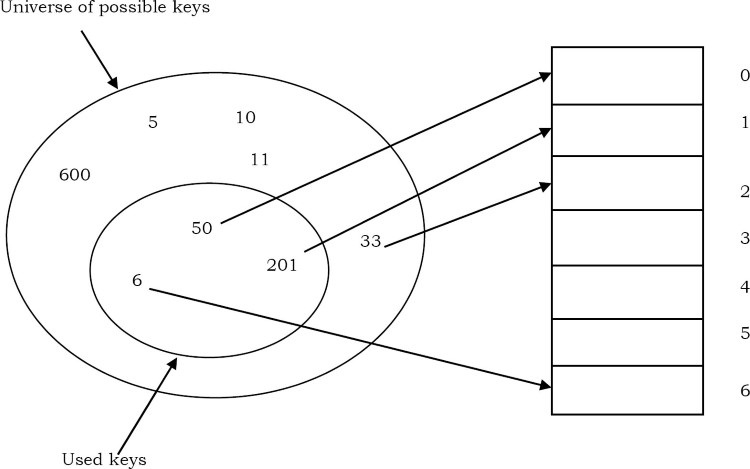
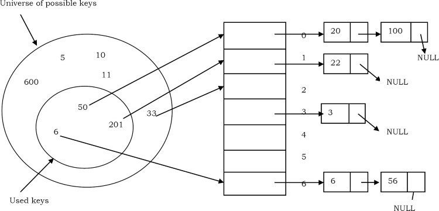
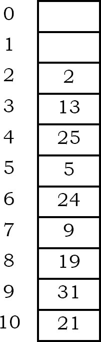
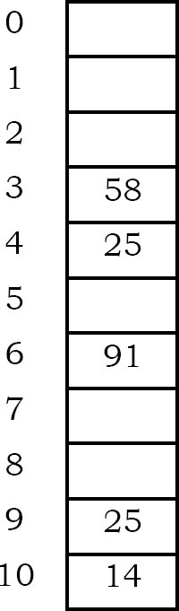
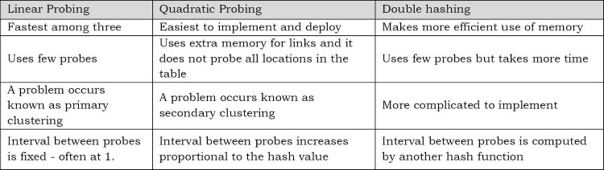

# Hashing

## What is hashing?

Hashing is a technique used for storing and retrieving information as quickly as possible. It is used to perform optimal searches and is useful in implementing symbol tables.

## Why hashing?

In the trees chapter we saw that balanced binary searhc trees support operations such as insert, delete and search in O(logn) time. In applications, if we need these oeprations in O(1), then hashing provides a way. Remembeer that worst case complexity of hashing is still O(n), but it gives O(1) on the average.

## HashTable ADT

The common operation for hash table are:

- CreateHashTable: Creates a new hash table
- HashSearch: Searches the key in hash table
- HashInsert: INserts a new key into hash table
- HashDelete: delets a key from hash table
- DeleteHashTable: Deletes the hash table

## Understanding hashing

In simple terms we can treat array as a hash table. For understanding the use of hash tables, let us consider the following example: Give an algorithm for pritning the first repeated character if there are duplicated element in it. Let us think about the posisble solutions. The simple and brute force way of solvign is: given a string, for each character check whether that character is repeated or not. THe time complexity of this approach is O(n^2) with O(1) space complexity.

Now, let us find a better solution for this problem. Since our objective is to find the first repeated character, what if we remmeber the previous character in some array?

We know that the number of possible characters is 256. Create an array of size 256 and initialize it with all zeros. For each of the input characters go to corresponding position and increment its count. Since we are using arrays, it takes constnat time for reaching any location. While scanning the input if we get a character whose counter is already 1 then we can say that the character is the one which is repeating for the first time.

## Why not arrays?

In the previous problem, we have used an array of size 256 because we know the number of different possible characters [256] in advance. Now, let us consider a slight variant of the same problem. Suppose the given array has numbers instead of characters, then how do we solve the problem?

In this case the set of possible values is infinity. Creating a huge array and storing the counters is not possible. That means there are a set of universal keys and limited location in the memory. If we want to solve this problem we need to somehow map all the possible keys to the possible memory location. From the above discussion and diagram it can be seen that we need a mapping of possible keys to one of the available locations. As a result using simplea rrays is not the correct choice for solving the problems where the possible keys are very big. The process of mapping the keys to locations is called hashing.

## Components of hashing

Hashing has four keys compoenents:

1) Hash table
2) Hash functions
3) Collisions
4) Collison resolution techniques

## Hash table

Hash table is a generalization of array. With an array, we store the element whose key is k at a positon k of the array. That means, given a key k, we find the whose key is k by just looking in the kth position of the array. This is called direct addressing.

Direct addressing is applicable when we can afford to allocate an array with one position for every possible key. but if we do not have enough space to allocate a location for each possible key, then we need a mechanism to handle this case. nother way of defining the scenario is: if we have less locations and more possible keys, then simple array implementations is not enough.

In these cases one option is to use hash tables. Hash table or hash map is a data strucutre that stores the keys and their associated values, and hash table uses a hash function to map keys to their associated values. The general convention is that we use a hash table when the number of keys actually stored is small relative to the number of possible keys.

## Hash function

The hash function is used to transform the key into the index. Ideally, the hash function should map each possible key to a unique slot index, but is is difficult ot achieve in practice.

Given a collection of elements, a hash function that maps each item into a unique slot is referred to as a perfect hash function. If we know the elements and collection will never change, then it is possible to construct a perfect hash function. Unfortunately, given an arbitrary collection of elements, there is no systematic way to construct a perfect hash function. Luckily, we do not need the hash function to be perfect to still gain performance efficiency.

One way to awlays have a perfect hash function is to increase the size of the hash table so taht each possible value in the element range can be accommodated. This guarantees that each element will have a unique slot. Althought this is practical for small numbers of elements, it is not feasible when the number of possible elements is large. For example, if the elements were nine-digit social secuirty numbers, this method would require almost one billion slots. if we only want to store data for a class of 25 students, we will be wasting an enormous amount of memory.

Our goal is to create a hash function that minimizes the number of coolisions, is easy to compute, and evenly distributes the elements in the hash table. There are a number of common ways to extend the simple remainder method. WE will consider a few of them here.

The folding method for constructing hash functions begins by dividing the element into equal size peices. These peices are then added together to give the resulting hash value. For example, if our example was th ephone 436-555-4601, we would take teh digits and divide them into groups os 2. After the addition, we get 210. If we assume our hash table has 11 slots, then we need to perform the extra of dividing by 11 and keeping the remainder. In this case 1, so the phone number hashes to slot 1. Some folding methods go one step further anad reverse every other piece before teh addition.

### How to choose hash function?

The basic problems associated with the creation of hash tables are:

- An efficient hash function should be designed so that it distributes the index values of inserted objects uniformaly across the table.
- An efficient collision resolution algorithm should be designed so that it computes an alternative index for a key whose hash index corresponds to a location previously inserted in the hash table.
- We must choose a hash function which can be calculated quickly, returns values within the range of locations in our table, and minimizes coolisions.

### Characteristics of good hash functions

A good hash function should have the following characteristics:

- Minimize collision
- Be easy and quick to compute
- Distribute key values evenly in the hash table
- Use all the information provided in the key
- Have a high load factor for a given set of keys

## Load factor

The load factor of a non-empty hash table is the number of items stored in the table divided by the size of the table. This is the decision paramter when we want to rehash or expand the existing hash table entries. This also helps us in determining the efficiency of the hashing function. That means, it tell whether the hash function is distributing the keys uniformly or not.

## Collisions

Hash functions are used to map each key to a differnet address space, but practically it is not possible to create such a hash function and the problem is called collision. Collision is the condition where two records are stored in the same location.

## Collisions Resolution techniques

The process of finding an alternate location is called collision resolution. Even though hash table have collision problems, they are more efficient in many cases compared to all other data structures, like search trees. There are a number of collision resolution techniques, and the most popular are direct chaining and open addressing.

- Direct chaining: An array of linked list application
  - Seperate chaining
- Open addressing: Array-based implementaiton
  - Linear probing
  - Quadratic probing
  - Double hashing

## Seperate chaining

Collision resolution by chaining combines linked represnetation with hash table. When two or more records hash to the ame location these records are constituted into singly-linked list called a chain.

## Open Addressing

In open addressing all keys are stored in the hash table itself. This approach is also known as closed hashing. This procedure is based on probing. A collision is resolved by probing.

### Linear probing

THe interval between probes is fixed at 1. In linear probing, we search the hash table sequentially, starting from the original hash location. If a loation is occupied, we check the next location. We wrap around from the last table location to the first table location if necessary. The function for rehashing is the following:

`rehash(key)=(n+1)%tablesize`

One of the problems with linear probing is that table items tend to cluster together in the hash table. This means that the table contains groups of consecutively occupied locations that are called clustering.

Clusters can get close to one another, and merge into a larger cluster. Thus, the one part of the table might be quite dence, even though another part has relatively few items, Clustering causes long probe searches and therefore decreases the overall efficiency.

The next location to be probed is determined by the step-size, where other step-sizes are possible. The step-size should be relatively prime to the table size. If we choose the table size to be a prime number, then any step-size is relatively prime to the table size. Clustering cannot be avoided by larger step-sizes.

### Quadratic probing

The interval between probs increases proportionally to the hash value. The problem of clustering can be eliminated if we use the quadratic probing method.

In quadratic probing, we start from the original hash location i. if a location is occupied, we check the locations i + 1^1, i + 2^2 ... We warp around from the last table location to the first table location if necessary.

`rehash(key)=(n+k^2)&tablesize`

Hash function: key mod 11

Even though clustering is avoided by quadratic probing, still there are chances of clustering. Clustering is caused by multiple search keys mapped to the same hash key. Thus, the probing sequence for such search keys is prolonged by repeated conflicts along the probing sequence. Both linear and quadratic probing use a probing sequence that is independnet of the search key.

### Double hashing

The interval between probs is computed by another hash function. Double hashing reduces clustering in a better way. The increments for the probing sequence are computed by using a second hash function.

We first probe the location h1(key). If the location is occupied, we probe the location h1(key)+h2(key), h1(key)+2 h2(key)+..

## Comparison of coolisoin resolution techniques

### Comparisons: Linear probing vs double hashing

The choice between linear probing and double hashing depends on the cost of computing the hash function and on the load factor of the table. Both use few probes but double hashing take more time between it hashes to compare two hash functions for long keys.

### Comparisons: Open Addressing vs Separate chaining

it is somewhat complicated because we have to account for the memory usage. Seperate chaining uses extra memory for links. Open addressing needs extra memory implicity within the table to terminate the probe sequence. Open addressing hash tables cannot be used if the data does not have unique keys. An alternative is to use seperated chained hash tables.

### Comparison: Open addressing methods

## How hashing gets O(1) complexity

From the previous discussion, one doubts how hashing gets O(1) if multiple elements map to the same location...

The answer to this problem in simple. By using the load factor we make sure that each block on the average stores the maximum number of elements less than the load factor. Also, in practice this factor is a constant.

If the average number of elements in a block is greater than the load factor, we rehash the elements with bigger hash table size. One thing we should rememebr is that we consider average occupancy when deciding the rehash.

The access time of the table depends on the load factor which in turn depends on the hash function. This is because hash function distirbutes the elements to the hash table. For this reason, we say hash table gives O(1) complexity on average. Also, we generally use hash tables in cases where searches are more than insertion and deletion operations.

## Hashing techniques