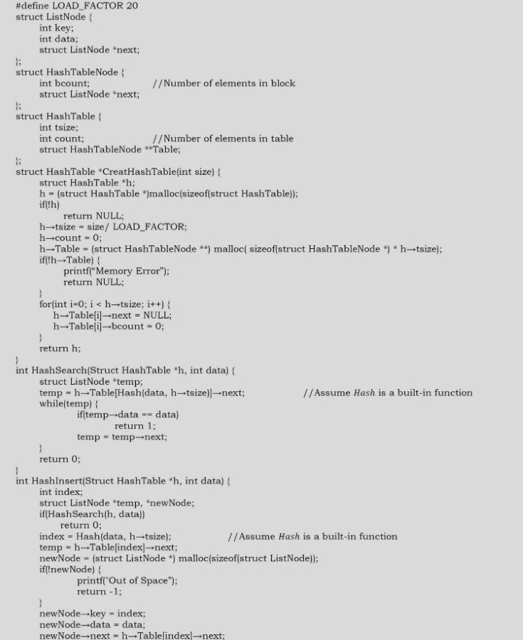
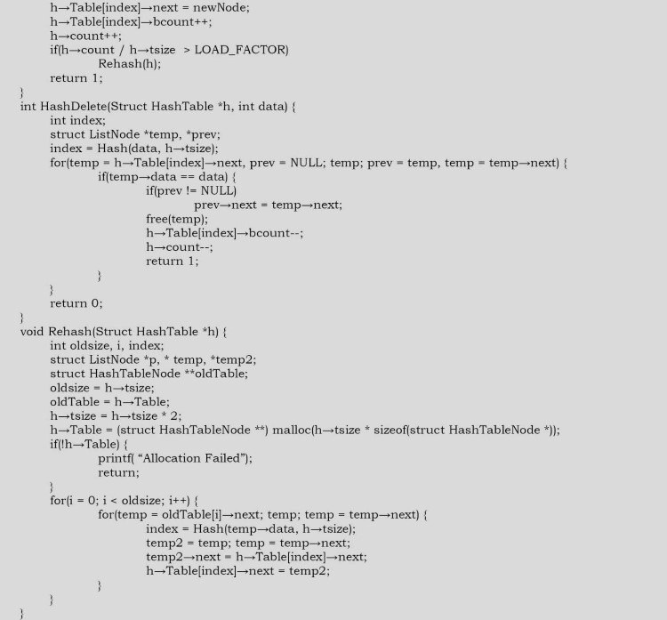

# Problems

### Q1. Implement a separate chaining collision resolution technique. Also, discuss time complexities of each function.

To create a hashtable of vien size, say n, we allocate an array of n/L pointers to list, initialized to NULL. To perform search/insert/delete operations, we first compute the index of the table from the given key by using hashfunction and then do the corresponding operaiton in the linear list maintained at that location. TO get uniform distribution of keys over a hashtable, maintain size as the prime number.




CreateHashTable - (n). HashSearch - O(1) average. HashInsert - O(1) average. HashDelete - O(1) average.

### Q2. Given an array of characters, give an algorithm for removing the duplicates.

Start with the first character and check whether it appears in the remaining part of the string using a simple linear search. If it repeats, bring the last character to that position and decrement the size of the string by one. Continue this process for each distinct character of the given string.

Time complexity: O(n^2)

### Q3. Can we find any other idea to solve this problem in better than O(n^2)? Observe that the order of characters in solutions do not matter.

Use sorting to bring the repeated characters together. Finally scan through the array to remove duplicates in consecutive positions.

```c
int compare(const void*a,const void*b){
    return *(char*)a-*(char*)b;
}
void removeDuplicates(char s[]){
    int last,current;
    quickSort(s,strlen(s),sizeof(char),Compare);
    current=0,last=0;
    for(;s[current];i++){
        if(s[last]!=s[current])
            s[++last]=s[current];
    }
    s[last]='\0';
}
```

Time complexity: O(nlogn)

### Q4. Can we solve this problem in a single pass over given array?

We can use hash table to check whether a character is repeating in the given string or not. If the current character is not available in hash table, then insert it into hash table and keep that character in the given string also. If the current character exists in the hash table then skip that character.

### Q5. Given two arrays of unordered numbers, check whether both arrays have the same set of numbers?

Let us assume that two given arrays are A and B. A simple solution to the given problem is: for each element of A, check whether that element is in B or not. A problem arises with this approach if there are duplicates. For example consider the following inputs:

A = {2,5,6,8,10,2,2}
B = {2,5,5,8,10,5,6}

The above algorithm gives the wrong result because for each element of A there is an element in B also. But is we look at the number of occurrences, they are not the same. This problem we can solve by moving the elements which are already compared to the end of the list. That means, if we find an element in B, then we move that element to the end of B, and in the enxt searching we will not find those elements. But the disadvantage of this is it needs extra swaps.

Time complexity is O(n^2).

### Q6. Can we improve the time complexity of Q5?

Yes. To improve the time complexity, let us assume that we have sorted both the lists. Since the sizes of both arrays are n, we need O(nlogn) time for sorting them. After sorting, we just need to scan both the arrays with two pointers and see whether they point to the same element every time, and keep moving the pointers until we reach the end of the arrays.

Time complexity: O(nlogn)

### Q7. Can we further improve the time complexity of Q5?

Yes, using a hash table. For this, consider the following algorithm.

- Construct the hash table with array A elements as keys.
- While inserting the elements, keep track of the number frequency for each number. That means, if there are duplicates, then incremenet the counter of that corresponding key.
- After constructing the hash tbale for A's elemnets, now scan the array B.
- For each occurrence of B's elements reduce the corresponding counter values.
- At the end, check whether all counters ar zero or not.
- If all counters are zero, then both arrays are the same otherwise the arrays are differnet.

Time complexity: O(n) Space complexity: O(n) for hash table.

### Q8. Given a list of number pairs; if pair(i,j) exists, and pair(i,j) exists, report all such pairs. For example, in {{1,3},{2,6},{3,5},{7,4},{5,3},{8,7}}, we see that {3,5} and {5,3} are present. Report this pair when you encounter {5,3}. WE call such pairs 'symmetric pairs'. So, give an efficient algorithm for finding all such pairs.

By using hashing, we can solve this problem in just one scan. Consider the following algorithm.

- Read the pairs of elements one by one and insert them into the hash table. For each pair, consider the first element as key and the second element as value.
- While inserting the elements, check if the hashing of the second element of the current pair is the same as the first number of the current pair.
- If they are same, then that indicates a symmetric pair exists and output that pair.
- Otherwise, insert that element into that. That means, use the first number of the current pair as key and the second number as value and insert them into the hash table.
- By the time we complete the scanning of all pairs, we have output all the symmetric pairs.

Time complexity: O(n) for scanning the arrays. Note that we are doing a scan only of the input. Space complexity: O(n) for hash table.

### Q9. Given a singly linked list, check whether it has a loop in it or not.

Using hash tables.

- Traverse the linked list nodes one by one.
- Check if the node's address is there in the hash table or not.
- If it is already there in the hash table, that indicates we are visting a node which was already visited. This is possible only if the given linked list has a loop in it.
- If the address of the node is not there is the hash tbale, then isnert that node's address into the hash table.
- Continue this process until we reach the end of the linked list or we find the loop.

Time complexity: O(n). Space complexity: O(n)

### Q10. Given an array of 101 elements. Out of them 50 are distinct, 24 elements are reapted 2 times, and one element is repeated 3 times. Find the element that is repeatead 3 tiems in O(1).

Using hash tables

- Scan the input array one by one
- Check if the element is already there in the hash table or not.
- If it is already there in the hash table, increment its counter value.
- if the element is not there in the hash table, insert that node into the hash table with counter value 1.
- Continue this process until reaching the end of the array.

Time complexity: O(n), because we are doing two scans. Space complexity: O(n), for hash table.

### Q11. Given m sets of integers that have n elements in them, provide an algorithm to find an element which appeared in the maximum number of sets?

Using hash tables

- Scan the input sets one by one.
- For each element keep track of the counter. The counter indicates the frequency of occurrences in all the sets.
- After completing the scan of all the sets, select the one which has the maximum counter value.

Time complexity: O(mn), because we need to scan all the sets. Space complexity: O(mn), for hash table. But, in the worst case all the element may be differnet.

### Q12. Given tow sets A and B, and a number K. Give an algorithm for finding whether there exists a pair of elements, one from A and one from B, that add up to K.

For simplicity, let us assume that the size of A is m and the size of B in n.

- Select the set which has minimum elements.
- For the selected set create a hash table. We can use both key and value as the same.
- Now scan the second array and check whether exists in the hash table or not.
- If it exists then return the pair of elements.
- Otherwise continue until we reach the end of the set.

Time complexity: O(max(m,n)). Space compexity: O(min(m,n))

### Q13. Give an algorithm to remove the specified character from a given string which are given in another string?

For simplicity, let us assume that the maximum number of different characters is 256. First we create an auxiliary array intialized to 0. Scan the characters to be removed, and for each of those character we set the value to 1, which indicates that we need to remove that character.

After initialization, scan the input string, and for each of the characters, we check whether that character needs to be deleted or not. If the flag is set then we simply skip to the next character, otherwise we keep the character in the input string. Continue this process until we reach the end of the input string. All these operation we can do in-place as given below.

Time complexity: Time for scanning the character to be removed + Time for scanning the input array = O(n)+O(m) ~ O(n).

Space complexity: O(m). m =256

### Q14. Give an algorithm for finding the first non-repeated character in a string. For example, the non-repeated character in the string 'abzddab' is 'z'.

The solution to this problem is trivia. For each character in the given string, we can scan the remaining string if that character appears in it. If it doe snot appears then we are done with the solution and we return that character. If the character appears in the rmeianing string, then go the next character. If the character appears in the remaining string, then go to the next character.

Time complexity: O(n^2)

### Q15. Can we improve the time complexity of Q13?

Yes. By using hash table we can reduce the time complexity. Create a hash table by reading all the characters in the input string and keeping count of the number of times each character appears. After creating the hash table, we can read the hash table entries to see which element has a count equal to 1. This approach takes O(n) space but reduces the time complexity also to O(n).

### Q16. Given a string, give an algorithm for finding the first repeating letter in a string?

The soltuion to this problem in somewhat similar to Q13 and Q15. The only difference is, isntead of scanning the hash table twice we can give the answer in just one scan. This is because while inserting into the hash table we can see whether that element already exists or not. if it already exits then we just need to return that character.

Time complexity: O(n) for scanning and creating the hash table. Note that we need only one scan for this problem. So the total time is O(n). Space complexity: O(n) for keeping the count values.

### Q17. Given an array of n elements, create an algorithm which displays all pairs whose sum is S.

This problem is similar to Q12. But instead of using two sets we use only one set.

- Scan the elements of the input array one by one and create a hash table. Both key and value can be the same.
- After creating the hash table, agian scan the input array and check whether exists in the hash table or not.
- If it exists then return the pair of elements.
- Otherwise continue and read all the elemnts of the array.

Time complexity: O(n). Space complexity: O(n)

### Q18. Is there any other way of solving Q17?

Yes. The alternative solution to this problem involves sorting. First sort the input array. After sorting, use two pointers, one at the starting and another at the ending. Each time add the values of both the indexes and see if their sum is euqal to S. If they are equal then print that pair. Otherwise increase the left pointer if the sum is less than S and decrease the right pointer if the sum is greater than S.

Time complexity: O(nlogn)

### Q19. We have a file with millions of lines of data. Only two lines are idential; the rest are unique. Each line is so long that it may not even fit in the memory. What is the most efficient solution for finding the idential lines?

Since a compelte lines may not fit into the main memory, read the line partially and compute the hash from that parital line. Then read the next part of the line and compute the hash. This time use the preivous hash also while computing the new hash vlaue. Continue this process until we find the hash for the complete line. Do this for each line and store all the hash values in a file. If at any point you get same hash value, read the correspoding lines part by part and compare.

Refer to searching chapter for related problems.

### Q20. If h is the hashing function and is used to hash n keys into a talbe of size s, where n<=s, the expect number of collisions involving a particular key X is:
1) Less than 1.
2) Less than n.
3) Less than s.
4) Less than n/2

1.

### Q21. IMplement bloom filters.

A bloom filter is a data structure designed to tell, rapidly and memory-efficiently, whether an element is present in a set. It is based on a probabilistic mechanism where false positive retrievel reuslts are possible, but false negatives are not. At the end we will see how to tune the paramters in order to minimize the number of false positive result.

Let's begin with a little bit of theory. The idea behind the bloom filter is to allocate a bit vector of length m, initially all set to 0, and then choose k independent hash function, h1, h2,...,hk, each with range [1..m]. When an element a is added to the set then the bits at positions h1(a),h2(a),...hk(a) in the bit vector are set to 1. Given a query element q we can test whether it is in the set using the bits at postiions h1(q),h2(q),...,hk(q) in the vector. If any of these bits is 0 we report that q is not in the set otherwise we report that q is. The thing we have to care about is that in the first case there remains some probability that q is not in the set which could lead us to a false postive response.