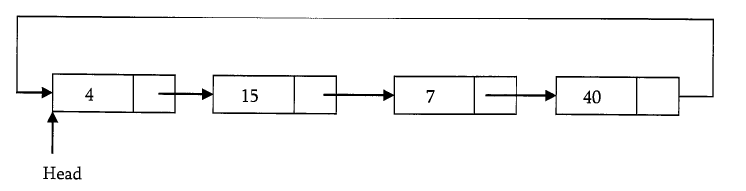

# Circular Linked List

```c
typedef struct CLLNode{
    int data;
    struct ListNode *next;
}
```



### Counting Nodes in a Circular LIst

```c
int CircularListLength(sturct CLLNode*head){
    struct CLLNode*current=head;
    int count=0;
    if(jead===NULL) return0;
    do{
        current=current->next;
        count++;
    }while(current!=head);
    return count;
}
```

Time complexity: O(n)
Space complexity: O(1)