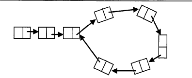

# Problems on Linked List

### Q. Check whether the given linked list is either NULL-termminated or ends in a cycle

```c
void check(LLNode*head){
    struct LLNode*current;
    current=head->next;
    while(current!=head){
        if(current == NULL){
            printf("NULL ended");
            return;
        }
        current=current->next;
    }
    printf("Cyclic");
    return;
}
```
`This only works if the list is fully looped`

---

For solving this kind: 

```c
int isLinkedListContainsLoop(struct ListNode*head){
    struct ListNode*slowPtr = head;
    struct ListNode*fastPtr = head;
    while(slowPtr && fastPtr){
        fastPtr = fastPtr->next;
        if(fastPtr==slowPtr){
            return 1;
        }
        if(fastPtr == NULL){
            return 0;
        }
        fastPtr=fastPtr->next;
        if(fastPtr == slowPtr){
            return 1;
        }
        slowPtr = slowPtr -> next;
    }
    return 0;
}
```

Time complexity: O(n)
Space complexity: O(1)

### Q. Check whether the given linked list is either NULL-terminated or cyclic. If there is a cycle find the start node of the loop

### Q. Check whether the given linked list is either NULL-terminated or not. If there is a cycle, find the length of the loop

### Q. Suppose there are two singly linked lists both of which intersect at some point and become a single linked list. The head or start pointer of both the lists are known, but the intersecting node is not known. Also the number of nodes in each of the lsit ebfore they intersect are unknown and both list may have it different. List1 may have n node before it reaches intersection point and List2 might have m nodes before it reaches intersection point. GIve an algorithm for finding the merging point

##### Solution 1: Using hash tables

- Select a list which is having less number of nodes(If we do not know the lengths beforehand then select one list randomly).
- Now, traverse the other list and for each node pointer of this list check whether the same node pointer exists in the hash table or not.
- If there a merge point for the give lists then we will definitely encounter the node pointer in the hash

Tmie complexity: `Time for creating the hash table` + `Time for scanning the second list` = `O(m) + O(n)`
Space complexity: O(m) or O(n)

##### Solution 2: Using stacks

- Create two stacks: one for the first list and one for the second list.
- Traverse the first list and push all the node address on to the first stack.
- Traverse the second list and push all the node address on to the second stack
- Now both stacks contain the node address of the corresponding lists
- Now, compare the top node address of both stacks
- If they are same, then pop the top elements from both the stacks and keep in some `temp` variable
- Continue this process untill top node addresses of the stacks are not same.
- This point is the one where the list merge into single list.
- Return the value of `temp` variable

Time complexity: O(m+n)
Space complexity: O(m+n)

##### Solution 3: Using "finding the first repeating number" approach in an array

- Create an array A and keep all the next pointers of both the lists in the array.
- In the array find the first repeating element in the array
- The first repeating number indicates the merging point of the both lists

Time complexity: O(m+n)
Space complexity: O(m+n)

##### Solution 4: Combining sorting and search techniques

- Create an array A and keep the next pointer of first list in the array.
- Sort these array elements.
- Then, for each of the second list element, search in the sorted array (binary search).
- Since we are scanning the second list one by one, the first repeating element which appears in the array is merging point.

Time complexity: `Time for sorting` + `Time for searchign` = `O(Max(mlogm,nlogn))`

Space complexity: `O(Max(m,n))`

##### Solution 5: Find diff

- Find length of both list => `O(max(m,n))`
- Take the `diff`
- Make `diff` steps in longer list => `O(d)`
- Steps in both lists in parallel until links to next node match => `O(min(m,n))`

Time complexity: `O(max(m,n))`
Space complexity: `O(1)`

### Q. Find middle of the linked list

```c
struct ListNode*FindMiddle(struct ListNode*head){
    struct ListNode*ptr1,*ptr2;
    ptr1=ptr2=head;
    int i=0;
    while(ptr1->next!=NULL){
        if(i==0){
            ptr1=ptr1->next;
            i=1;
        }
        else if(i == 1){
            ptr1=ptr1->next;
            ptr2=ptr2->next;
            i=0;
        }
    }
    return ptr2;
}
```

Time: O(n)
Space: O(1)

### How will you display a linked list from the end?

```c
void PrintListFromEnd(struct ListNode*head){
    if(!head)return;
    PrintListFromEnd(head->next);
    printf("%d",head->data);
}
```

Time: O(n)
Space: O(n)

### Check whether the given LL length is even or odd?

```c
int isLLEven(struct ListNode*head){
    while(head && head->next){
        head=heat->next->next;
    }
    if(!head) return 0;
    return 1;
}
```

Time: O(n)
Space: O(1)

### Given two sorted LL, we need to merge them into the third list sorted order.

```c
struct ListNode*MergeList(struct ListNode*a,struct ListNode*b){
    struct ListNode*result=NULL;
    if(a==NULL) return b;
    if(b==NULL) return a;
    if(a->data <= b->data){
        result=a;
        result->next=MergeList(a->next,b);
    }else{
        result=b;
        result->next=Mergelist(b->next,a);
    }
    return result;
}
```

Time complexity: `O(m+n)`

### Q. Reverse the linked list in pairs. If you have a linked list that holds 1->2->3->4->X, then after the function has been called the linekd list would hold 2->1->4->3->X.

```c
struct ListNode*PairSwitchList(struct ListNode*list){
    if(list==NULL || list->next == NULL) return list;
    int temp;
    temp=list->data;
    list->data=list->next->data;
    list->next->data=temp;
    list->next->next=PairSwitchList(list->next->next);
    return list;
}
```