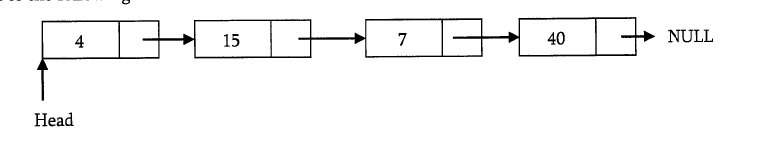

# Singly Linked List

Generally "linked list" means a singly linked list. This list conssits of a number of nodes in which each node has a next pointer to the following elements. The link of the last node in the list is NULL which indicates end of the list.



```c
struct ListNode{
    int data;
    struct ListNode *next;
}
```

### Basic Operations on a list 

- Traversing the list
- Inserting an item in the list
- Deleting an item from the list

### Traversing the list

- Follow the pointer
- Display the contents of the nodes (or count) as they are traversed.
- Stop when the next pointer points to NULL

```c
int ListLength(struct ListNode*head){
    struct ListNode*curren=head;
    int count=0;
    while(current!=NULL){
        count++;
        current=current->next;
    }
    return count;
}
```

Time complexity: O(n)
Space complexity: O(1)

### Singly Linked List Insertion

- Inserting a new node before the head
- Inserting a new node after the tail
- Inserting a new node at a random position

#### Inserting a new node before the head

- Update the next pointer of the new node, to point to the current head
- Update head pointer to point to the new node

#### Inserting a new node after the tail

- New nodes next pointer points to NULL
- Last node next pointer points to the new node

#### Inserting a new node at random place

```c
void insertInLinkedLIst(struct ListNode**head,int data,int position){
    struct ListNode*p,*q;
    struct ListNode*newNode = (ListNode*) malloc(sizeof(struct ListNode));
    if(!newNode){
        printf("Memory error");
        return;
    }
    newNode->data=data;
    p=*head;
    if(position == 1){
        newNode->next=p;
        *head = newNode;
    }else{
        int k=1;
        while((p!=NULL) && (k<position-1)){
            k++;
            q=p;
            p=p->next;
        }
        if(p==NULL){
            q->next = newNode;
            newNode->next=NULL;
        }else{
            q->next = newNode;
            newNode->next =p;
        }
    }
}
```

Time Complexity: O(n)
Space comeplexity: O(1)

### Singly Linked List Deletion

- Deleting the first node
- Deleting the last node
- Deleting an intermediate node

```c
void DeleteNodeFromLinkedList(struct ListNode*head,int position){
    int k=1;
    struct ListNode *p,*q;
    if(*head==NULL){
        return;
    }
    p=*head;
    if(position==1){
        *head = *head->next;
        free(p); // Delete the head object
        return;
    }else{
        while((p!=NULL) && (k<position-1>)){
            k++;
            q=p;
            p=p->next;
        }
        if(p==NULL){
            return;
        }else{
            q->next = p->next;
            free(p);
        }
    }
}
```

Time complexity: O(n)
Space complexity: O(1)

#### Deleting the whole list

```c
void DeleteLinkedList(struct ListNode**head){
    struct ListNode*auxilaryNode, *iterator;
    iterator=*head;
    while(iterator){
        auxilaryNode = iterator -> next;
        free(iterator);
        iterator = auxilaryNode;
    }
    *head = NULL;
}
```

Time complexity: O(n)
Space complexity: O(1)