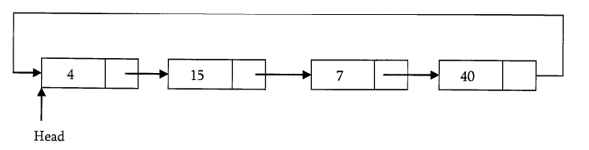

# Linked List

### Advantages of Linked list

#### They can be expanded in constant time. 

To create an array we must allocate memory for a certain number of elements. To add more elemnts to the array then we must create a new array and copy the old array into the new array.

We can prevent this by allocating lots of space initally but then you might allocate more than you need and wasting memory. With a linked list we can start with space for just one element allocated and add on new elements easily without the need to do any copying and reallocating

### Disadvantage

#### Access Time

Array is random-access, which means it takes O(1) to acess any element in the array. Linked lists takes O(n) for access to an element in the list in worst case. Another advantage of arrays in access time is special locality in memory. Arrays are defined as contiguous blocks of memory, and so any array element will be physically near its neighbors. This greatly benefits from modern CPU caching methods.

Althought the dynamic allocation of storage is a great advantage, the overhead with storing and retrieving data can make a big difference. Sometimes linked list are hard to manipulate. If the last item is deleted, the last but one must now have its pointer changed to hold a NULL reference. This required that the list is traversed to find the last but one link, and its pointer set to a NULL reference. Finally, linked lists wastes memory in terms of extra reference points

# Singly Linked List

Generally "linked list" means a singly linked list. This list conssits of a number of nodes in which each node has a next pointer to the following elements. The link of the last node in the list is NULL which indicates end of the list.


```c
struct ListNode{
    int data;
    struct ListNode *next;
}
```

### Basic Operations on a list 

- Traversing the list
- Inserting an item in the list
- Deleting an item from the list

### Traversing the list

- Follow the pointer
- Display the contents of the nodes (or count) as they are traversed.
- Stop when the next pointer points to NULL

```c
int ListLength(struct ListNode*head){
    struct ListNode*curren=head;
    int count=0;
    while(current!=NULL){
        count++;
        current=current->next;
    }
    return count;
}
```

Time complexity: O(n)
Space complexity: O(1)

### Singly Linked List Insertion

- Inserting a new node before the head
- Inserting a new node after the tail
- Inserting a new node at a random position

#### Inserting a new node before the head

- Update the next pointer of the new node, to point to the current head
- Update head pointer to point to the new node

#### Inserting a new node after the tail

- New nodes next pointer points to NULL
- Last node next pointer points to the new node

#### Inserting a new node at random place

```c
void insertInLinkedLIst(struct ListNode**head,int data,int position){
    struct ListNode*p,*q;
    struct ListNode*newNode = (ListNode*) malloc(sizeof(struct ListNode));
    if(!newNode){
        printf("Memory error");
        return;
    }
    newNode->data=data;
    p=*head;
    if(position == 1){
        newNode->next=p;
        *head = newNode;
    }else{
        int k=1;
        while((p!=NULL) && (k<position-1)){
            k++;
            q=p;
            p=p->next;
        }
        if(p==NULL){
            q->next = newNode;
            newNode->next=NULL;
        }else{
            q->next = newNode;
            newNode->next =p;
        }
    }
}
```

Time Complexity: O(n)
Space comeplexity: O(1)

### Singly Linked List Deletion

- Deleting the first node
- Deleting the last node
- Deleting an intermediate node

```c
void DeleteNodeFromLinkedList(struct ListNode*head,int position){
    int k=1;
    struct ListNode *p,*q;
    if(*head==NULL){
        return;
    }
    p=*head;
    if(position==1){
        *head = *head->next;
        free(p); // Delete the head object
        return;
    }else{
        while((p!=NULL) && (k<position-1>)){
            k++;
            q=p;
            p=p->next;
        }
        if(p==NULL){
            return;
        }else{
            q->next = p->next;
            free(p);
        }
    }
}
```

Time complexity: O(n)
Space complexity: O(1)

#### Deleting the whole list

```c
void DeleteLinkedList(struct ListNode**head){
    struct ListNode*auxilaryNode, *iterator;
    iterator=*head;
    while(iterator){
        auxilaryNode = iterator -> next;
        free(iterator);
        iterator = auxilaryNode;
    }
    *head = NULL;
}
```

Time complexity: O(n)
Space complexity: O(1)

# Doubly Linked List

```c
struct DLLNode{
    int data;
    struct DLLNode *next;
    struct DLLNode *prev;
}
```

### Doubly Linked List Insertion

- Inserting a new node before the head.
- Inserting a new node after the tail.
- Inserting a new node at middle of list.


```c
void DLLInsert(struct DLLNode**head,int data,int position){
    int k=1;
    struct DLLNode*temp,*newNode;
    newNode=(struct DLLNode*) malloc(sizeof(struct DLLNode));
    if(!newNode){
        return;
    }
    newNode->data=data;
    if(postion==1){
        newNode->next=*head;
        newNode->prev=NULL;
        *head->prev=newNode;
        *head=newNode;
        return;
    }
    temp=*head;
    while((k<position-1>) && temp->next!=NULL){
        temp = temp->next;
        k++;
    }
    if(temp->next==NULL){
        nextNode->next=temp->next;
        newNode->prev=temp;
        temp->next=newNode;
    }else{
        newNode->next=temp->next;
        newNode->prev=temp;
        temp->next->prev=newNode;
        temp->next=newNode;
    }
    return;
}
```

Time Complexity: O(n)
Space Complexity: O(1)

### Double Linked List Deletion

```c
void DLLDelete(struct DLLNode**head,int position){
    struct DLLNode*temp,*temp2;
    temp=*head;
    int k=1;
    if(*head==NULL){
        return;
    }
    if(postion==1){
        *head=*head->next;
        if(*head!=NULL){
            *head->prev=NULL;
        }
        free(temp);
        return;
    }
    while((k<position-1) && temp->next!=NULL){
        temp=temp->next;
        k++;
    }
    if(temp->next==NULL){
        temp2=temp->prev;
        temp2->next=NULL;
        free(temp);
    }else{
        temp2=temp->prev;
        temp2->next=temp->next;
        temp->next->prev=temp2;
        free(temp);
    }
    return;
}
```

Time complexity: O(n)
Space Complexity: O(1)

# Circular Linked List

```c
typedef struct CLLNode{
    int data;
    struct ListNode *next;
}
```



### Counting Nodes in a Circular LIst

```c
int CircularListLength(sturct CLLNode*head){
    struct CLLNode*current=head;
    int count=0;
    if(jead===NULL) return0;
    do{
        current=current->next;
        count++;
    }while(current!=head);
    return count;
}
```

Time complexity: O(n)
Space complexity: O(1)

# Memory-efficient Doubly Linked List

```c
typedef struct ListNode{
    int data;
    struct ListNode*ptrdiff;
}
```

The ptrdiff pointer field contains the difference between the pointer to the next node and the pointer to the previous node. POinter difference is calcualted by using X-OR operation.

# Problems on Linked List

<details>
<summary><h3 style="display:inline">Check whether the given linked list is either NULL-termminated or ends in a cycle</h3></summary>

```c
void check(LLNode*head){
    struct LLNode*current;
    current=head->next;
    while(current!=head){
        if(current == NULL){
            printf("NULL ended");
            return;
        }
        current=current->next;
    }
    printf("Cyclic");
    return;
}
```
`This only works if the list is fully looped`

---

For solving this kind: 

```c
int isLinkedListContainsLoop(struct ListNode*head){
    struct ListNode*slowPtr = head;
    struct ListNode*fastPtr = head;
    while(slowPtr && fastPtr){
        fastPtr = fastPtr->next;
        if(fastPtr==slowPtr){
            return 1;
        }
        if(fastPtr == NULL){
            return 0;
        }
        fastPtr=fastPtr->next;
        if(fastPtr == slowPtr){
            return 1;
        }
        slowPtr = slowPtr -> next;
    }
    return 0;
}
```

Time complexity: O(n)
Space complexity: O(1)

</details>

### Q. Check whether the given linked list is either NULL-terminated or cyclic. If there is a cycle find the start node of the loop.

### Q. Check whether the given linked list is either NULL-terminated or not. If there is a cycle, find the length of the loop

<details>
    <summary><h3 style="display:inline">Suppose there are two singly linked lists both of which intersect at some point and become a single linked list. The head or start pointer of both the lists are known, but the intersecting node is not known. Also the number of nodes in each of the lsit ebfore they intersect are unknown and both list may have it different. List1 may have n node before it reaches intersection point and List2 might have m nodes before it reaches intersection point. GIve an algorithm for finding the merging point.</h3></summary>


Solution 1: Using hash tables
---
- Select a list which is having less number of nodes(If we do not know the lengths beforehand then select one list randomly).
- Now, traverse the other list and for each node pointer of this list check whether the same node pointer exists in the hash table or not.
- If there a merge point for the give lists then we will definitely encounter the node pointer in the hash

Tmie complexity: `Time for creating the hash table` + `Time for scanning the second list` = `O(m) + O(n)`
Space complexity: O(m) or O(n)

Solution 2: Using stacks
---

- Create two stacks: one for the first list and one for the second list.
- Traverse the first list and push all the node address on to the first stack.
- Traverse the second list and push all the node address on to the second stack
- Now both stacks contain the node address of the corresponding lists
- Now, compare the top node address of both stacks
- If they are same, then pop the top elements from both the stacks and keep in some `temp` variable
- Continue this process untill top node addresses of the stacks are not same.
- This point is the one where the list merge into single list.
- Return the value of `temp` variable

Time complexity: O(m+n)
Space complexity: O(m+n)

Solution 3: Using "finding the first repeating number" approach in an array
---

- Create an array A and keep all the next pointers of both the lists in the array.
- In the array find the first repeating element in the array
- The first repeating number indicates the merging point of the both lists

Time complexity: O(m+n)
Space complexity: O(m+n)

Solution 4: Combining sorting and search techniques
---

- Create an array A and keep the next pointer of first list in the array.
- Sort these array elements.
- Then, for each of the second list element, search in the sorted array (binary search).
- Since we are scanning the second list one by one, the first repeating element which appears in the array is merging point.

Time complexity: `Time for sorting` + `Time for searchign` = `O(Max(mlogm,nlogn))`

Space complexity: `O(Max(m,n))`

Solution 5: Find diff
---

- Find length of both list => `O(max(m,n))`
- Take the `diff`
- Make `diff` steps in longer list => `O(d)`
- Steps in both lists in parallel until links to next node match => `O(min(m,n))`

Time complexity: `O(max(m,n))`
Space complexity: `O(1)`

</details>

### Find middle of the linked list

```c
struct ListNode*FindMiddle(struct ListNode*head){
    struct ListNode*ptr1,*ptr2;
    ptr1=ptr2=head;
    int i=0;
    while(ptr1->next!=NULL){
        if(i==0){
            ptr1=ptr1->next;
            i=1;
        }
        else if(i == 1){
            ptr1=ptr1->next;
            ptr2=ptr2->next;
            i=0;
        }
    }
    return ptr2;
}
```

Time: O(n)
Space: O(1)

### How will you display a linked list from the end?

```c
void PrintListFromEnd(struct ListNode*head){
    if(!head)return;
    PrintListFromEnd(head->next);
    printf("%d",head->data);
}
```

Time: O(n)
Space: O(n)

### Check whether the given LL length is even or odd?

```c
int isLLEven(struct ListNode*head){
    while(head && head->next){
        head=heat->next->next;
    }
    if(!head) return 0;
    return 1;
}
```

Time: O(n)
Space: O(1)

### Given two sorted LL, we need to emrge them into the third list sorted order.

