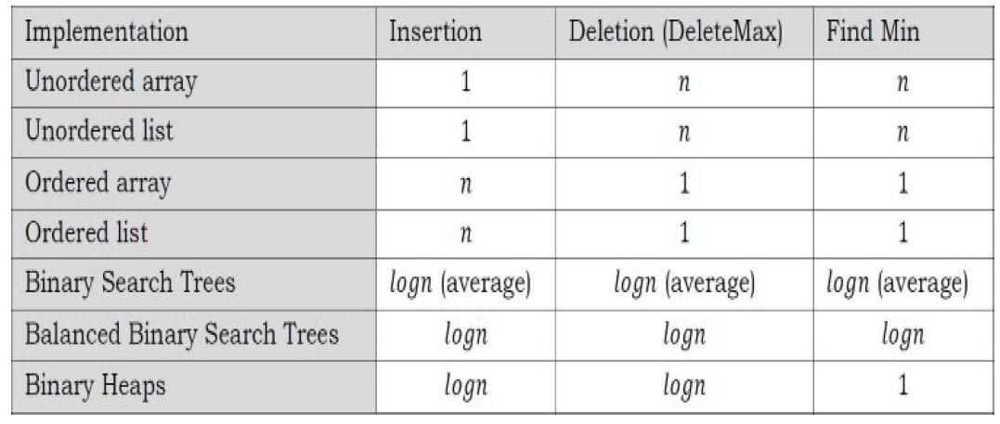
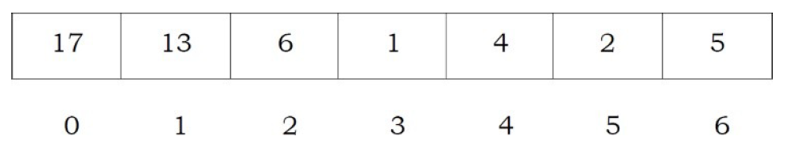
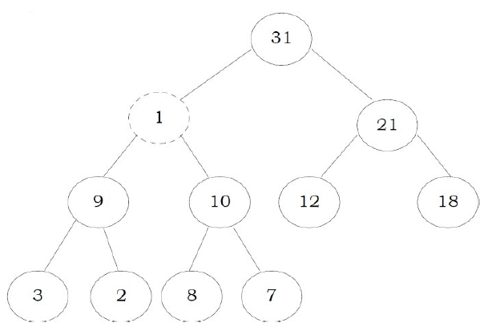
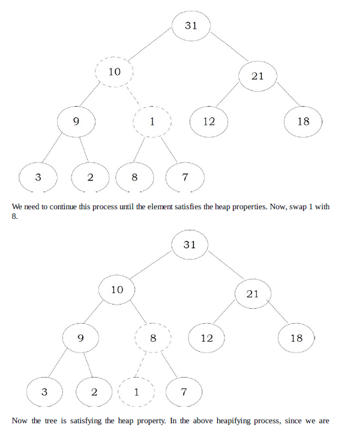
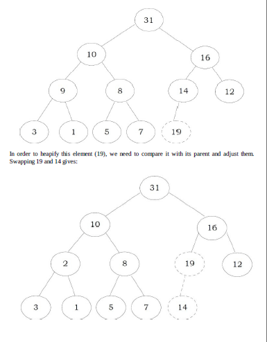
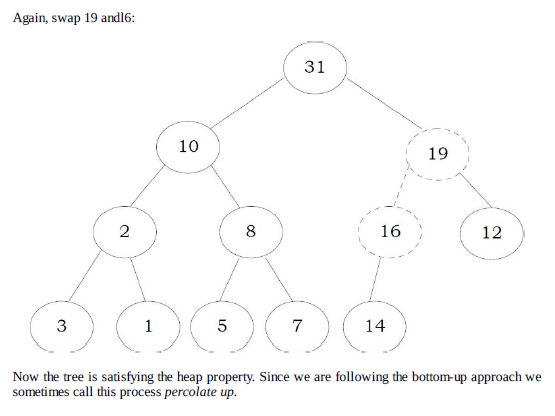
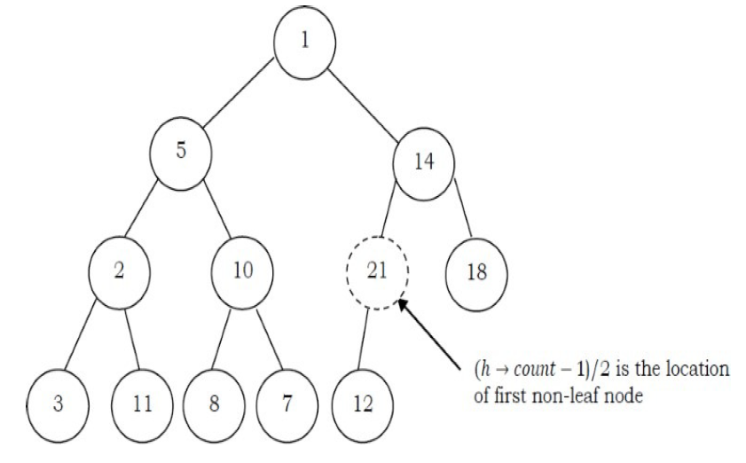

# Priority Queues and Heaps

## What is Priority Queue?

In some situations we may need to find the minimum/maximum element among a collection of element. We can do this with the help of Priority Queue ADT. A priority queue ADT is a data structure that supports the operations Insert and DeleteMin (which returns and removes the minimum element) or DeleteMax(which returns and removes the maximum element).

These operations are equivalent to EnQueue and DeQueue operations of a queue. The difference is that, in priority queues, the order in which the elements enter the queue may not be the same in which they were processed. An example application of a priority queue is job scheduling, which is prioritized instead of serving in first coem first serve.

A priority queue is called an ascending - priority queue, if the item with the smallest key has the highest priority (that means, delete the smallest element always.) Similarly, a priority queue is said to be descending priority queue if the item with the largest key has the highest priority (delete the maximum element always). Since these two types are symmetric we will be concentrating on one of them:ascending-priority queue.

## Priority Queue ADT

The following operations make priority queues an ADT

### Main priority queues operations

A priority queue is a container of elements, each having an associated key.

- insert(key,data): inserts data with key to the priority queue. Elements are ordered based on key.
- deleteMin/deleteMax: remove and return the element with the smallest/largest key.
- getMin/getMax: return the element with smallest/largest key without deleting it

### Auxiliary Priority Queues Operations

- kth- smallest/kth - largest: Returns the kth-smallest/kth-largest key in priority queue.
- size: returns number of elements in priority queue.
- Heap sort: sorts the element in the priority queue based on priority (key)

## Priority Queue applications

Priority queues have many application - a few of them are listed below:

- Data compression: Huffman coding algorithm
- Shortest path algorithm: Dijkstra's algorithm
- Minimum spanning tree algorithms: Prim's algorithm
- Event-driven simulation: customers in a line
- Selection problem: Finding kth-smallest element

## Priority Queue implementations

Before discussing the actual implementations, let us enumerate the possible options.

### Unordered array implemnetation

Elements are inserted into the array without bothering about the order. Deletions (deleteMax) are performed by searching the key and then deleting.

### Unorder List implementation

It is very similar to array implementation, but instead of using arrays, linked lists are used.

### Order array implementaiton

Elements are inserted into the array in sorted order based on key field. Deletions are performed at only one end.

### Ordered List implementation

Elements are isnerted into the list in sorted order based on key field. Deletions are performed at only one end, hence preserving the status of the priority queue. All other functionalities associated with a linked list ADT are performed without modifications

### Binary Search Tree implementation

Both insertions and deletions take O(logn) on average if isnertions are random

### Balanced Binary Search Tree implementation

Both insertions and deletion take O(logn) in the worst case

### Binary Heap implementaiton

IN subsequent sections we will discuss this in full detail. For now, assume that binary heap implementation gives O(logn) complexity for search, insertions and deletions and O(1) for finding the maximum or minimum element.

### Comparing Implementations



## Heaps and Binary Heaps

### What is heap?

A heap is a tree with some special properties. The basic requirement of a heap is that the value of a node must be greater than equal to or less than equal than the values of its children. This is called heap property. A heap also has the additional property that all leaves should be at h or h-1 levels for some h>0. That means heap should form a complete binary tree.

### Types of Heaps?

- Min heap: the value of a node must be less than or equal to the values of its children
- Max heap: The vlaues of a node must be greater than or equal to the values of its children

## Binary Heaps

In binary heap each node may have up to two children. In practice, binary heaps are enough and we concentrate on binary min heaps and binary max heaps for the remaining discussion.

**Representing heaps**: Before looking at heap operations, let us see how heaps can be represented. One possibility is using arrays. Since heaps are forming compelte binary tree, there will not be any wastage of locations. For the discussion below let us assume that elements are stored in arrays, which starts at index 0. The previous max heap can be represented as:



### Declaration of heap

```c
struct Heap{
    int *array;
    int count;
    int capacity;
    int heap_type;
}
```

### Creating Heap

```c
struct Heap*createHeap(int capacity,int heap_type){
    struct Heap*h=(struct Heap*)malloc(sizeof(struct Heap));
    if(h==NULL) return;
    h->heap_type=heap_type;
    h->count=0;
    h->capacity=capacity;
    h->array=(int*)malloc(sizeof(int))*h->capacity;
    if(h->array==NULL) return;
    return h;
}
```

### Parent of a node

For a node at ith location, its parent is at (i-1)/2 location. In the preivous example, the element 6 is at second location and its parent is at 0th location.

```c
int parent(struct Heap*h,int i){
    if(i<=0 || i>=h->count) return -1;
    return (i-1)/2;
}
```

### Children of a node

Similar to the above discussion, for a node at ith location its children are at 2\*i+1 and 2\*i+2 locations.

### Getting the maximum elemnet

Since the maximum element in max heap is always at root, it will be stored at `h->array[0]`

### heapifying an element

After inserting an element into heap, it may not satisfy the heap property. In that case we need to adjust the locations of the heap to make it heap again. This process is called heapifying. In max-heap, to heapify an element, we have to find the maximum of its children and swap it with the current element and continue this process until the heap property is satisifed at every node.



**Observation**: One important property of heap is that, if an element is not satisfying the heap property, then all the elements from that element to the root will have the same problem. In the example below, element 11 is not satisfying the heap property and its parent 31 is also having the issue. Similarly, if we heapify an element, then all the elements from that element to the root will also satisfy the heap property automatically.

To heapify 1, find the maximum of its children and swap with that.



```c
void percolateDown(struct Heap*h,int i){
    int l,r,max,temp;
    l=leftChild(h,i);
    r=rightChild(h,i);
    if(l!=-1 && h->array[l] > h->array[i]) max=l;
    else max=i;
    if(r!=-1 && h->array[r] > r->array[max]) max=r;
    if(max!=i){
        swap(h->array[i],h->array[max]);
    }
    percolateDown(h,max);
}
```

### Deleting an element

To delete an element from heap,we just need to delete the element from the root. This is the only operation (maximum element) supported by standard heap. After deleting the root element, copy the last element of the heap (tree) and delete that last element.

After replacing the last element, the tree may not satisfy the heap property. To make it heap again, call the percolateDown funciton

- copy the first element into some variable
- copy the last element in first element location
- percolateDown the first element

```c
int deleteMax(struct Heap*h){
    int data;
    if(h->count==0) return -1;
    data=h->array[0];
    h->array[0]=h->array[h->count-1];
    h->count--;
    percolateDown(h,0);
    return data;
}
```

### Inserting an element

Insertion of an element is similar to the heapify and deletion process.
- Increase the heap size
- Keep the new element at the end of the heap
- Heapify the element from bottom to top

Before going through code, let us look at an example. We have inserted the element 19 at the end of the heap and this is not satisfying the heap property.




```c
int insert(struct Heap*h,int data){
    int i;
    if(h->count==h->capacity) resizeHeap(h);
    h->count++;
    i=h->count-1;
    while(i>=0 && data>h->array[(i-1)/2]){
        h->array[i]=h->array[(i-i)/2];
        i=(i-1)/2;
    }
    h->array[i]=data;
}
void resizeHeap(struct Heap*h){
    int *array_old=h->array;
    h->array=(int*)malloc(sizeof(int)*h->capacity*2);
    if(h->array ==NULL) return;
    copy(array_old[0],array_old[h->capacity-1],h->array);
    free(array_old);
}
```

### Destroying Heap

```c
void destroyHeap(struct Heap*h){
    if(h==NULL) return;
    free(h->array);
    free(h);
    h=NULL;
}
```

### Heapifying the array

One simple approach for building the heap is, take n input items and place them into an empty heap. This can be done with n successive inserts and tkaes O(nlogn) in the worst case. This is due to the fact that each insert operations takes O(logn)

To finish our discussion of binary heaps, we will look at a method to build an entire heap from a list of keys. The first method you might think of may be like the following. Given a list of keys, you could easily build a heap by isnerting each key one at a time. Since you are starting with a list of one item, the list is sorted and you could use binary search to find the right position to insert the next key at a cost of approximately O(logn) operations.

However, remember that inserting an item in the middle of the list may required O(n) operations to shift the rest of the list over to make room for the new key. Therefore, to insert n keys into the heap would require a total of O(nlogn) operations. However, if we start with an entire list then we can build the whole heap in O(n) operations.

**Observation**: Leaf nodes always satisfy the heap property and do not need to care for them. The leaf elements are always at the end and to heapify the given array it should be enough if we hapify the non-leaf nodes. Now let us concentrate on finding the first non-leaf node. The last element of the heap is at location h->count-1, and to find the first non-leaf node it is enough to find the parent of the last element.



```c
void buildHeap(struct Heap*h,int A[],int n){
    if(h==NULL) return;
    while(n>h->capacity) resizeHeap(h);
    copy(A[0],A[n-1],h->array);
    h->count=n;
    for(int i=(n-1)/2;i>=0;i--) percolateDown(h,i);
}
```

## Heapsort

One main application of heap ADT is sorting. The heap sort algorithm inserts all elements into a heap, then removes them from the root of a heap until the heap is empty. Note that heap sort canbe done in place with the array to be sorted. Instead of deleting an element, exchange the first element with the last element and reduce the heap size. Then,we heapify the first element. Continue this process until the number of reminaing elements is one.

```c
void Heapsort(int A[],int n){
    struct Heap*h=createHeap();
    int old_size,i,temp;
    buildHeap(h,A,n);
    old_size=h->count;
    for(i=n-1;i>0;i--){
        swap(h->array[0],h->array[h->count-1]);
        h->acount--;
        percolateDown(h,0);
    }
    h->count=old_size;
}
```