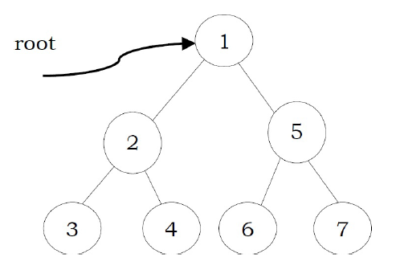
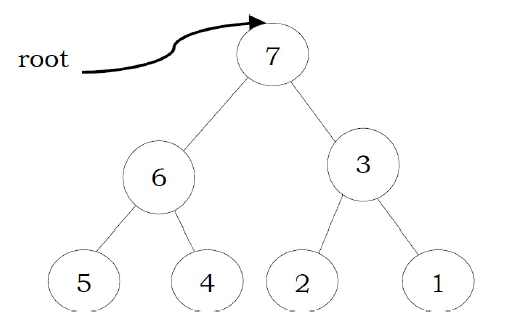
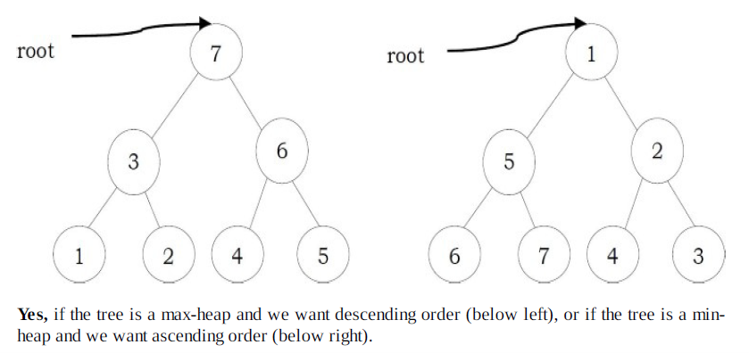
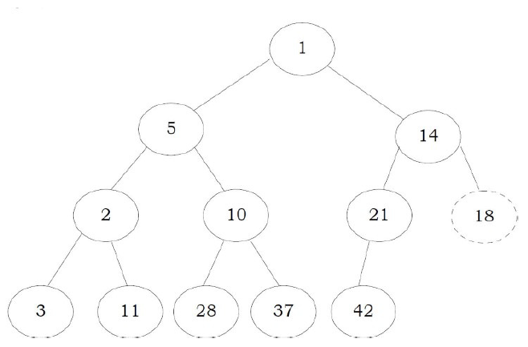
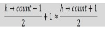
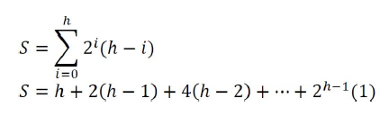
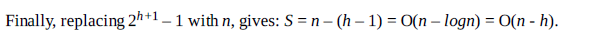

# Priority Queues [Heaps]: Problems & Solutions

### Q1. What are the minimum and maximum number of elemnets in a heap of height h?

Since heap is a complete binary tree, it has at most 2^(h+1) -1 elements. This is because, to get maximum nodes, we need to fill all the h levels completley and the maximum number of nodes is nothing but the sum of all nodes at all h levels.

To get minimum nodes, we should fill the h-1 levels fully and the last level with only on element. As a result, the minimum number of nodes is nothing but the sum of all nodes from h-1 levels plus 1 and we get 2^h elements

### Q2. Is there a min-heap with seven distinct elements so that the preorder traversal of it gives the elements in sorted order?

Yes. For the tree below, preorder traversal produces ascending order.


### Q3. Is there a max-heap with seven distinct elements so that the preorder traversal of it gives the elements in sorted order?

Yes. For the tree below, preorder traversal produces descending order.


### Q4. Is there a min-heap/max-heap with seven distinct elemnets so that the inorder traversal of it gives the elements in sorted order?

No. Since a heap must be either a min-heap or a max-heap, the root will hold the smallest element or the largest. An inorder traversal will visit the root of the tree as its second step, which is not the appropriate place if the tree's root contains the smallest or largest element.

### Q5. Is there a min-heap/max-heap with seven distinct elements so that the postorder traversal of it gives the elemnets in sorted order?



### Q6. Show that the height of a heap with n elements is logn?

A heap is a complete binary tree. All the levles, except the lowest, are completley full. A heap has at least 2^h elements and at most elements 2^h < n < 2^(h+1)-1. This implies, h=logn

### Q7. Given a min-heap, give an algorithm for finding the maximum element.

For a given min heap, the maximum element will always be at leaf only. Now, the next question is how to find the leaf nodes in the tree.



If we carefully observe,the next node of the last element's parent is the first leaf node. Since the last element is always at the h->count-1th location, the next node of its parent can be calculared as:



Now, the only step remaining is scanning the leaf nodes and finding the maximum among them.

```c
int findMaxInMinHeap(struct Heap*h){
    int Max=-1;
    for(int i=(h->count+1)/2;i<h->count;i++){
        if(h->array[i]>Max) Max=h->array[i];
    }
}
```

### Q8. Give an algorithm for deleting an arbitrary element from min heap

To delete an element, first we need to search for an element. Let us assume taht we are using level order traversal for finding the element. After finding the element we need to fllowing the deleteMin process.

### Q9. Give an algorithm for deleting the ith indexed element in a given min-heap.

```c
int delete(struct Heap*h,int i){
    int key;
    if(n<i) return;
    key=h->array[i];
    h->array[i]=h->array[h->count-1];
    h->count--;
    precolateDown(h,i);
    return key;
}
```

### Q10. Prove that, for a compelte binary tree of height h of sum of the height of all nodes is O(n-h).

A compelte binary tree has 2^i nodes on level. Also, a node on level i has depth i and height h-i. Let us assume that S denotes the sum of the heights of all these nodes and S can be calculated as:



Multiplying with 2 on both sides gives: 2S=2h+4(h-1)+8(h-2)+...+2^(h-1) (1)

h=log(n+1)



### Q11. Give an algorithm to find all elements less than some value of k in a binary heap.

Start from the root of the heap. If the value of the root is smaller than k then print its value and call recursively once for its left child and once for its right child. If the value of a node is greater or equal than k then the function stops without printing that value.

The complexity of this algorithm is O(n), where n is the total number of nodes in the heap. This bound takes place in the worst case, where the value of every node in the heap will be smaller than k, so the function has to call each node of the heap.

### Q12. Give an algorithm for merging two binary max-heaps. Let us assume that the size of the first heap is m+n and the size of the second heap is n.

One simple way of solving this problem is:
- Assume that the elements of the first array (with size m+n) are at the beginning. That means, first m cells are filled and remaining n cells are empty.
- Without changing the first heap, just append the second heap and heapify the arrays.
- Since the total number of elements in the new array is m+n, each heapify operation takes O(log(m+n))

The complexity of this algorithm is : O((m+n)log(m+n))

### Q13. Can we improve the complexity of problem-12?

Instead of heapifying all the elements of the m+n array, we can use the technique of "building heap with an array of elements". We can start with non-leaf nodes and heapify them. The algorithm can be given as:

- Assume that the elements of the first array (with size m+n) are at the beginning. That means, first m cells are filled and the remaining n cells are empty.
- Without changing the first heap, just append the second heap.
- Now, find the first non-leaf node and start heapifying from that element.

### Q14. Is there an efficient algorithm for merging 2 max-heaps (stored as an array)?

The alternative solution for this problem depends on what type of heap it is. If it's a standard heap where every node has up to two children and which gets filled up so that the leaves are on a maximum of two different rows, we cannot get better than O(n) for the merge.

There is an O(logm x logn) algorithm for merging two binary heaps with sizes m and n. For m=n.

For better merging performance, we can use another variant of binary heap like a Fibonacci-Heap which can merge in O(1) on average (amortized)

### Q15. Give an algirhtm for finding kth smallest element in min-heap.

One simple solution to this problem is: perform deletion k times from min-heap

```c
int kthSmallest(Heap*h){
    for(int i=0;i<k;i++){
        deleteMin(h);
    }
    return deleteMin(h);
}
```

Time complexity: O(klogn)

### Q16. For problem-15, can we improve the time complexity?

Assume that the original min-heap is called HOrig and the auxiliary min-heap is named HAux. Initially, the element at the top of HOrig, the minimum one, is inserted into HAux. Here we don't do the operation of deleteMin with HOrig.

```c
Heap HOrig;
Heap HAux;
int findKthLargest(int k){
    int heapElement;
    int count=1;
    HAux.insert(HOrig.Min());
    while(true){
        heapElement=HAux.deleteMin();
        if(++count==k) return heapElement;
        else{
            HAux.insert(heapElement.leftChild());
            HAux.insert(heapElement.rightChild());
        }
    }
}
```

Every while-loop iteration gives the kth smallest element and we need k loops to get the kth smallest elements. Because the size of the auxiliary heap is awlays less than k, every while-loop iteration the size of auxiliary heap increases by one, and original heap HOrig has no operation during the finding, the running time is O(klogk).

Note: the above algorithm is useful if the k value is too small compared to n. If the k value is approximately equal to n, then we can simply sort the array and return kth smallest element from the sorted array. This gives O(n) solution.

### Q17. Find k max elements from max heap.

One simple solution to this problem is: build max-heap and perform deletion k times.

O(klogn)

### Q18. For problem-17, is there any alternative solution?

We can use the problem-16 solution. At the end, the auxiliary heap contains the k-largest elements. Without deleting the elements we should keep on adding elements to HAux.

### Q19. How do we implement a stack using heap?

To implement a stack using a priority queue(min heap), let us assume that we are using one extra integer variable c. Also, assume that c is initialized equal to any known value. The implementation of the stack ADT is given below. Here c is used as the priority while inserting/deleting the element from PQ.

```c
void push(int element){
    PQ.insert(c,element);
    c--;
}
int pop() return PQ.deleteMin();
int top() return PQ.min();
int size() return PQ.size();
int isEmpty() return PQ.isEmpty();
```

We could use the negative of the current system time instead of c.

### Q20. How do we implement Queue using heap?

To implement a queue using a priority queue (min heap), as similar to stacks simulation, let us assume that we are using one extra integer variable, c. Also, assume that c is initialized equal to any know value. The implementaiton of the queue ADT is given below.

Same as Q19 but instead c increases.