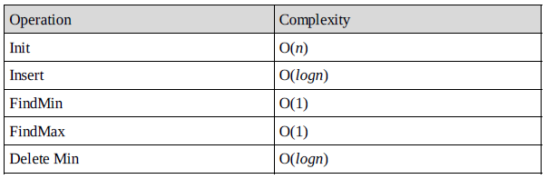
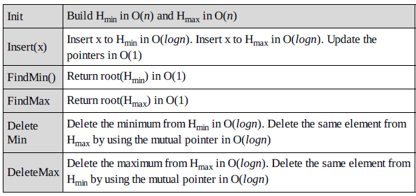

# Priority Queues [Heaps]: Problems & Solutions

### Q1. What are the minimum and maximum number of elemnets in a heap of height h?

Since heap is a complete binary tree, it has at most 2^(h+1) -1 elements. This is because, to get maximum nodes, we need to fill all the h levels completley and the maximum number of nodes is nothing but the sum of all nodes at all h levels.

To get minimum nodes, we should fill the h-1 levels fully and the last level with only on element. As a result, the minimum number of nodes is nothing but the sum of all nodes from h-1 levels plus 1 and we get 2^h elements

### Q2. Is there a min-heap with seven distinct elements so that the preorder traversal of it gives the elements in sorted order?

Yes. For the tree below, preorder traversal produces ascending order.


### Q3. Is there a max-heap with seven distinct elements so that the preorder traversal of it gives the elements in sorted order?

Yes. For the tree below, preorder traversal produces descending order.


### Q4. Is there a min-heap/max-heap with seven distinct elemnets so that the inorder traversal of it gives the elements in sorted order?

No. Since a heap must be either a min-heap or a max-heap, the root will hold the smallest element or the largest. An inorder traversal will visit the root of the tree as its second step, which is not the appropriate place if the tree's root contains the smallest or largest element.

### Q5. Is there a min-heap/max-heap with seven distinct elements so that the postorder traversal of it gives the elemnets in sorted order?


### Q6. Show that the height of a heap with n elements is logn?

A heap is a complete binary tree. All the levles, except the lowest, are completley full. A heap has at least 2^h elements and at most elements 2^h < n < 2^(h+1)-1. This implies, h=logn

### Q7. Given a min-heap, give an algorithm for finding the maximum element.

For a given min heap, the maximum element will always be at leaf only. Now, the next question is how to find the leaf nodes in the tree.


If we carefully observe,the next node of the last element's parent is the first leaf node. Since the last element is always at the h->count-1th location, the next node of its parent can be calculared as:


Now, the only step remaining is scanning the leaf nodes and finding the maximum among them.

```c
int findMaxInMinHeap(struct Heap*h){
    int Max=-1;
    for(int i=(h->count+1)/2;i<h->count;i++){
        if(h->array[i]>Max) Max=h->array[i];
    }
}
```

### Q8. Give an algorithm for deleting an arbitrary element from min heap

To delete an element, first we need to search for an element. Let us assume taht we are using level order traversal for finding the element. After finding the element we need to fllowing the deleteMin process.

### Q9. Give an algorithm for deleting the ith indexed element in a given min-heap.

```c
int delete(struct Heap*h,int i){
    int key;
    if(n<i) return;
    key=h->array[i];
    h->array[i]=h->array[h->count-1];
    h->count--;
    precolateDown(h,i);
    return key;
}
```

### Q10. Prove that, for a compelte binary tree of height h of sum of the height of all nodes is O(n-h).

A compelte binary tree has 2^i nodes on level. Also, a node on level i has depth i and height h-i. Let us assume that S denotes the sum of the heights of all these nodes and S can be calculated as:


Multiplying with 2 on both sides gives: 2S=2h+4(h-1)+8(h-2)+...+2^(h-1) (1)

h=log(n+1)


### Q11. Give an algorithm to find all elements less than some value of k in a binary heap.

Start from the root of the heap. If the value of the root is smaller than k then print its value and call recursively once for its left child and once for its right child. If the value of a node is greater or equal than k then the function stops without printing that value.

The complexity of this algorithm is O(n), where n is the total number of nodes in the heap. This bound takes place in the worst case, where the value of every node in the heap will be smaller than k, so the function has to call each node of the heap.

### Q12. Give an algorithm for merging two binary max-heaps. Let us assume that the size of the first heap is m+n and the size of the second heap is n.

One simple way of solving this problem is:
- Assume that the elements of the first array (with size m+n) are at the beginning. That means, first m cells are filled and remaining n cells are empty.
- Without changing the first heap, just append the second heap and heapify the arrays.
- Since the total number of elements in the new array is m+n, each heapify operation takes O(log(m+n))

The complexity of this algorithm is : O((m+n)log(m+n))

### Q13. Can we improve the complexity of problem-12?

Instead of heapifying all the elements of the m+n array, we can use the technique of "building heap with an array of elements". We can start with non-leaf nodes and heapify them. The algorithm can be given as:

- Assume that the elements of the first array (with size m+n) are at the beginning. That means, first m cells are filled and the remaining n cells are empty.
- Without changing the first heap, just append the second heap.
- Now, find the first non-leaf node and start heapifying from that element.

### Q14. Is there an efficient algorithm for merging 2 max-heaps (stored as an array)?

The alternative solution for this problem depends on what type of heap it is. If it's a standard heap where every node has up to two children and which gets filled up so that the leaves are on a maximum of two different rows, we cannot get better than O(n) for the merge.

There is an O(logm x logn) algorithm for merging two binary heaps with sizes m and n. For m=n.

For better merging performance, we can use another variant of binary heap like a Fibonacci-Heap which can merge in O(1) on average (amortized)

### Q15. Give an algirhtm for finding kth smallest element in min-heap.

One simple solution to this problem is: perform deletion k times from min-heap

```c
int kthSmallest(Heap*h){
    for(int i=0;i<k;i++){
        deleteMin(h);
    }
    return deleteMin(h);
}
```

Time complexity: O(klogn)

### Q16. For problem-15, can we improve the time complexity?

Assume that the original min-heap is called HOrig and the auxiliary min-heap is named HAux. Initially, the element at the top of HOrig, the minimum one, is inserted into HAux. Here we don't do the operation of deleteMin with HOrig.

```c
Heap HOrig;
Heap HAux;
int findKthLargest(int k){
    int heapElement;
    int count=1;
    HAux.insert(HOrig.Min());
    while(true){
        heapElement=HAux.deleteMin();
        if(++count==k) return heapElement;
        else{
            HAux.insert(heapElement.leftChild());
            HAux.insert(heapElement.rightChild());
        }
    }
}
```

Every while-loop iteration gives the kth smallest element and we need k loops to get the kth smallest elements. Because the size of the auxiliary heap is awlays less than k, every while-loop iteration the size of auxiliary heap increases by one, and original heap HOrig has no operation during the finding, the running time is O(klogk).

Note: the above algorithm is useful if the k value is too small compared to n. If the k value is approximately equal to n, then we can simply sort the array and return kth smallest element from the sorted array. This gives O(n) solution.

### Q17. Find k max elements from max heap.

One simple solution to this problem is: build max-heap and perform deletion k times.

O(klogn)

### Q18. For problem-17, is there any alternative solution?

We can use the problem-16 solution. At the end, the auxiliary heap contains the k-largest elements. Without deleting the elements we should keep on adding elements to HAux.

### Q19. How do we implement a stack using heap?

To implement a stack using a priority queue(min heap), let us assume that we are using one extra integer variable c. Also, assume that c is initialized equal to any known value. The implementation of the stack ADT is given below. Here c is used as the priority while inserting/deleting the element from PQ.

```c
void push(int element){
    PQ.insert(c,element);
    c--;
}
int pop() return PQ.deleteMin();
int top() return PQ.min();
int size() return PQ.size();
int isEmpty() return PQ.isEmpty();
```

We could use the negative of the current system time instead of c.

### Q20. How do we implement Queue using heap?

To implement a queue using a priority queue (min heap), as similar to stacks simulation, let us assume that we are using one extra integer variable, c. Also, assume that c is initialized equal to any know value. The implementaiton of the queue ADT is given below.

Same as Q19 but instead c increases.

### Q21. Given a big file containing billions of numbers, how can you find the 10 maximum numbers from that file?

Always remember that when you need to find max n elements, the best data structure to use is priority queues.

One solution for this problem is to divide the data is sets of 1000 elements and make a heap of them, and they take 10 elements from each heap one by one. Finally heap sort all the sets of 10 elements and take the top 10 among those. But the problem is this approach is where to store 10 elements from each heap. That may require a large amount of memory as we have billions of numbers.

Reusing the top 10 elements in subsequent element can solve this problem. That means take the first block of 1000 elements and subsequenct blocks of 990 element each. Initially, Heapsort the first set of 1000 numbers, take max 10 elements, and mix them with 990 elements of 2nd set. Again, Heapsort these 1000 numbers, take 10 max elements, and mix them with 990 element of the 3rd set. Repeat till the last set of 990 element and take max 10 element from the final heap. These 10 elements will be your answer.

O(n)

### Q22. Merge k sorted lists with total n element: We are given k sorted lists with total n inputs in all the lists. Give an algorithm to merge them into one single sorted list.

Since there are k equal size lists with a total of n element, the size of each list is n/k. One simple way of solving this problem is:

- Take the first list and merge it with the second list. Since the size of each list is n/k, this step produces a sorted list with size 2n/k. THis is similar to merge sort logic.
- Continue this process untill all the lists are merged to one list.

O(nk)

### Q23. For problem-22, can we improve the time complexity?

1. Divide the lists into pairs and merge them. That means, first take two lists at a time and merge them so that the total elements parsed for all lists is O(n). This operation gives k/2 lists.
2. Repeat step-1 until the number of lists becomes one.

Time complexity: Step-1 executes logk times and each operation parses all n elements in all the lists for making k/2 lists. For example, if we have 8 lists, then the first pass would make 4 lists by parsing all n elements. The second pass would make 2 lists by again parsing n elemnets and the third pass would give 1 list by again parsing n element. As a result the total time complexity is O(nlogn).

### Q24. For problem-23, can we improve the space complexity?

1. Build the max-heap with all the first elements from each list in O(k).
2. In each step, extract the maximum element of the heap and add it at the end of the output.
3. Add the next element from hte list of the one extracted. That means we need to select the next element of the list which contains the extracted element of the previous step.
4. Repeat step-2 and step-3 until all the elements are completed from all the lists.

Time complexity: O(nlogk)
Space complexity: O(k)

### Q25. Given 1 arrays A and B each with n elements. Give an algorithm for finding largest n pairs (A[i],B[j]).

- Heapifiy A and B. This steps takes O(n).
- Then keep on deleting the element from both the heaps. Each step takes O(logn)

Total time complexity: O(nlogn)

### Q26. Min-Max heap: Give an algorithm that supports min and max in O(1) time insert, delete min and delete max in O(logn) time. That means, design a data structure which supports the following operations:



This solution can be solved using two heaps. Let us say two heaps are: H_min and H_max. Also, assume that elements in both the arrays have mutual pointers. That means, an element in H_min will have a pointer to the same elemnet in H_max and an element in H_max will have a pointer to the same element in H_min.



### Q27. Dynamic median finding. Design a heap data structure that supports finding the median.

In a set of n elements, median is the middle element, such that the number of element lesser than the median is equal to number of elements larger than the median. If n is odd we can find the median by sorting the set and taking the middle element. if n is even, the median is usually defined as the average of the two middle elements. This algorithm works even when some of the elemnets in the list are equal. For example, the median of the multiset {1,1,2,3,5} is 2, and the median of the multiset {1,1,2,3,5,8} is 2.5.

"Median heaps" are the avriant of that give access to the median element. A median heap can be implemented usign two heaps, each contianing half the elemnts. One is a max-heap, containing the smallest elements; the other is a min-heap, containing the largest elmenets. The size of the max-heap may be equal to the size of min-heap, if the total number of elements is dven. In thsi case, the median is the average of the maximum elemnt of the max-heap and the minimum element of the min-heap. If there is an odd number of elemnet, the max-heap will contain one more elemne tthan the min-heap. The median in this caes is simply the maximum element of the max-heap.

### Q28. maximum sum in sliding window: Given array A[] with sliding window of size w which is moving from the very left of the array to the very right. Assumet that we can only see the w numbers in the window. Each time the sliding window moves rightwards by one position.

Brute force solution is,every time the iwndow is moved we can search search for a total of w elements in the window.

### Q29. For problem-28, can we reduce the complexity?

Yes we can use heap data sturcutre. This reduces the time complexity to O(nlogw). Insert operation takes O(logw) time, where w is the size of the heap. However, getting the maximum value is cheap; it merely takes constant time as the maximum value is awlays kept in the roo tof the heap. As the window slides to the rgiht, some elements in the heap might not be valid anymore. How should we remove them? We would need to be somewhat careful here. Since we only remove elements that are out of the window's range, we would need to keep track of the element's indices too.


### Q30. For problem-29 can we further reduce the complexity?

Yes the double-ended queue is the perfect data sturcture for this problem. It supports insertion/deletion from the front and back. The trick is to find a way such that the largest element in the window would always appear in the front of the queue. how would you maintin this requirement as you push and pop element in and out of the queue?

Besides, you will notice that there are some redundant elements in the queue that we shouldn't even consider. For example, if the element queue has the element: [10 5 3], and a new element in the window has the element 11. Now, we could have emptied the queue without considering elements 10,5 and 3 and insert only element 11 into the queue.

Typically, most people try to maintain the queue size the same as the window's size. Try to break away from this though and think out of the box. Removing redundant elements and storing only elements that need ot be considered in the queue is the key to achieving the efficient O(n) solution below. This is ebcause each element in the list is being inserted and removed at most once.


```c
void maxSlidingWindow(int A[],int n,int w,int B[]){
    struct DoubleEndQueue*Q=CreateDoubleEndQueue();
    for(int i=0;i<w;i++){
        while(!isEmptyQueue(Q) && A[i]>=A[QBack(Q)]) PopBack(Q);
        PushBack(Q,i);
    }
    for(int i=w;i<n;i++){
        B[i-w]=A[QFront(Q)];
        while(!isEmptyQueue(Q) && A[i]>= A[QBack(Q)]) PopBack(Q);
        while(!isEmptyQueue(Q) && QFront(Q)<= i-w) PopFront(Q);
        PushBack(Q,i);
    }
    B[n-w]=A[QFront(Q)];
}
```

### 31. A priority queue is a list of items in which each item has associated with it a priority. Items are withdrawn from a priority queue in order of their priorities starting with the highest priority item first. If the maximum priority item is required, then a heap is constructed such than priority of every node is greater than the priority of its children. Design such a heap where the item with the middle priority is withdrawn first. If there are n items in the heap, then the number of items with the priority smaller than the middle priority is n/2 if n is odd, else ???.

