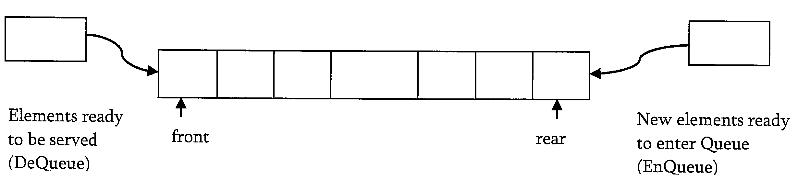
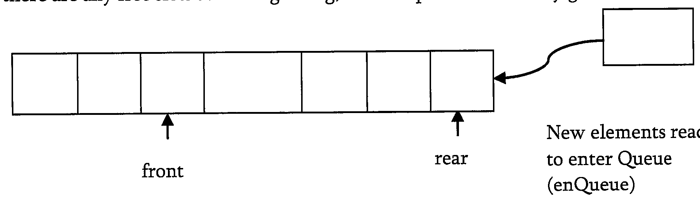

# Queue

A queue is a data structure used for storing data. In queue, the order in which the data arrives is important. In general, a queue is a line of people or things waiting to be served in sequential order starting at the beginning of the line or sequence.

**Definition**: A queue is an ordered list in which insertions are done at one end and deletions are done at oher end. The first element to be inserted is the first one to be deleted. Hence it is called as `First in First out(FIFO)` or `Last in Last out(LILO)` list.

Similar to stacks, special names are given to the two charges that can be made to a queue. When an element in inserted in a queue, the concept is called as EnQueue, and when an element is removed from the queue, the concept is called as DeQueue. Trying to DeQueue an empty queue is called as underflow and trying to EnQueue an element in a full queue is called as overflow. Generally, we treat them as exceptions.



## Queue ADT

- `EnQueue(int data)`: Inserts an element at the end of the queue
- `int DeQueue()`: Removes and returns the element at the front of the queue
- `int Front()`:Returns the element at the front without removing it
- `int QueueSize()`:Returns the number of elements stored
- `int isEmptyQueue()`:Indicates whether no elements are stored

## Applications

- Operating systems schedule jobs in the order of arrival
- Simulatin of real-world queues such as lines at a counter
- Multiprogramming
- async data transfer

## Implementation

### Why circular arrays?

First, let us see whether we can use simple arrays for implementing queues which we have done for stacks. We know that, in queues, the insertions are performed at one end and deletions are performed at other end. After some insertions and deletions it is easy to get the situation as shown below. It can be seen clearly that, the initial slots of the array are getting wasted. So, simple array implementation for queue is not efficient. To solve this problem we assyme the arrays as circular arrays. That means, we treat last element and first array elements are contiguous. With this representation, if there are any free slots at the beinning, the rear pointer can easily go to its next free slot



### Simple circular array implementation

This simple implementation of queue ADT uses an array. In the array, we add elements circularly and use two variables to keep track of start element and end element. Generally, front is used to indicate the start element and rear is used to indicate the end element in the queue. The array storing the queue elements may become full. An EnQueue operation will then throw a full queue exception. Similarly, if we try deleting an element from empty queue then it will throw empty queue exception.

```c
struct ArrayQueue{
    int front,rear;
    int capacity;
    int*array;
}
struct ArrayQueue*Queue(int size){
    struct ArrayQueue*Q=malloc(sizeof(struct ArrayQueue));
    if(!Q) return NULL;
    Q->capacity = size;
    Q->front = Q->rear = -1;
    Q->array = malloc(Q->capacity*sizeof(int));
    if(!Q->array) return NULL;
    return Q;
}
int isEmptyQueue(struct ArrayQueue*Q){
    return (Q->front == -1);
}
int isFullQueue(struct ArrayQueue*Q){
    return ((Q->rear +1)%Q->capacity == Q->front);
}
int QueueSize(){
    return (Q->capacity - Q->front + Q->rear +1)% Q->capacity;
}
void EnQueue(struct ArrayQueue*Q,int data){
    if(isFullQueue(Q)) printf("Queue overflow");
    else {
        Q->rear = (Q->rear+1) % Q->capacoty;
        Q->array[Q->rear]=data;
        if(Q->front == -1) Q->front = Q->rear;
    }
}
int DeQueue(struct ArrayQueue*Q){
    if(isEmptyQueue(Q)){
        printf("Queue is empty");
        return 0;
    }else{
        data = Q->array[Q->front];
        if(Q->front == Q->rear) Q->front = Q->Rear = -1;
        else Q->front = (Q->front+1)%Q->capacity;
    }
    return data;
}
void DeleteQueue(struct ArrayQueue*Q){
    if(Q){
        if(Q->array) free(Q->array);
        free(Q);
    }
}
```

### Dynamic circular array implementation

### Linked List implementation