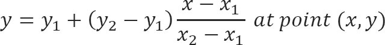
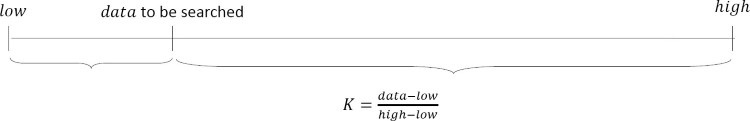
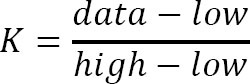
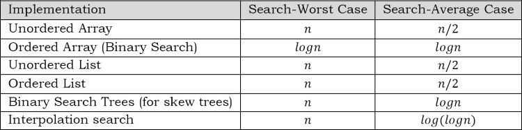

# Searching

## What is searching?

In computer science, searching is the process of finding an item with specified properties from a collection of items. The items may be stored as records in a databse, simple data elements in arrays, text in files, nodes in trees, vertices and edges in graphs, or they may be elements of other search spaces.

## Why do we need searching?

Searching is one of the core computer science algorithms. We know that today's computers store a lot of information. To retriee this informaiton proficiently we need very efficient searching algorithms. There are certain ways of organizing the data the improves the searching rocess. That means, if we keep the data in proper order, it is easy to search the required element. Sorting is one of the techniques for making the elements ordered. In this chapter we will see diferent searching algorithms.

## Types of searching

Following are the types of searches which we will be discussing in this book.

- Unordered linear search
- sorted/ordered linear search
- binary search
- interpolation search
- binary searhc trees
- symbol tables and hashing
- string search algorithms

## Unordered linear search

Let us assume we are given an array where the order of the elements is not known. That means the elements of the array are not sorted. In this case, to search for an element we have to scan the compelte array and see if the element is there in the given list or not.

```c
int unorderedLinearSearch(int A[],int n,int data){
    for(int i=0;i<n;i++){
        if(A[i]==data) return i;
    }
    return -1;
}
```

Time complexity: O(n), in the worst case we need to scan the complete array. Space complexity: O(1)

## Sorted/Ordered linear search

If the elements of the array are already sorted, then in many cases we don't have to scan the complete array to see if the element is there in the given array or not. In the algorithm below, it can be seen that, at any point if the value at A[i] is greater than the data to be searched, then we just return -1 without searching the remaining array.

```c
int orderedLinearSearch(int A[],int n,int data){
    for(int i=0;i<n;i++){
        if(A[i]==data) return i;
        else if(A[i]>data) return -1;
    }
    return -1;
}
```

Time complexity of this algorithm is O(N). This is because in the worst case we need to scan the compelte array. BUt in the average case it reduces the complexity even though the growth rate is same.

Space complexity: O(1)

For the above algorithm we can make further improvement by incrementing the index at a faster rate (say,2). THis will reduce the number of comparisons for searching in the sorted list.

## Binary search

Let us consider the problem of searching a word in a dictionary. Typically, we directly go to some approximate page and start searching from that point. If the name that we are searching is the same then the search is complete. If the page is before the selected pages then apply the same process for the first half; otherwise apply the same process to the second half. Binary search also works in the same way. The algorithm applying such a strategy is referred to as binary search algorith.

```c
int BniarySearchIterative(int A[],int n,int data){
    int low=0;
    int high=n-1;
    while(low<=high){
        mid=low+(high-low)/2;
        if(A[mid]==data) return mid;
        else if(A[mid]<data) low=mid+1;
        else high=mid-1;
    }
    return -1;
}

int binarySearchRecursive(int A[],int low,int high,int data){
    int mid=low+(high-low)/2;
    if(low>high) return -1;
    if(A[mid]==data) return mid;
    else if(A[mid]<data) return binarySearchRecursive(A,mid+1,high,data);
    else return binarySearchRecursive(A,low,mid-1,data);
    return -1;
}
```

## Interpolation search

Undoubtedly binary search is a great algorithm for searching with average running time complexity of logn. It always chooses the middle of the remaining search space, discarding one half or the other, again depending on the comparison between the key value found at the estimated (middle) position and the key value sough. The remaining search space is reduced to the part before or after the estimated position.

In the mathematics, interpolation is a process of constructing new data points within the range of a discrete set of known data points. In computer science, one often has a number of data points which reperesnet the values of a function for a limited number of values of the indepenedent variable. It is often required to interpolate the value of that function for an intermediate value of the independent variable.

For example, suppose we have a table like this, which gives some values of an unkwnon function f. Interpolation provides a means of estimating the function at intermediate points, such as x=55.

There are many different interpolation methods, and one of the simplest methods is linear iterpolation. Since 55 is midway between 50 and 60, it is reasonable to take f(55) midway between f(5)=50 and f(6)=60, which yields 55.

Linear interpolation takes two data points, say (x1,y1) and (x2,y2), and the interpolant is given by:



With above inputs, what wil happen if we don't use the constant 1/2, but another more accurate constant "K", that can lead us closer to the searched item.



This algorithm tries to follow the way we search a name in a phone book, or a word in the dictionary. We, humans, know in advance that in case the name we're searching start with a "m", like monk for isntance, we should start searching near the middle of the phone book. Thus if we're searching the word "career" in the dictionary, you know that it should be placed somewhere at the beginning. This is because we know the order of the ltters, we know the interval (a-z), and somehow we intuitively know that the words are dispered equally. These facts are enough to realize that the binary search can be a bad choice. Indeed the binary search algorithm divides the list into two equal sub-lists, which is useless if we know in advance that the searched item is somewhere in beeginning or the end of the list. Yes, we can use also jump search if the item is at beginning. but not if it is at the end, in that case this algorithm is not so effective.

The interpolation search algorithm tries to improve the binary search. The quesiton is how to find this vlaue? Well, we know bounds of the interaval and looking closer to the image above we can define the following formula.



The constnat K is used to narrow down the search space. For binary search, this constant K is (low+high)/2.

Now we can be sure that we're closer to the searched value. On average the interpolation search makes about log(logn) comparisons, where n is the number of elements to be searched. in the worst case it can make up to O(n) comprisons. In iterpolation-sequentil search, interpolation is used to find an item near the one being search for, then linear search is used to find the exact item. For this algorithm to give best reuslts, the dataset should be ordered and uniformly distribtued.

```c
int interpolationSearch(int A[],int data){
    int low=0,mid,high=sizeof(A)-1;
    while(low<=high){
        mid=low+low+(((data-A[low])*(high-low))/(A[high]-A[low]));
        if(data==A[mid]) return mid+1;
        if(data<A[mid]) high=mid-1;
        else low=mid+1;
    }
    return -1;
}
```

## Comparing basic searching algorithms



## Symbol tables and hashing

Refer to Symbol Tables and hashing chapters.

## String searching algorithms

Refer to string algorithms chapter.