# Problems

### Q1. Given an array of n numbers, give an algorithm for checking whether there are any duplicate elements in teh array or no?

This is one of the simplest problems. One obvious answer to this is exhaustively searching for duplicates in the array. That means, for each input element check whether there is any element with the same value. This we can solve jusut by using two simple for loops.

### Q2. Can we improve the complexity of Q1's solution?

Yes. sort the given array. After sorting, all the elements with euqal values will be adjacent. Now, do another scan on this sorted array and see if there re elements witht he same value and adjacent.

Time complexity: O(nlogn)

### Q3. Is there any alternative way of solving Q1?

Yes, using hash table. Hash tables are a simple and effective method used to implement dictionaries. Average time to search for an element is O(1), while worst-case tie is O(n). Refer to hashing chapter for more details on hashing algorithms. As an example, consider the array, A={3,2,1,2,2,3}

Scan the input array and insert the elements into the hash. For each inserted element, keep the coutner as 1. This indicates that the corresponding element has occurred already. For the given array, the hash table will look like.

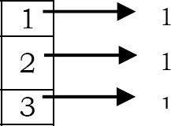

Time complexity: O(n)

### Q4. Can we further improve the complexity of Q1 solution?

Let us assume that the array elements are positive numbers and all the elements are in the range 0 to n-1. For each element A[i], go to the array elements whose index is A[i]. That means select A[A[i]] and mark - A[A[i]]. Continue this process until we encounter the element whose value is already negated. if one such element exists then we say duplicate elements exist in the given array. As an example, consider the array, A={3,2,1,2,2,3}.

Initially,

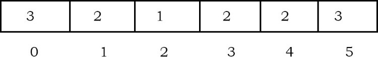

At step-1, negate A[abs(A[0])],
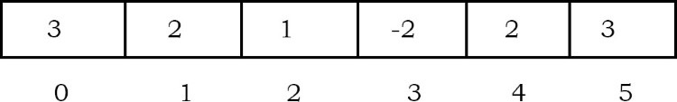
At step-2, negate A[abs(A[1])],
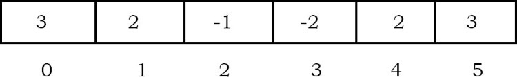
At step-3, negate A[abs(A[2])],
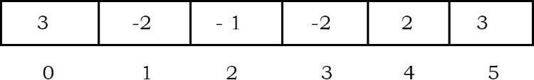
At step-4, negate A[abs(A[3])],
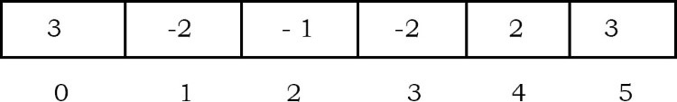
At step-4, observe that A[abs(A[3])] is already negative. That means we have encountered the same value twice.

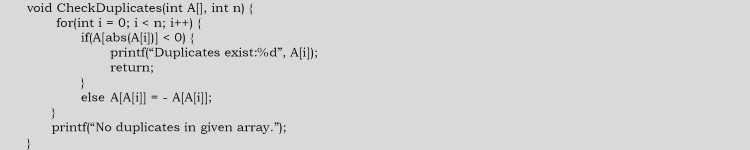

Time complexity: O(n)

Note:
- This solution does not work if the given array is read only.
- This solution will work only if all the array elements are positive.
- If the elements range is not in 0 to n-1 then it may give exceptions.

### Q5. Given an array of n numbers. Give an algorithm for finding the element which appears the maximum numbers of times in the array?

**Brute Force solution**: One simple solution to this is, for each input element check whether there is any element with the same value, and for each such occurrence, increasement the coutner. Each time, check the current counter with the max coutner and update it if this value is greate rhtan max counter. This we can solve just by using two simple for loops.

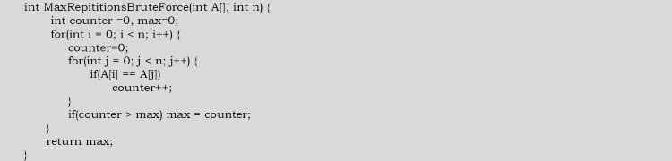

Time complexity: O(n^2)

### Q6. Can we improve the complexity of Q5 solution?

Yes. Sort the given array. After sorting, all the elements with equal values come adjacent. Now, just do another scan on this sorted array and see which element is appearing the maximum number of times.

TIme complexity: O(nlogn)

### Q7. Is there any other way of solving Q5?

Yes, using hash table. For each element of the input, keep track of how many times that element appeared in the input. That means the counter value represents the number of occurrences for that element.

Time complexity: O(n)

### Q8 Can we improve Q5 time complexity? Assume that the element's range is 1 to n. That means all the element are within this range only.

Yes. We can solve this problem in two scans. We cannot use the negation technique of Q3 for this problem because of the number of repetitions. in the first scn, instead of negating, add the value n. That means for each occurrence of an element add the rray size to that element. In the second scan, check the element value by dividing it by n and return the elemnet which gives the maximum value. The code based on this method is given below.

```c
void maxRepititions(int A[],int n){
    int i=0,max=0,maxIndex;
    for(i=0;i<n;i++) A[A[i]%n]+=n;
    for(i=0;i<n;i++)
        if(A[i]/n > max){
            max = A[i]/n;
            maxIndex=i;
        }
    return maxIndex;
}
```

**Note**:
- This solution does not work if the given array is read only.
- This solution will work only if the array elements are positive.
- If the elements range is not in 1 to n then it may give exceptions.

Time compelxity: O(n)

### Q9. Given an array of n numbers, give an algorithm for finding the first element in the array which is repeated. For example, in the array A={3,2,1,2,2,3}, the first repeated number is 3 (not 2). That means, we need to return the first elemnet among the repeated elements.

We use can the brute force solution that we used for Q1. For each element, since it checks whether there is duplicate for that element or not, whichever element duplicates first will be returned.

### Q10. For Q9, can we use the sorting technique?

No. For proving the failed case, let us consider the following array. For example, A={3,2,1,2,2,3}. After sorting we get A={1,2,2,2,3,3}. In this sorted array the first repeated element is 2 but the actual answer is 3.

### Q11. For Q9, can we use hashing technique?

Yes. But the simple hashing technique which we used for Q3 will not work. For example, if we consider the input array as A={3,2,1,2,3}, then the first repeated element is 3, but using our simple hashing technique we get the answer as 2. This is because 2 is coming twice before 3. Now let us change the hashing table behavior so that we go the frist repeated element. Let us say, isntead of storing 1 value, initially we store the position of the element in the array. As a result the hash table will look like

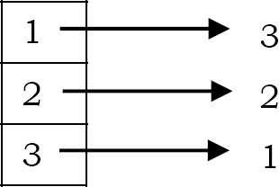

Now, if we see 2 again, we just negate the current value of 2 in the hash table. That means, we make its counter value as -2. The negative value in the hash table indicates that we have seen the same element two times. Similarly, for 3 (the next element in the input) also, we negate the current value of the hash table and finally the hash table will look like:

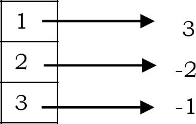

After processing the complete input array, scan the hash table and return the highest negative indexed value from it. The higest negative value indicates that we have seen that element first and also repeating.

**What if the element is repeated more than twice?** In this case, just skip the element if the corresponding value i is already negative.

### Q12. For Q9, can we use the technique that we use for Q3 (negation technique)?

No. As an example of contradiction, for the array A={3,2,1,2,2,3} the first repeated element is 3. But with negation technique the result is 2.

### Q13. Finding the missing number: We are given a list of n-1 integers and these integers are in the range of 1 to n. There are no duplicates in the list. One of the integers i missing in the list. Given an algorithm to find the mixxing integers. Example: I/P: [1,2,4,6,3,7,8] O/P: 5

Brute force solution: One simple solution to this is, for each number in 1 to n, check whether that number is in the given array or not.

```c
int findMissingNumber(int A[],int n){
    int i,j,found=0;
    for(i=1;i<=n;i++){
        found=0;
        for(j=0;j<n;j++)
            if(A[j]==i)
                found=1;
        if(!found) return i;
    }
    return -1;
}
```

Time complexity: O(n^2)

### Q14. For Q13, can we use sorting technique?

Yes. Sorting the list will give the elements in increasing order and with another scan we can find the misisng number.

Time complexity: O(nlogn)

### Q15. For Q13, can we use hashing technique?

Yes. Scan the input array and insert elements into the hash. For inserted elemnets, keep counter as 1. This indicates that the corresponding element has occurred already. Now, scan the hash table and return the element which has counter value ero.

Time complexity: O(n)

### Q16. For Q13, can we improve the complexity?

Yes. We can use summation formula.

1) Get the sume of numbers, sum=n*(n+1)/2
2) Subtract all the numbers from sum and you will get the missing number.

### Q17. In Q13, if the sum of numbers goes beyond the maximum allowed integer, then there can be integer overflow and we may not get the correct answer. Can we solve this problem?

1) XOR all the array element, let the result of XOR be X.
2) XOR all numbers from 1 to n, let XOR be y.
3) XOR of x and y gives the misisng number.

Time complexity: O(n)

### Q18. Find the number occuring an odd number of times: Given an array of positive integers, all numbers occur an even number of times except one number which occurs an odd number of times. Find the number in O(n) tiem & constant space. Example: [1,2,3,2,3,1,3]. Answer=3

Do a bitwise XOR of all the elements. We get the number which has odd occurrences. This is beucase, A XOR A = 0.

Time complexity: O(n)

### Q19. Find the two repeating element in a given array: Given an array with size, all elements of the array are in range 1 to n and also all elements occur only once except two numebrs which occur twice. Find thoes two repeating numbers. For example: if the array is 4,2,4,5,2,3,1 with size=7 and n=5. The input has n+2=7 elements with all elements occurring once except 2 and 4 which occur twice. So the output should be 4 2.

One simple way is to scan the complete array for each element of the input elements. That means use two loops. In the outer loop, select elements one by one and count the number of occurrences of the selected element in the inner loop. For the code below, assume that printRepeatedElements is called with n+2 to indicate the size.

```c
void printRepeatElements(int A[],int size){
    for(int i=0;i<size;i++)
        for(int j=i+1;j<size;j++)
            if(A[i]==A[k])
                printf("%d",A[i]);
}
```

Time complexity: O(n^2)

### Q20. For Q19, can we improve the time complexity?

Sort the array using any comparison sorting algorithm and see if there are any elements which are contigous with thee same value.

Time complexityL O(nlogn)

### Q21. For Q19, can we improve the time complexity?

Use count array. This solution is like using a hash table. For simplicity we can use array for storing the counts. Traverse the array once and keep track of the count of all elements in the array using a temp array count[] of size n. When we see an element whose count is already set, print it as duplicate. For the code below assume that printRepeatedElements is called with n+2 to indicate the size.

```c
void printRepeatedElemenets(int A[],int size){
    int*count=(int *)calloc(sizeof(int),(size-2));
    for(int i=0;i<size;i++){
        count[A[i]]++;
        if(count[A[i]]==2)
            printf("%d",A[i]);
    }
}
```

Time complexity: O(n)

### Q22. Consider Q19. Let us assume that the numbers are in the range 1 to n. Is there any other way of solving the problem?

Yes, by using XOR operations. Let the repeating numbers be X and Y, if we XOR all the elements in the array and also all integers from 1 to n, then the result wil be X XOR Y. The 1's in binary repesentation of X XOR Y correspond to the differnet bits between X and Y. If the kth bit of X XOR Y is 1, we can XOR all the elemnets in the array and also all integers from 1 to n whose kth bits are 1. The result will be one of X and Y.

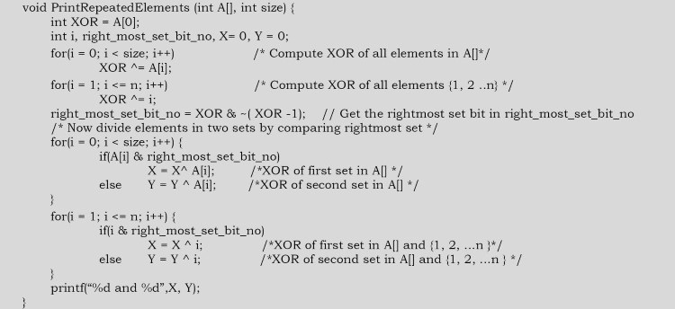

Time complexity: O(n)

### Q23. Consider Q19. Let us assume that the numbers are in range 1 to n. Is there yet other way of solving the problem?

We can solve this by creating two simple mathematical equations. let us assume that two numbers we are going to find are X and Y. We know the sum for n numbers is n(n+1)/2 and the product is n!. Make two equations using these sum and product formulae, and get values of two unknowns using the two equations. Let the summation of all numbers in array be S and product be P and the numbers which are being repeated are X and Y.


Using the eabove two equations, we can find out X and Y. There can be an addition and multiplication oveflow problem with this approach.

Time complexity: O(n)

### Q24. Similar to Q19, let us assume that the numbers are in the range to n. Also, n-1 elements are repeating thrice and reminaing element repeated twice. Find the element which repeated twice.

If we XOR all the elements in the array and all integers from 1 to n, then all the element which rare repeated thrice will become zero. This is because, since the elmenet is repeating thrice and XOR anotehr time from range makes the element appear four times. As a result, the output of a XOR a XOR a XOR a = 0. It is the same case with ll elements that are repeated three times.

With the same logic, for the elmenets which repeated tiwce, if we XOR the input elements and also the range, then the total number of appearances for that elemnet is 3. As a result, the output of a XOR a XOR a = a. Finally, we get the element which repeated twice.

Time complexity: O(n)

### Q25. Given an array of n elemenets. Find two elements in the array such that their sum is equal to given element K.

**Brute Force solution**: One simple solution to this is, for each input element, check whether there is any element whose sum is K. this we can solve just by using two simple for loops. The code for this solution canbe given as:

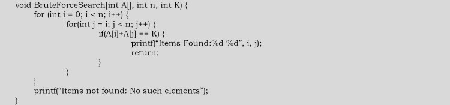

Time compelxity: O(n^2)

### Q26. For Q25, can we improve the time complexity?

Yes. Let us assume that we have sorted the given array. This operation takes O(nlogn). On the sorted array, maintain indices loIndex=0 nd hiIndex=n-1 and compute A[loIndex]+A[hiIndex]. If the sum equals K, then we are done with the solution. If the sum is less than K, decrement hiIndex, if the sum is greater than K, incremenet loIndex

Time complexity: O(nlogn)

### Q27. Does the solution of Q25 work even if the array is not sorted?

Yes. Since we are checking all possibilities, the algorithm ensures that we get the pair of numebrs if they exist.

### Q28. Is there any other way of solving Q25?

Yes, using hash table. Since our objective is to find two indexes of the array whose sum is K. Let us say those indexes are X and Y. That means A[X]+A[Y]=K. What we need is, for each element of the inptu array A[X], check whether K-A[X] also exists in the input array. Now, let us simplify that searching with hash table.

**Algorithm**:
- For each element of the input array, insert it into the hash table. Let us say the current element is A[X].
- Before proceeding to the next element we check whether K-A[X] also exists in the hash table or not.
- There existence of such number indicates that we are able to find the indexes.
- Otherwise proceed to the next input element.

Time complexity: O(n)

### Q29. Given an array A of n elements. Find three indices, i,j & k such that A[i]^2 + A[j]^2 = A[k]^2?

**Algorithm**:
- Sort the given array in-place.
- For each array index i compute A[i]^2 and store in array.
- Search for 2 numbers in array from 0 to i-1 which adds to A[i] similar to Q25. This will give us the result in O(n) time. If we find such a sum, return true, otherwise continue.

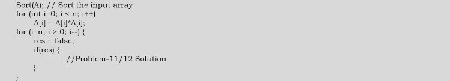

Time complexity: O(nlogn) + n*O(n) = n^2

### Q30. Two elements whose sum is closet to zero. Given an array with both positive and negative numbers, find the two elements such that their sum is closet to zero. For the below array, algorithm shoudl give -80 and 85. Example [1,60,-10,70,-80,85]

**Brute force solution**: For each element, find the sum with every other element in the array and compare sums. Finally, return the minimum sum.

O(n^2)

### Q31. Can we improve the time complexity of Q30?

Use sorting.

**Algorithm**:
1) Sort all the elements of the given input array.
2) Maintain two indexes, one at the beginning (i=1) and the other at the ending (j=n-1). Also, maintain two variables to keep track of the smallest positive sum closet to zero and the smallest negative sum closet to zero.
3) While i<j:
   1) If the current pair sum is >zero and < positiveClosert then update postiveClosert. Decrement j.
   2) If the current pair sum is < zero and >negativeClosest then update the negativeClosest. Increment i.
   3) Else, print the pair.

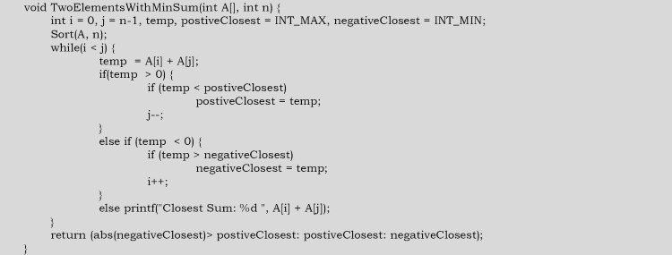

Time complexity: O(nlogn)

### Q32. Given an array of n elements. Find three elements in the array such that their sum is equal to given element K?

**Brute force solution**: The default solution to this is, for each pair of input element check whether there is any element whose sum is K. This we can solve just by using three simple for loops. The code for this solution can be given as:

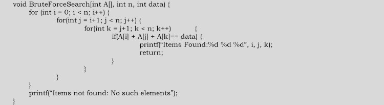

Time complexity: O(n^3)

### Q33. Does the solution of Q32 work even if the array is not sorted?/

Yes. Since we are checking all possibilities, the algorithm ensures that we can find three numbers whose sum is K if they exist.

### Q34. Can we use sorting technique for solving Q32?

Yes.

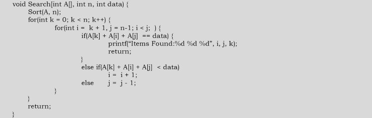

Time complexity: O(n^2)

### Q35. Can we use hashing technique for solvint Q32?

Yes. Since our objective is to find three indexes of the array whose usm is K. Let us say those indexes are X,Y,Z. That means, A[X]+A[Y]+A[Z]=K.

Let us assume that we have kept all possible sums along with their pairs in hash table. That means the key to hash table is K-A[X] and values for K-A[X] are all possible pairs of input whose sum is if -A[X].

**Algorithm**:
- Before starting the search, insert all possible sums with pairs of elements into the hash table.
- For each element of input array, insert into the hash table. Let us say the currnet elemnet is A[X]
- Check whether there exist a hash entry in the table with key: K-A[X]
- If such element exists then scan the element pairs of K-A[X] and return all possible pairs by including A[X] also
- If no such element exists (with K-A[X] as key) then go to next element.

Time complexity: O(n^2)

### Q36. GIven an array of n integers, the 3-sum problem is to find three integers whose sum is closest to zero.

This is the same as that of Q32 with K value is zero.

### Q37. Let A be an array of n distinct integers. Suppose A has the following property: there exists an index 1<=k<=n such that A[l],...,A[k] is an increasing sequence and A[k+1],...,A[n] is a decreasing sequence. Design and analyze an efficient algorithm for finding k. Similar question: Let us assume that the given array iss sorted but starts with negative numbers and ens with positive numbers. In this array find the starting index of positive numbers. Assume that we know the legnth of input array. Design a O(logn) algorithm.

```c
int search(int A[],int n,int first,int last){
    int mid,first=0,last=n-1;
    while(first<=last){
        if(first==last) return A[first];
        else if(first==last-1) return max(A[first],A[last]);
        else{
            mid=first+(last-first)/2;
            if(A[mid-1]<A[mid] && A[mid]>A[mid+1]) return A[mid];
            else if(A[mid-1]<A[mid] && A[mid]<A[mid+1]) first=mid+1;
            else if(A[mid-1]>A[mid] && A[mid]>A[mid+1]) last=mid-1;
            else return INT_MIN;
        }
    }
}
```

The recursion equation is T(n)=2T(n/2)+c. We get O(logn)

### Q38. If we don't know n,how do we solve the Q37?

Repeatedly compute A[1],A[2],A[4],A[8],A[16] and so on,until we find a value of n such that A[n]>0

Time complexity: O(logn), since we are moving at the rate of 2.

### Q39. Given an input array of size unknown with all 1's in the beginning and 0s in the end. Find the index in the array from where 0s strat. Consider there are millions of 1s and 0s in the array.

This problem is almost similar to Q38. Check the bits at the rate of 2^k where k = 0,1,2.. Since we are moving at the rate of 2, the complexity of O(logn)

### Q40 Given a sorted array of n integers that has been rotated an unknown number of times, give a O(logn) algorithm that finds an elemnet in the array.

Let us assume that the given array is A[] and use the solution of Q37 with an extension. The function below FindPivot returns the k value. Find the pivot point, divide the array into two sub-arrays and call binary search.

The main indea for finding the pivot point is - for a sorted (in increasing order) and pivoted array, the pivot element is the only element for which the enxt element to it is smaller than it. Using the above criteria and the binary search methodology we can get pivot element in O(logn) time.

**Algorithm**:
1) Find out the pivot point and divide the array into two sub-arrays.
2) Now call binary search for one of the two sub-arrays
   1) If the element is greater than the first element then search in left subarray
   2) else search in right subarray
3) If element is found in sleected subarraay, then return index else return -1.

```c
int findPivot(int A[],int start,int finish){
    if(finish-start==0) return start;
    else if(start==finish-1){
        if(A[start]>=A[finish]) return start;
        else return finish;
    }else{
        mid=start+(finish-start)/2;
        if(A[start]>=A[mid]) return findPivot(A,start,mid);
        else return findPivot(A,mid,finish);
    }
}

int search(int A[],int n,int x){
    int pivot=findPivot(A,0,n-1);
    if(A[pivot]==x) return pivot;
    if(A[pivot]<=x) return binarySearch(A,0,pivot-1,x);
    else return binarySearch(A,pivot+1,n-1,x);
}

int binarySearch(int A[],int low,int high,int x){
    if(high>=low){
        int mid=low+(high-low)/2;
        if(x==A[mid]) return mid;
        if(x>A[mid]) return binarySearch(A,mid+1,high,x);
        else return binarySearch(A,low,mid-1,x);
    }
    return -1;
}
```

Time complexity: O(logn)

### Q41. For Q40, can we solve with recursion?

Yes.

```c
int binarySearchRotated(int A[],int start,int finish,int data){
    int mid=start+(finish-start)/2;
    if(start>finish) return -1;
    if(data==A[mid]) return mid;
    else if(A[start]<=A[mid]){
        if(data>=A[start] && data<A[mid])
            return binarySearchRotated(A,start,mid-1,dat);
        else return binarySearchRotated(A,mid+1,finish,data);
    }else{
        if(data>A[mid] && data<=A[finish])
            return binarySearchRotated(A,mid+1,finish,data);
        else return binarySearchRotated(A,start,mid-1,data);
    }
}
```

Time complexity: O(logn)

### Q42. Bitonic search: An array is bitonic if it is comprised of an increasing sequence of itnegers follwed imeediately by a decreasing sequence of integers. Given a bitonic array A of n distinct integers, decribe how to determine whether a given integer is in the array in O(logn) steps.

The solution is same as that for Q37.

### Q43 Yet, otehr way of framing Q37. Let A[] be an array that starts out increasing, reaches a maximum, and then decreases. Design an O(logn) algorithm to find the index of maximum value.

### Q44. Give an O(nlogn) algorithm for computing the median of a sequence of n integers.

Sort and return element at n/2.

### Q45. Given two sorted lists of size m and n, find median of all elements in O(log(m+n)) time.

Refer to divide and conquer chapter.

### Q46. Given a sorted array A of n elements, possibly with duplicatse, find the index of the first occurrence of a number in O(logn) time.

To find the first occurrence of a number we need to check for the following condition.
Return the position if any one of the following is true:

`mid==low && A[mid]==data || A[mid]==data && A[mid-1]<data`

```c
int binarySearchFirstOccurrence(int A[],int low,int high,int data){
    int mid;
    if(high>=low){
        mid=low+(high-low)/2;
        if((mid==low && A[mid]==data) || (A[mid]==data && A[mid-1]<data))
            return mid;
        else if(A[mid]>=data)
            return binarySearchFirstOccurrence(A,low,mid-1,data);
        else return binarySearchFirstOccurrence(A,mid+1,high,data);
    }
    return -1;
}
```

Time complexity: O(logn)

### Q47. Given a sorted array A of n elements, possibly with duplicates. Find the index of the last occurrence of a number in O(logn) time.

To find the last occurrence of a number we need to check for the following condition. Return the position if any one of the following is true:

`mid==high && A[mid]==data || A[mid]==data && A[mid+1]>data`

```c
int binarySearchLastOccurrence(int A[],int low,int high,int data){
    int mid;
    if(high>=low){
        mid=low+(high-low)/2;
        if((mid==high && A[mid]==data) || (A[mid]==data && A[mid+1]>data))
            return mid;
        else if(A[mid]<=data)
            return binarySearchLastOccurrence(A,mid+1,high,data);
        else return binarySearchLastOccurrence(A,low,mid-1,data);
    }
    return -1;
}
```

Time complexity: O(logn)

### Q48. Given a sorted array of n elements, possibly with duplicates. Find the number of occurrences of number.

**Brute force solution**: Do a linear search of the array and increment count as and when we find the element data in the array.

```c
int linearSearchCount(int A[],int n,int data){
    int count=0;
    for(int i=0;i<n;i++)
        if(A[i]==data)
            count++;
    return count;
}
```

Time complexity: O(n)

### Q49. Can we improve the time complexity of Q48?

Yes. We can solve this by using one binary search call followed by another small scan.

**Alogirthm**:

- Do a binary search for the data in the array. Let us assume its position in K.
- Now traverse towards the left from K and count the number of occurrences of data. Let this count be leftCount.
- Similarly, traverse towards right and count the number of occurrences of data. Let this count be rightCount.
- Totatl number of occurrences = leftCount+1+rightCount

Time complexity: O(logn +S) where S is the number of occurrences of data.

### Q50. Is there any alternative way of solving Q48?

**Algorithm**:
- Find first occurrence of data and call its index as firstOccurrence
- Find last occurence of data and calls its index as lastOccurrence
- Return lastOccurrence-firstOccurrence+1

Time complexity: O(logn)

### Q51. What is the next number in the sequence 1,11,21 and why?

Read the given number loudly. This is just a fun problem.

### Q52. Finding second smallest number efficiently.

We can construct a heap of given elements using up just less than n comparisons. Then we find the second smallest using logn comparisons for getMax() operation. Overall, we get n+logn+c

### Q53. Is there any other solution for Q52?

Alternatively, split the n numbers into groups of 2, perform n/2 comparisons successively to find the largest, using a tournament-like method. The first round will yield the maximum in n-1 comarpisons. The second round will be performed on the winners of the first round and hte ones that the maximum popped. This will yield logn-1 comparison for a total of n+logn-2. THe above solution is called the tournament problem.

### Q54. An element is a majority if it appears more than n/2 times. Give an algorithm takes an array of n element as argument and identifies a majority (if it exists).

The basic solution is to have two loops and keep track of the maximum count for all different elements. If the maximum count becomes greater than n/2, then break the loops and return the element having maximum count. If maximum count doesn't become more tha n/2, then the majority element doesn't exist.

Time complexity: O(n^2)

### Q55. Can we improve Q54 time complexity to O(nlogn)?

Using binary search we can achieve this. Node of the Binary Search Tree (used in this approach) will be as follows.

```c
struct TreeNode{
    int element;
    int count;
    struct TreeNode*left;
    struct TreeNode*right;
} BST;
```

Insert elements in BST one by one and if an element is already present then increment the count of the node. At any stage, if the count of a node becomes more than n/2, then return. This method works well for the cases where n/2+1 occurrences of the majority element are present at the start of the array for example {1,1,1,1,1,2,3,4}.

Time complexity: If a binary search tree is used then worst time complexity will be O(n^2). If a balanced-binary-search tree is used then O(nlogn). Space complexity: O(n)

### Q56. Is there any other of achieving O(nlogn) complexity for Q54?

Sort the input array and scan the sorted array to find the majority element.

Time complexity: O(nlogn). Space complexity: O(1)

### Q57. Can we improve the complexity for Q54?

If an element occurs more than n/2 times in A the it must be the median of A. But, the reverse is not true, so once the median is found, we must check to see how many times it occurs in A. We can use linear selection which takes O(n) time.

```c
int checkMajority(int A[],int n){
    // Use linear selection to find the median m of A.
    // Do one more pass through A and count the number of occurrences of m.
        // If m occurs more tha n/2 times then return true;
        // Otherwise return false.
}
```

### Q58. Is there any other way of solving Q54?

Since only one element is repeating, we can use a simple scan of the input array by keeping track of the count for the elements. If the count is 0 then we can assume that the element visited for the first time otherwise that the resultant element.

```c
int majorityNum(int A[],int n){
    int count=0,element=-1;
    for(int i=0;i<n;i++){
        // If the counter is 0 then set the current candidate to majority num and set the counter to 1.
        if(count==0){
            element=A[i];
            count=1;
        }else if(element==A[i]){
            // Incremenet counter if the counter is not 0 and element is same as current candidate.
            count++;
        }else{
            // Decremenet counter if the counter is not 0 and element is different from current candidate.
            count--;
        }
    }
    return element;
}
```

Time complexity: O(n). Space complexity: O(1)

### Q59. Given an array of 2n elements of which n elements are the same and the remaining n elements are all different. Find the majority element.

The repeated elements will occupy half the array. No matter what arrangement it is, only one of the below will be true:
- All duplicate elements will be at a relative distance of 2 from each other. Ex. n,1,n,100,n,54,n...
- At least two duplicate elements will be next ot each other. Ex: n,n,1,100,n,54,n..

In worst case, we will need two passes over the array:
- First pass: compare A[i] and A[i+1]
- Second pass: compare A[i] and A[i+2]

Somethignw ill match and that's your element. This will cost O(n) in time.

### Q60. Given an array with 2n+1 integer elements, n elements appear twice in arbitrary places in the array and a single integer appears only once somewhere insie. FInd the lonely integer with O(n) operations and O(1) extra memory.

Except for one element, all elements are repeated. We know that A XOR A = 0. Based on this if we XOR all the input elements then we get the remaining element.

```c
int solution(int*A){
    int i,res;
    for(i=res=0;i<2*n+1;i++) res=res^A[i];
    return res;
}
```

Time complexity: O(n)

### Q61. Throwing eggs from an n-story building: Suppose we have an n story building and a number of eggs. Also assume that an egg breaks if it is thrown from floor F or higher, and will not break otherwise. Devise a strategy to determine floor F,while breaking O(logn) eggs.

Refer to divide and conquer chapter.

### Q62. Local minimum of an array: Given an array A of n distinct integers, design an O(logn) algorithm to find a local minimum: an index i such that A[i-1] < A[i] < A[i+1]

Check the middle value A[n/2], and two neighbors A[n/2-1] and A[n/2+1]. If A[n/2] is local minimum, stop; otherwise search in half with smaller neighbor.

### Q63. Give an n * n array of elements such that each row is in ascending order and each column is in ascending order, devise an O(n) algorithm to determine if a given element x is in the array. You may assume all elements in the n * n array are distinct.

Let us assume that the given matrix is A[n][n]. Start with the last row, first column [or first row, last column]. If the element we are searching for is greater than the element at A[1][n], then the first column can be eliminated. If the search element is less than the element at A[1][n], then the last row can be completley eliminated. Once the first column or the last row is eliminated, startthe process again with the left-bottom end of the remaining array. In this algorithm, there would be maximum n elements that the search element would be compared with.

Time complexity: O(n). This is because we will traverse at most 2n points.

### Q64. Given an n * n array of n^2 numbers, give an O(n) algorithm to find a pair of indices i and j such that A[i][j] < A[i+1][j] * A[i][j], A[i][j] < A[i-1][j], and A[i][j] < A[i][j-1].

This problem is the same as Q63.

### Q65. Given n * n matrix, and in each row all 1's are followed by 0's. Find the row with the maximum number of 0's.

Start with first row, last column. If the element is 0 then move to the previous column in the same row and at the same time increase the counter to indicate the maximum number of 0's. If the element is 1 then move to the next row in the same column. Repeat this process until reach last row, first column.

Time complexity: O(2n)

### Q66. Given an input array of size unknown, with all numbers in the beginning and special symbols in the end. Find the index in the array from where the special symbols start.

Refer to divide and conquer chapter.

### Q67. Separate even and odd numbers: Given an array A[], write a function that segregates even and odd numbers. The functions should put all even numbers first, and then odd numbers. Example: Input = {12,34,45,9,8,90,3} Output = {12,34,90,8,9,45,3}

The problem is very similar to seperate 0's and 1's (Q68) in an array, and both problems are variations of the famour dutch national flag problem.

The logic is similar to quick sort

1) Initialize two index varibales left and right: left=0, right=n-1
2) Keep incrementing the left index untill you see an odd number.
3) Keep decrementing the right index until you see an even number.
4) If left < right then swap A[left] and A[right]

Time complexity: O(n)

### Q68. The following is another way of structuring Q67, but with a slight difference. Separate 0's and 1's in an array: We are given array of 0's and 1's in random order. Separate 0's on the left side and 1's on the right side of the array. Traverse the array only once. Input array = [0,1,0,1,0,0,1,1,1,0] Output = [0,0,0,0,0,1,1,1,1,1]

Counting 0's or 1's

1) Count the number of 0's. Let the count be C.
2) Once we have the count, put C 0's at the beginning and 1's at the remaining n-C positions in the array.

Time complexity: O(n)

### Q69. Can we solve Q68 in one scan?

Yes. Use two indexes to travesre: Maintain two indexes. Initialize the first index left as 0 and second index right as n-1. Do the following while left < right:

1) Keep the incrementing index left while there are 0s in it
2) Keep the decrementing index right while there are 1s in it
3) if left < right then exchange A[left] and A[right]

Time complexity: O(n)

### Q70. Sort an array of 0's,1;s and 2's [or R's, G's and B's]: Given an array A[] consisting of 0's,1's and 2's, give an algorithm for sorting A[]. The algorithm should put all 0's first, then all 1's and finally all 2's at the end. Example input = {0,1,1,0,1,2,1,2,0,0,0,1}, Output = {0,0,0,0,0,1,1,1,1,1,2,2}

```c
void Sorting012sDutchFlagProblem(int A[],int n){
    int low=0,mid=0,high=n-1;
    while(mid<=high){
        switch(A[mid]){
            case 0:
                swap(A[low],A[mid]);
                low++;mid++;
                break;
            case 1:
                mid++;
                break;
            case 2:
                swap(A[mid],A[high]);
                high--;
                break;
        }
    }
}
```

Time complexity: O(n)

### Q71. Maximum difference between two elements: Given an array A[] of integers, find out the difference between any two elements such that the larger element appears after the smaller number in A[]. Examples: If array is [2,3,10,6,4,8,1] then returned value should be 8. If array is [7,9,5,6,3,2] then the returned value should be 2

Refer to divide and conquer chapter.

### Q72. Given an array of 101 elemnets. Out of 101 elements, 25 are repeated twice, 12 elements are repeated 4 times, and one element is repeated 3 times. Find the element which repeated 3 times in O(1)

Before solving this problem, let us consider the following XOR operation property: a XOR a = 0. That means, if we apply the XOR on the same element then the result is 0.

Time complexity: O(n)

### Q73. Given a number n, give an algorithm for finding the number of trailing zeros in n1!.

```c
int NumberOfTrailingZeroInNumber(int n){
    int i,count=0;
    if(n<0) return -1;
    for(i=5;n/i>0;i*=5) count+=n/i;
    return count;
}
```

Time complexity: O(logn)

### Q74. Given an array of 2n integers in the following format a1 a2 a3 ... an b1 b2 b3 ... bn. Shuffle the array to a1 b1 a2 b2 a3 b3 .. an bn without any extra memory.

A brute force solution involves two nested loops to rotate the elements in the second half of the array to the left. THe first loop runs n times to cover all elements in the second half of the array. The second loop rotates the elements to the left. Note that the start index in the second loop depends on which element we are rotating and the end index depends on how many positions we need to move to the left.

```c
void ShuffleArray(){
    int n=4;
    int A[]={1,3,5,7,2,,4,6,8};
    for(int i=0,q=1,k=n;i<n;i++,k++,q++){
        for(int j=k;j>i+q;j--){
            swap(A[j-1],A[j]);
        }
    }
    for(int i=0;i<2*n;i++) printf("%d ",A[i]);
}
```

Time complexity: O(n^2)

### Q75. Can we improve Q74 solution?

Refer to the divide and conquer chapter. A better solution of time complexity O(nlogn) can be achieved using the divide and concur technique. Let us look at an example

1) Start the array: a1 a2 a3 a4 b1 b2 b3 b4
2) Split the array into two halves: a1 a2 a3 a4 : b1 b2 b3 b4
3) Exchange elements around the center: exchange a3 a4 with b1 b2 and you get: a1 a2 b1 b2 a3 a4 b3 b4
4) Split a1 a2 b1 b2 into a1 a2 : b1 b2 Then split a3 a4 b3 b4 into a3 a4 : b3 b4
5) Exchange elements around the center for each subarray you get: a1 b2 a2 b2 and a3 b3 a4 b4

Note that this solution only handles the case when n=2^i. In our example n=4 which makes it easy to recursively split the array into two halves. The basic idea behind swapping elements around the center before calling the recursive function is to produce smaller size problems. A solution with linear time complexity may be achieved if the elemnt are of a specific nature. For example, if you can calculate the new position of the element using the value of the element itself.

### Q76. Given an array A[], find the maximum j-i such that A[j]>A[i]. For example, input: {34,8,10,3,2,80,30,33,1} and output: 6 (j=7,i=1)

**Brute force approach**: Run two loops. In the other loop, pick elements one by one from the left. In the inner loop, compare the picked element with the elements starting from the right side. Stop the inner loop when you see an element greater than the picked element and keep updating the maximum j-i so far.

Time complexity: O(n^2)

### Q77. Can we improve the complexity of Q76?

To solve this problem, we need to get two optimum indexes of A[]: left index i and right index j. For an element A[i], we do not need to consider A[i] for the left index if there is an element smaller than A[i] on the left side of A[i]. Similarly, if there is a greater element on the right side of A[j] then we do not need to consider this j for the right index.

So we construct two auxiliary arrays LeftMins[] and rightMaxs[] such that LeftMins[i] holds the smallest element on the left side of A[i] including A[i], and RightMaxs[j] holds the greater elements on the right side of A[j] including A[j]. After constructing these two auxiliary arrays, we traverse both these arrays from left to right.

While traversing LeftMins[] and RightMaxs[], if we see the LeftMins[i] is greater than RightMaxs[j], then we must move ahead in LeftMins[] because all elements on left of LeftMins[i] are greater than or equal to LeftMins[i]. Otherwise we must move ahead in RightMaxs[j] to look for a greaer y-i value.

Time complexity: O(n)

### Q78. Given an array of elemnets, how do you check whether the list is pariwise sorted or not? A list is considered pairwise sorted if each surccessive pair of numbers is in sorted (non-decreasing) order.

```c
int checkPairwiseSorted(int A[],int n){
    if(n==0 || n==1) return 1;
    for(int i=0;i<n-1;i+=2){
        if(A[i]>A[i+1]) return 0;
    }
    return 1;
}
```

Time complexity: O(n)

### Q79. Given an array of n elements, how do you print the frequencies of element without using extra space. Assume all elemnets are positive, editable and less than n.

Use negation technique

Array should have numbers in the range [1,n]. The if condition (A[pos]>0 && A[expectedPos]>0) means that both th enumbers at indices pos and expectedPos are actual numbers in the array but not their frequencies. So we will swap them so that the number at the index pos will go to the position where it should have been if the numebrs 1,2,3...n are kept in 0,1,2,...,n-1 indices. In the above example input array, intially pos=0,so,10 at index 0 will go to index 9 after the swap. As this is the first occurrence of 10, make it to -1. Note that we are sorted the frequencies as negaitve numbers to differencetiate between actual numbers and frequencies.

The else if condition means A[pos] is a number of A[expectedPos] is its frequency without including the occurence of A[pos]. So increment the frequency by 1. As we count its occurrence we need to move to next pos, so pos++, but before moving to that next position we should make the frequency of the number pos+1 which corresponds to index pos to zero, since such a number has not yet occurred.

The final else part  means the current index pos already has the frequency of the number pos+1 so move to the next pos, hence pos++.

Time complexity: O(n)

### Q80. Which is faster and by how much, al inear search of only 1000 elemnets on a 5-GHz comptuer or a binary search of 1 million elements on a 1-GHz computer. Assume that the execuation of each instruction on the 5-GHz computer is five times faster than on the 1-GHz computer and that each iteration of the linear search algorithm is twice as fast as each iteration of the binary search algorithm.

A binary search of 1 million elements would require log2(1 mil) or about 20 iterations at most. A linear search of 1000 elemnets would require 500 iterations on the average. Therefore, binary search would be 25 faster than linear search. However, since linear search iterations are twice as fast, binary search would be 12 times faster than linear searhc overall, on the same machine. SInce we run them on different machines, where an instruction on 5-ghz machine is 5 times faster than an instruciton on 1-ghz machine, binary search would be about 2 times faster than linear search!