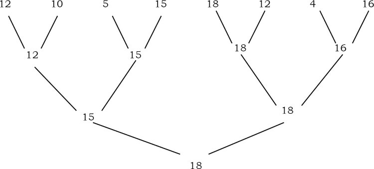

# Problems

### Q1. Find the largest element in an array A of size n.

Scan the compelte array and return the largest element

Time complexity: O(n)

### Q2. Find the smallest and largest elements in an array A of size n.

Time complexity: O(n)

### Q3. Can we improve the previous algorithms?

Yes. we can this by comparing in pairs.

Time complexity: O(n)

- Straightforward comparisons - 2(n-1) comparisons
- Compare for min only if comparison for max fails
- best case: increasing order - n-1 comparisons
- worst case: decreasing order - 2(n-1) comparisons
- Average case: 3n/2 -1 comparisons

### Q4. Give an algorithm for finding the second largest element in the given input list of elements.

**Brute force method**

- Find largest element: needs n-1 comparisons
- Delete the largest element
- Again find largest element

### Q5. Can we reduce the number of comparisons in Q4 solution?

**The tournament method**: For simplicity, assume that numbers are distinct and that n is a power of 2. We pair the keys and compare the pairs is rounds until only one round remians. if the input has 8 keys, there are four comparisons in the first round, two in the second, and one in the list. The winner of the last round is the largest key. The figure below shows the method.

The tournament method directly applies only when n is a power of 2. When this is not the case, we can add enough items to the end of array to make the array size a power of 2. If the tree is compelte then the maximum height of the tree is logn. If we construct the compelte binary tree, we need n-1 comparisons to find the alrgest. The second largest key has to be among the oens that were lost in comarpison with the largest one. That means, the second largest element should be one of the opponets of the largest element. The number of keys that are lost to the largest key is the height of the tree, logn. THen using the seleciton algorithm to find the largest among them, take logn-1 comparisons. Thus the total number of comparisons to find the largest and second largest keys is n+logn-2.

### Q6. Find the k-smallest elements in an array S of n elements using partitioning method.

**Brute Force Approach**: Scan through the numebrs k times to have the desired element. This method is the one used in bubble sort, every time we find otu the smallest element in the whole sequence by comparing every element. In this method, the sequence has to be traversed k times. So the complexity is O(nk).

### Q7. Can we use the sorting technique for solving Q6?

Yes. Sort and take the first k element.

Time complexity: O(nlogn).