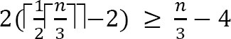
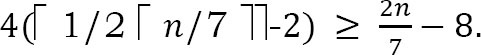

# Problems

### Q1. Find the largest element in an array A of size n.

Scan the compelte array and return the largest element

Time complexity: O(n)

### Q2. Find the smallest and largest elements in an array A of size n.

Time complexity: O(n)

### Q3. Can we improve the previous algorithms?

Yes. we can this by comparing in pairs.

Time complexity: O(n)

- Straightforward comparisons - 2(n-1) comparisons
- Compare for min only if comparison for max fails
- best case: increasing order - n-1 comparisons
- worst case: decreasing order - 2(n-1) comparisons
- Average case: 3n/2 -1 comparisons

### Q4. Give an algorithm for finding the second largest element in the given input list of elements.

**Brute force method**

- Find largest element: needs n-1 comparisons
- Delete the largest element
- Again find largest element

### Q5. Can we reduce the number of comparisons in Q4 solution?

**The tournament method**: For simplicity, assume that numbers are distinct and that n is a power of 2. We pair the keys and compare the pairs is rounds until only one round remians. if the input has 8 keys, there are four comparisons in the first round, two in the second, and one in the list. The winner of the last round is the largest key. The figure below shows the method.

The tournament method directly applies only when n is a power of 2. When this is not the case, we can add enough items to the end of array to make the array size a power of 2. If the tree is compelte then the maximum height of the tree is logn. If we construct the compelte binary tree, we need n-1 comparisons to find the alrgest. The second largest key has to be among the oens that were lost in comarpison with the largest one. That means, the second largest element should be one of the opponets of the largest element. The number of keys that are lost to the largest key is the height of the tree, logn. THen using the seleciton algorithm to find the largest among them, take logn-1 comparisons. Thus the total number of comparisons to find the largest and second largest keys is n+logn-2.

### Q6. Find the k-smallest elements in an array S of n elements using partitioning method.

**Brute Force Approach**: Scan through the numebrs k times to have the desired element. This method is the one used in bubble sort, every time we find otu the smallest element in the whole sequence by comparing every element. In this method, the sequence has to be traversed k times. So the complexity is O(nk).

### Q7. Can we use the sorting technique for solving Q6?

Yes. Sort and take the first k element.

Time complexity: O(nlogn).

### Q8. Can we use the tree sorting technique for solving Q6?

Yes.

1) Insert all the elemenets in a binary search tree.
2) Do an InOrder traversal and print k elements which will be the smallest ones. So, we have the k smallest elements.

Time complexity: O(nlogn)

**Disadvantage**: If the numbers are sorted in descending order, we will be getting a tree which will be skewed towards the left. In that case, the construction of the tree will be O(n^2). To escape from this, we can keep the tree balanced, so that the cost of consturcting the tree will be only nlogn.

### Q9. Can we imporve the tree sorting technique for solving Q6?

Yes. Use a smaller tree to give the same result.

1) Take the first k elements of the sequence to create a balanced tree of k nodes (klogk)
2) Take the remaining numbers one by one, and
   1) If the number is larger than the largest element of the tree, return
   2) If the number is smallest than the largest elemnet of the tree, remove the largest elemnet of the tree and add the new element. This step is to makes ure that a smaller element replaces a larger elemnet from the tree. And of course the cost of this operation is logk since the tree is balanced tree of k elements.

Once step 2 is over, the balanced tree with k elemnets will have the smallest k elemnets. The only reminaing task is to print out the largest element of the tree.

Total cost is klogk + (n-k)logk=nlogk

### Q10. Can we use the partitioning technique for solving Q6?

Yes.

1) Choose a pivot from the array
2) Partition the array so that: A[low...pivotpoint-1] <= pivotpoint <= A[pivotpoint+1...high].
3) if k < pivotpoint then it must be on the left of the pivot, so do the same method recursively on the left part.
4) if k=pivotpoint then it must be the pivot and print all the elemnt from low to pivotpoint
5) if k > pivotpoint then it must be on the right of the pivot, so do the same method recursively on the right part.

The top-level call would be kthSmallest = Selection(1,n,k)

Time complexity: O(n^2). Avg = O(nlogk)

### Q11. Find the kth-smallest element in an array S of n element in best possible way.

This problem is similar to Q6 and all the solution discussed for Q6 are valid for this problem. The only difference is that isntead of printing all the k elements, we print only the kth element. We can improve the solution by using the median of medians algorithm. Medina is a special case of the selection algorithm. The algorithm Selection(A,k) to findt eh kth smallest element from set A of n elements is as follows:

1) Partition A into ceil(lenA/5) groups, with each group having five items.
2) Sort each group separately
3) Find the median of each of the n/5 groups and store them in some array
4) Use selection recursively to find the median of A'. Let us say the median of medians is m.
5) Let q= #elemnts of A smaller than m;
6) If(k==q+1) return m;
7) else partition A into X and Y
   - X = {items smaller than m}
   - Y = {items larger than m}
8) If(k < z+1) return Selection(X,k);
9) else return selection(Y,k-(q+1));

Before developing recurrence, let us consider the representation of the input below. In the figure, each circle is an element and each column is grouped with 5 elemnets. The black circles indicate teh median in each groups of 5 elements. As discussed, sort each column using constnat time insertion sort.

In the figure above the gray circled items is the median of medians. It can be seen that at least 1/2 of 5 elemnet group median<=m. Also, these 1/2 of 5 element groups contribute 3 elemnets that are <=m except 2 groups. Similarly, at least 1/2 of 5 element groups contribute 3 elements that are >=m as shown above. 1/2 of 5 elements groups contribute 3 elemnets, except 2 groups give: . The remaining are n-3n/10-6 ~ 7n/10 + 6

**Componenets in recurrence**:
- In our selection algorithm, we choose m, which is the median of medians, to be a pivot, and parition A into two sets X and Y. We need to select the set which gives maximum size.
- The time in function sleect when called from precedure parition. THe number of keys in the input to this call to seleciton is n/5.
- The number of comparisons required to parition the array. This number is length(S), let us say n.

We have established the following recurrence:

From the above discussion we have seen that, if we select medina of medians m as pivot, the partion sizes are: 3n/10 - 6 and 7n/10 + 6. If we select the maximum of these, theyn we get:

### Q12. In Q11, we divided the input array into groups of 5 elements. The constant 5 play an important part in the analysis. Can we divide in groups of 3 which work in linear time?

In this case the modification casues the routine to take more than linear time. In the worst case, at least of the ceil(n/3) medians found in the grouping step are greater than the median of medians m, but two of those groups contribute less than two elements larger than m. So as an upper bound, the number of elements larger than the pivotpoint is at least:

Likewise this is a lower bound. Thus up to n-(n/3 -4) = 2n/3 + 4 elements are fed into the recursive call to select. The recursive step that finds the median of medians runs on a problem of size ceil(n/3), and consequently the time recurrence is:

Assuming that T(n) is monotonically increasing, we may conclude that T(2n/3 + 4)>=T(2n/3)>=2T(n/3), and we can say the upper bound for this as T(n)>=2T(n/3)+omega(n), which is O(nlogn). THere, we cannot select 3 as the group size.

### Q13. As in Q12, can we use groups of size 7?

Following a similar reasoning, we once more modify the routine, now using groups of 7 instead of 5. In the worst case, at least half the ceil(n/7) medians found int he grouping step are greater than the median of medians m, but two of those groups contribute less than four elements larger than m. So as an upper bound, the number of elements larger than the pivotpoint is at least.

Like this is a lower bound. Thus up to n-(2n/7 - 8)=5n/7 + 8 elements are fed into the recursive call to select. The recursive step that finds the median of medians run on a problem of size ceil(n/7), and consequently the time recurrence is

This is bounded above by (a+c)n provided that cn/7 - 9c >=0. THerefore, we can select 7 as the group size.

### Q14. GIven two arrays each containing n sorted elements, give an O(logn)-timie algorithm to find the median of all 2n elements.

The simple solution to this problem is to merge the two lists and then take the average of the middle two elements. But, the merge would be omega(n), so that doesn't satisfy the problem statement. To get logn complexity, let medianA and medianB be the medians of the respective lists. If medianA==medianB, then that is the overall median of the union and we are done. Otherwise, the median of the union must be between medianA and medianB. Suppose that medianA < medianB. THen we need to find the median of the union of the following two sets:

`{x in A|x>=medianA}{x in B|x<=medianB}`

So, we can do this recursively by resetting the boundaries of the two arrays. The algorithms tracks both arrays using two indices. These indices are used to access and comopare the median of both arrays to find where the overall median lies.

Time complexity: O(logn)

### Q15. Let A and B be two sorted arrays of n elements each. We can easily find the kth smallest element in A in O(1) time by just outputting A[k]. Similarly, we can easily find the kth smallest element in B. Give an O(logk) time algorithm to find the kth smallest element overall

It's just another way of asking Q14.

### Q16. Find the k smallest elements in sorted order: Given a set of n elements from a totally-ordered domain, find the k smallest elements, and lsit them in sorted order. Analyze the worst-case running time of the best implementation of the approach.

Sort the numbers, and list the k smallest.

T(n) = Time complexity of sort + listing k smallest elements = O(nlogn)

### Q17. For Q16, if we follow the approcah below, then what is the complexity?

Using the priority queue data structure from heap sort, construct a min-heap over the set, and perform extract-min k times. Refer to priority queues (heaps) chapter for more details.

### Q18. For Q16, if we follow the approach below then what is the complexity?

Find the kth smallest elemnet of the set, parition around this pivot element, and sort the k smallest elements.

T(n) = Time complexity of kth-smallest + Finding pivot + Sorting prefix = O(n) + O(n) + O(klogk) = O(n+klogk)

### Q19. Find k nearest neighbors to the median of n distinct numbers in O(n) time.

Let us assume that the array elemnets are sorted. Now find the median of n numbers and call its index as X. All we need to do is select k elements with the smallest absolute differences from the median, movign from X-1 to 0, and X+1 to n-1 when the median is at index m.

Time complexity: Each step takes omega(n). So the total time complexity of the algorithm is omega(n).

### Q20. Is there any other way of solving Q19?

Assume for simplicity that n id odd and k is even. If set A is in sorted order, the median is in position n/2 and the k numbers in A that are closet to the median are in positions (n-k)/2 through (n+k)/2.

We first use linear time selection to find the (n-k)/2 , n/2 and (n+k)/2 elements and then pass through set A to find the numbers less than the (n+k)/2 element, greater than the (n-k)/2 element, and not equal to the n/2 elements. The algorithm takes O(n) time as we use linear time seleciton exactly three times and traverse the n numbers in A once.

### Q21. Given (x,y) coordinates of n houses, where should you build a road parallel to x-axis to minimize the consturction cost of building driveways?

The road costs nothing to build. It is the driveways that cost money. The driveway cost is proportional to its distance from the road. Obviously, they will be perpendicular. The solution is to put the street at the median of the y coordinates.

### Q22. Given a big file containing billions of numbers, find the maximum 10 numbers from that file.

Refer to the priority queues chapter.

### Q23. Suppose there is a milk company. The company collects milk every day from all its agents. The agents are located at different places. TO collect the milk, what is the best place to start so that the last amount of total distance is travelled?

Starting at the median reduces the total distance travelled because it is place which is at the center of all the places.