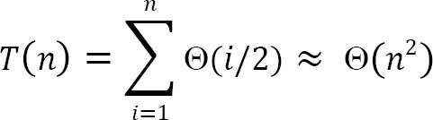

# Sorting

## What is storing?

Sorting is an algorithm that arranges the elements of a lsit in a certain order [either ascending or descending]. The output is a permutation or reordering of the input.

## Classification of sorting algorithms

Sorting algorithms are generally categorized based on the followning parameters.

### By number of comparisons

In this method, sorting algorithms are classified based on the number of camparisons. For comparison based sorting algorithms, best case behavior is O(nlogn) and worst case behavior is O(n^2). Comparison-based sorting algorithms evalute the elements of the lsit by key comparison operation and need at least O(nlogn) comparisons for most inputs.

### By number of swaps

In this method, sorting algorithms are categorized by the number of swaps

### By memory usage

Some sorting algorithms are "in place" and they need O(1) or O(logn) memory to create auxiliary locations for sorting the data temprarily.

### By recursion

Sorting algorithms are either recursive [quick sort] or non-recursive [selection sort, and insertion sort] and there are some algorithms which use both (merge sort).

### by Stability

Sorting algorithm is stable if for all indices i and j such that the key A[i] equals key A[j], if record R[i] precedes record R[j] in the original file, record R[i] precedes record R[j] in the sorted list. Few sorting algorithms maintain the relative order of element with equal keys.

### By Adaptability

With a few sorting algorithms, the complexity changes based on pre-sortedness [quick sort]: pre-sortedness of the input affects the running time. Algorithms that take this into account are known to be adaptive.

## Other Classifications

Another method of classifying sorting algorithms is:
- Internal Sort
- External Sort

### Internal Sort

Sort algorithms that use main memory exclusively during the sort are called internal sorting algorithms. This kind of algorithm assumes high-speed random access to all memory.

### External Sort

Sorting algorithms that use external memory, such as tape or disk, during the sort came under this category.

## Bubble Sort

Bubble sort is the simplest sorting algorithm. It works by iterating the input array fromt he first element to the last, comparing each pair of elements and swapping them if needed. Bubble sort continues its iterations until no more swaps are needed. The algorithm gets its name from the way smaller elements "bubble" to the top of the list. Generally, insertion sort has better performance than bubble sort. Some researchers suggest that we should not teach bubble sort ebcause of its simplicity and high time complexity.

The only significant advantage that bubble sort has over other implementations is that it can detect whether the input list is already sorted or not.

### Implementation

```c
void BubbleSort(int A[],int n){
    for(int pass=n-1;pass>=0;pass--){
        for(int i=0;o<=pass-1;i++){
            if(A[i]>A[i+1]){
                swap(A[i],A[i+1]);
            }
        }
    }
}
```

We can improve it by using one extra flag. No more swaps indicate the completion of sorting. if the lsit is already sorted, we can use this flag to skip the remaining passes.

```c
void BubbleSortSkip(int A[],int n){
    int pass,i,swapped=1;
    for(pass=n-1;pass>=0 && swapped;pass-){
        swapped=0;
        for(i=0;i<=pass-1;i++){
            if(A[i]>A[i+1]){
                swap(A[i],A[i+1]);
                swapped=1;
            }
        }
    }
}
```

This modified version improves the best case of bubble sort to O(n).

### Performance

- Worst case complexity: O(n^2)
- Best case complexity: O(n)
- Wrost case space complexity: O(1)

## Selection Sort

Selection sort is an in-place sorting algorithm. Selection sort works well for small files. It is used for sorting the files with very large values and small keys. This is because selesction is made based on keys and swaps are made only when required.

### Advantages

- Easy to implement
- In-plane sort

### Disadvantages

- Doesn't scale well: O(n^2)

### Algorithm

1. Find the minimum value in the list
2. Swap it with the value in the current position
3. Repeat this process for all the elements until the entire array is sorted

The algorithm is called selection sort since it repeatdly selects the smallest element.

### Implementation

```c
void Selection(int A[],int n){
    int i,j,min,temp;
    for(i=0;i<n-1;i++){
        min=i;
        for(j=i+1;;j<n;j++){
            if(A[j]<A[min]) min=j;
        }
        swap(A[min],A[i]);
    }
}
```

### Performance

- Worst case complexity: O(n^2)
- Best case complexity: O(n^2)
- Average case complexity: O(n^2)
- Worst case space complexity: O(1)

## Insertion Sort

Insertion sort is a simple and efficient comparison sort. In this algorithm, each iteration removes an element from the input data and inserts it into the correct position in the list being sorted. The choice of the element being removed from the input is random and this process is repeated until all input elements have gone through.

### Advantages

- Simple implementation
- Efficient for small data
- Adaptive: if the input list is presorted then insertions sort takes O(n+d), where d is the number of inversions
- Practicall more efficient than selection and bubble sorts, even though all of them have O(n^2) worst case complexity
- Stable: Maintains relative order of input data if the keys are same
- In-place: It requies only a constant amount O(1) of additional memory space
- Online: Insertion sort can sort the list as it receives it.

### Algorithm

Every repetition of insertion sort removes an element from the input data, and inserts it into the correct position in the already-sorted list until no input elements remain. Sorting is typically done in-place. The resulting array after k iterations has the property where the first k+1 entries are sorted.


Each element greater than x is copied to the right as it is compared against x.

### Implementation

```c
void InsertionSort(int A[],int n){
    int i,j,v;
    for(i=1;i<=n-1;i++){
        v=A[i];
        j=i;
        while(A[j-1]>v && j>=1){
            A[j]=A[j-1];
            j--;
        }
        A[j]=v;
    }
}
```

### Example

Given an array: 6 8 1 4 5 3 7 2 and the goal is to put them in ascending order.

**6** 8 1 4 5 3 7 2
**6 8** 1 4 5 3 7 2
**1 6 8** 4 5 3 7 2
**1 4 6 8** 5 3 7 2
**1 4 5 6 8** 3 7 2
**1 3 4 5 6 8** 7 2
**1 3 4 5 6 7 8** 2
**1 2 3 4 5 6 7 8**

### Analysis

#### Worst case analysis

Worst case ocfurs when for every i the inner loop has to move all the elemnts, that takes Θ(i-1) time.


#### Average case analysis

For the average case, the inner loop will insert A[i] in the middle. This takes Θ(i/2) time.



### Performance

If every element is greater than or equal to every element to its left, the running time of insertion sort is O(n). This situation occurs if the array starts out already sorted, and so an already-sorted array is the best case of insertion sort.

- Worst case complexity: O(n^2)
- Best case complexity: O(n)
- Average case complexity: O(n^2)
- Worst case space complexity: O(n^2)

### Comparions to Other sorting algorithms

Insertion sort is one of the elementary sorting algorithms with O(n^2) worst-case time. Insertion sort is used when the data is nearly sorted or when the input size if small. For these reasons and due to its stability, insertion sort is used as the recursive base case for higher overhead divide and conqurt sorting algorithms, such as merge sort or quick sort.

**Notes:**

- Bubble sort takes n^2 /2 comparisons and n^2 /2 swaps (inversions) in both average case and in worst case.
- Selection sort takes n^2 /2 comparisons and n swaps.
- Insertion sort takes n^2 /4 comparisons and n^2 /8 swaps in average case and in the worst case they are double.
- Insertion sort is almost linear for pratially sorted input.
- Selection sort is best suits for elemnets with bigger values and small keys.

## Shell Sort

Shell Sort was invented by Donald Shell. THis sorting algorithm is a generalization of insertion sort. Insertion sort work efficienty on input that is already almost sorted. Shell sort is also known as n-gap insertion sort. instead of comparing only the adjacent pair, shell sort makes several passes and uses various gaps between adjacent elements (ending with the gap of 1 or classiacal insrtion sort).

In insertion sort, comparisons are made between the adjacent elements. At most 1 inversion is eliminated for each comarpison done with insertion sort. The variation used in shell sort is to avoid comapring adjacent elements until the last step of the algorithm. So, the last step of shell sort is effectively the insertion sort algorithm. it improves insertion sort by allowing the comparison and exchange of elemnets that are far away. This is the first algorithm which got less than quadratic complexity among comparison sort algorithms.

Shell sort is actually a simple extension for insertion sort. The primary difference is its capability for exchanging elements that are far apart, making it considerably fast for elemnets to get to where they should be. For example, if the smallest element happens to be at the end of an array, with insertion sort it will require the full array of steps to put this element at the beginning of the array. However, with shell sort, this element can jump more than one step a time and reach the proper destination in fewer exchanges.

The basic idea in shell sort is to exchange every hth element in the array. now this can be confusion so we'll talk more about this, h determines how far apart element exchange can happens, say for example take h as 13, the first element is exchanged with the 14th element if necessary. The second element with the 15th, and so no. Now if we take has 1, it is exactly the same as a regular insertion sort.

Shell sort works by starting with big enough h so as to allow eligible element exchanges that are far apart. once a sort is complete with a particular h, the array can be said as h-sorted. The next step is to reduce h by a certain sequence, and again perform another complete h-sort. Once h is 1 and h-sorted, the array is completely sorted. notice that the last sequence for h is 1 so the alst sort is awlays an insertion sort, except by this time the array is already well-formed and easier to sort.

Shell sort uses a sequence h1,h2,...,ht called the incremenet sequence. Any incremenet sequence is fine as long as h1=1, and some choices are better than others. Shell sort makes multiple passes through the input list and sorts a number of euqally sized sets using the insertion sort. Shell sort improves the efficiency of insertion sort by quickly shifting values to their destination.

### Implemention

```c
void ShellSort(int A[],int array_size){
    int i,j,h,v;
    for(h=1;h=array_size/9;h=3*h+1);
    for(;h>0;h=h/3){
        for(i=h+1;i=array_size;i+=1){
            v=A[i];
            j=i;
            while(j>h && A[j-h]>v){
                A[j]=A[j-h];
                j-=h;
            }
            A[j]=v;
        }
    }
}
```

note that when h==1, the algorithm ameks a pass over the entire list, comparing adjacenct elemnets, but doing every few element exchanges. For h==1, shell sort works just like insertion sort, except the number of inversions that have to be eliminated is grearly reduced by the previous steps of the algortihms with h>1.

### Analysis

Shell sort is efficiency for medium size lists. For bigger lists, the algorithm is not the best choice. It is the fastest of all O(n^2) sorting algorithms.

The disadvantages of Shell sort is that it is a complex algorithm and not nearly as efficient as the merge, heap and quick sorts. Shell sort is significantly slower than the merge,heap and quick sorts, but is a relatively simple algorithm, which makes it a good choice for sorting lists of less than 5000 items unless speed is important. It is also a good choice for repetitive sorting of smallest lists.

The best case in shell sort is when the array is already sorted in the right order. The number of comparisons is less. The running time of Shell sort depends on the choice of incerment esquence.

### Performce

- Worst case complexity depends on gap sequence: O(nlog^(2)n)
- Best case complexity: O(n)
- Average case complexity depends on gap sequence
- Worst case space complexity: O(n)

## Merge sort

Merge sort is an example of divide and conquer strategy.

### Important Notes

- Merging is the process of combining two sorted files to make one bigger sorted file.
- Selection is the process of dividing a file into two parts: k smallest elemnets and n-k largest elements.
- Selection and merging are opposite operations
  - Selection splits a list into two lists
  - Merging joins two files to make one file
- Merge sort is Quick sort's complement
- Merge sort accesses the data in a sequential manner
- This algortihm is used for sorting a linked list
- merge sort is insensitive to the intial order of its input
- In Quick sort most of the work is done before the recursive calls. Quick sort starts with the largest subfile and finishes with the small ones and as a result it needs stack. Moreover, this algorithm is not stable. Merge sort divides the list into two parts; then each part is conquered individually. Merge sort starts with the smallest subfiles and finishes with the largest one. As a result it doesn't need stack. This algorithm is stable.

### Implementation

```c
void MergeSort(int A[],int temp[],int left,int right){
    int mid;
    if(right>left){
        mid = (right+left)/2;
        MergeSort(A,temp,left,mid);
        MergeSort(A,temp,mid+1,right);
        Merge(A,temp,left,mid+1,right);
    }
}

void Merge(int A[],int temp[],int left,int mid,int right){
    int i,left_end,size,temp_pos;
    left_end=mid-1;
    temp_pos=left;
    size=right-left+1;
    while(left<=left_end && mid<=right){
        if(A[left]<=A[mid]){
            temp[temp_pos]=A[left];
            temp_pos++;
            left++;
        }else{
            temp[temp_pos]=A[mid];
            temp_pos++;
            mid++;
        }
    }
    while(left<=end_left){
        temp[temp_pos]=A[left];
        left++;
        temp_pos++;
    }
    while(mid<=right){
        temp[temp_pos]=A[mid];
        mid++;
        temp_pos++;
    }
    for(i=0;i<=size;i++){
        A[right]=temp[right];
        right--;
    }
}
```

### Analysis

In merge sort the input list is divided into two parts and these are solved recursively. After solving the sub problems, they are merged by scanning the resultant sub problems, Let us assume T(n) is the complexity of Merge Sort with n elemnets. THe recurrence for the merge sort can be defined as:


### Performance

- Wrost case complexity: O(nlogn)
- Best case complexity: O(nlogn)
- Average case complexity: O(nlogn)
- Worst case space complexity: O(n)

## Heap Sort

Heapsort is a comparison-based sorting algorithm and is part of the selection sort family. Althought somewhat slower in practice on mast machines than a good implementation of Quick sort, it has the advantage of a more favorable worst-case O(nlogn) runtime. heapsort is an in-place algorithm but is not a stable sort.

### Performance

- Worst case performance: O(nlogn)
- Best case performance: O(nlogn)
- Average case performance: O(nlogn)
- Worst case space complexity: O(n) total, O(1) auxiliary

## Quicksort

Quick sort is an example of a divide and conquer algorithmir technique. It is also called partition exchange sort. It suses ercursive calls for sorting the elements, and it is one of the famous algorithms among camparison-based sorting algorithms.

Divide: The array A[low ...high] is partitioned into two non-empty sub arrays A[low ...q] and A[q+1... high], such that each element of A[low... high] is less than or equal to each element of A[q+1 ... high]. The index q is computed as part of this partitioning procedure.

Conquer: The two sub arrays A[low ... q] and A[q+1 ... high] are sorted by recursive calls to quick sort.

### Algorithm

The recursive algorithm consists of four steps:
1) If there are one or no elements in the array to be sorted, return.
2) Pick an element in the array to serve as the "pivot" point.
3) Split the array into two parts - one with elements larger than the pivot and the other with elements smaller than the pivot.
4) Recursively repeat the algorithm for both halves of the original array.

### Implementation

```c
void quicksort(int A[],int low,int high){
    int pivot;
    if(high>low){
        pivot=Partition(A,low,high);
        quicksort(A,low,pivot-1);
        quicksort(A,pivot+1,high);
    }
}
int Partition(int A,int low,int high){
    int left,right,pivot_item=A[low];
    left=low;
    right=high;
    while(left<right){
        while(A[left]<=pivot_item) left++;
        while(A[right]>pivot_item) right--;
        if(left<right) swap(A,left,right);
    }
    A[low]=A[right];
    A[right]=pivot_item;
    return right;
}
```

### Analysis

Let us assume that T(n) be the complexity of Quick sort and also assume that all elemnets are distinct. Recurrence for T(n) depends on two sub problem sizes which depend on partition element. If pivot is ith smallest element than exactly (i-1) items will be in left part and (n-i) in right part. Let us call it as i-split. Since each element has equal probability of selecting it as pivot the probability of selecting ith element is 1/n;

**Best case**: Each partition splits array in halves and gives

T(n)=2T(n/2)+O(n) = O(nlogn)

**Worst case**: Each partition gives unbalanced splits and we get

T(n) = T(n-1) +  O(n) = O(n^2)

The worst-case occurs when the list is already sorted and last element chosen as pivot.

**Average case**: In the average case of quick sort, we do not know where the split happens. For this reason, we take all possible values of split locations, add all their complexities and divide with n to get the average case complexity.


### Performance

- Worst case complexity: O(n^2)
- Best case complexity: O(nlogn)
- Average case complexity: O(nlogn)
- Worst case space complexity: O(1)

### Randomized quick sort

In average-case behavior of quick sort, we assume that all permutation of the input numbers are equally likely. However, we cannot always expect it to hold. WE can add randomization to an algorithm in order to reduce the proabability of getting worst case in quick sort.

There are two ways of adding randomization in quick sort: either by randomly placing the input data in the array or by randomly choosing an element in the input data for pivot. THe second choice is easier to analyze and implement. The change will only be done at the partition algorithm.

In normal quick sort, pivot element was always the leftmost element in the list to be sorted. Instead of always using A[low] as pivot, we will use a randomly chosen element from the subarray in the randomized version of quick sort. It is done by exchanging element A[low] with an element chosen at random from A. This ensures that the pivot element is equally likely to be any of the high-low+1 elements in the subarray.

Since the pivot element is randomly chosen, we can expect the split of the input array to be reasonbly well balanced on average. This can help in preventing the worst-case behavior of quick sort which occurs in unbalanced partitioning. Even though the randomized version improves the worst case complexity, its worst case complexity is still O(n^2). One way to improve Randomized - Quick sort is to choose the pivot for partitioing more carefully than by picking random elemnet from the array. One common approach is to choose the pivot as the median of a set of 3 elements randomly selected from the array.

## Tree Sort

Tree sort uses a binary search tree. It involves scanning each element of the input and placing it into its proper position in a binary search tree. This has two phases:
- First phase is creating a binary search tree using the given array elements.
- Second phase is traversing the given binary search tree in inorder, thus resulting in a sorted array.

### Performance

The average number of comparisons for this method is O(nlogn). But in worst case, the number of comparisons is reduced by O(n^2), a case which arises when the sort tree is skew tree.

## Comparison of sorting algorithms


## Linear sorting algorithms

In earlier sections, we have seen many examples of comparison-based sorting algorithms. Among them, the best comparison-based sorting has the complexity O(nlogn). In this section, we will discuss other types of algorithms: Linear sorting algorithms. To improve the time complexity of sorting these algorithms, we make some assumptions about the input. A few examples of Linear sorting algorithms are:
- Counting sort
- Bucket sort
- Radix sort

## Counting sort

Counting sort is not a comparison sort algorithm and gives O(n) complexity for sorting. To achieve O(n) complexity, counting sort assumes that each of the elements is an integer in the range 1 to K, for some integer K. When if O(n), the counting sort runs in O(n) time. The basic idea of counting sort is to determine, for each input element X, the number of elements less than X. This information can be used to place it directly into its correct position. For example, if 10 elements are less than X, then X belongs to position 11 in the output.

In the code below, A[0 ... n-1] is the input array with length n. In couting sort we need two more arrays: let us assuem array B[0 .. n-1] contains the sorted output and the array C[0 ... k-1] provides temporary storage.

```c
void CountingSort(int A[],int B[],int k){
    int C[k],i,j;
    for(i=0;i<k;i++) C[i]=0;
    for(j=0;j<n;j++) C[A[j]] = C[A[j]] + 1;
    for(i=1;i<k;i++) C[i]=C[i]+C[i-1];
    for(j=n-1;j>=0;j--){
        B[C[A[j]]]=A[j];
        C[A[j]]=C[A[j]]-1;
    }
}
```

Total Complexity: O(K) + O(n) + O(K) + O(n) = O(n) if K =O(n). Space Complexity: O(n) if K =O(n).

Note: Counting works well if K =O(n). Otherwise, the complexity will be greater.

