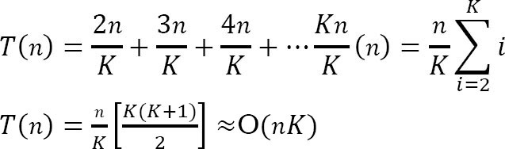
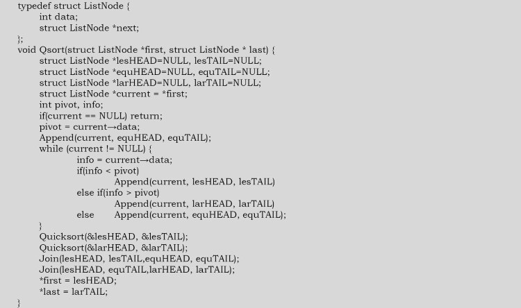
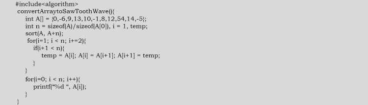
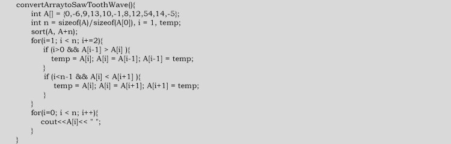

# Problems

### Q1. Given an array A[0...n-1] of n numbers containing the repetition of some number. Give an algorithm for checking whether there are repeated elements or not. Space comexplity: O(1)

Since we are not allowed to use extra space, one simple way is to scan the elements one-by-one and for each element check whether that element appears in the remaining elements. If we find a match we return true.

```c
int checkDuplicatesInArray(int A[],int n){
    for(int i=0;i<n;i++)
        for(int j=i+1;j<n;j++)
            if(A[i]==A[j])
                return true;
    return false;
}
```

Time complexity: O(n^2)

### Q2. Can we improve the time complexity of Q1?

Using sorting technique

```c
int checkDuplicatesInArray(int A[],int n){
    heapsort(A,n);
    for(int i=0;i<n-1;i++)
        if(A[i]==A[i+1])
            return true;
    return false;
}
```

Time complexity: O(nlogn)

### Q3. Given an array A[0...n-1], where each element of the array represents a vote in the election. Assume that each vote is given as an integer representing the ID of the chosen cadidate. Give an algorithm for determining who wins the election.

This problem is nothing but finding the element which repeated the maximum number of times. The solution is similar to the Q1,

```c
int checkWhoWinsTheElection(int A[],int n){
    int i,j,counter=0,maxCounter=0,cadidate;
    cadidate=A[0];
    for(i=0;i<n;i++){
        candidate=A[i];
        counter=0;
        for(j=i+1;i<n;j++){
            if(A[i]==A[j]) counter++;
        }
        if(counter>maxCounter){
            maxCounter=counter;
            candidate=A[i];
        }
    }
    return candidate;
}
```

Time complexity: O(n^2)

### Q4. Can we improve the time complexity of Q3? Assume we don't have any extra space.

The approach is to sort the votes based on candidate ID, then can the sorted array and count up which candidate so far has the most votes. We only have to remember the winner, so we don't need a clever data strcuture. We can use heapsort as it is an in-place sorting algorithm.

```c
int checkWhoWinsTheElection(int A[],int n){
    int i,j,currentCounter=1,maxCounter=1;
    int currentCandidate,maxCandidate;
    currentCandidate=maxCandidate=A[0];
    heapsort(A,n);
    for(int i=1;i<=n;i++){
        if(A[i]==currentCandidate) currentCounter++;
        else{
            currentCandidate=A[i];
            currentCounter=1;
        }
        if(currentCounter>maxCounter) maxCounter=currentCounter;
        else{
            maxCandidate=currentCandidate;
            maxCounter=currentCounter;
        }
    }
    return candidate;
}
```

Time complexity: O(nlogn)

### Q5. Can we further imrpove the time complexity of Q3?

In the given problem, the number of candidates is less but the number of votes is significantly large. For this problem we can use counting sort.

Time complexity: O(n), n is the number of votes (elements) in the array. Space complexity: O(k), k is the number of candidates participating in the election.

### Q6. Given an array A of n elements, each of which is an integer in the range [1,n^2], how do we sort the array in O(n) time?

If we subtract each numberf by 1 then we get the range [0,n^2-1]. if we consider all numbers as 2-digit base n. Each digit ranges from 0 to n^2-1. Sort this using radix sort. This uses only two calls to counting sort. Finally, add 1 to all the numbers. SInce there are 2 calls, the complexity is O(2n) ~ O(n).

### Q7. For Q6, what if the range is [1...n^3]?

If we subtract each number by 1 then we get the range [0,n^3-1]. Considering all numbers as 3-digit base n: each digit ranges from 0 to n^3-1. Sort this using radix sort. This uses only three calls to counting sort. Finally, add 1 to all the numbers. Since there are 3 calls, the complexity is O(3n).

### Q8. Given an array with n integers, each of value less than n^100, can it be sorted in linear time?

Yes. The reasoning is same as in of Q6 & Q7.

### Q9. Let A and B be two arrays of n elements each. Given a number K,give an O(nlogn) time algorithm for determining whether there exists a is memeber of A and b is memeber of B such that a+b=K.

Since we need O(nlogn), it gives us a pointer that we need to sort. So, we will do that.

```c
int find(int A[],int B[],int n,K){
    int i,c;
    heapsort(A,n);
    for(i=0;i<n;i++){
        c=k-B[i];
        if(binarySearch(A,c)) return 1;
    }
    return 0;
}
```

O(nlogn)

### Q10. Let A,B and C be three arrays of n elements each. Given a number K, give an O(nlogn) time algorithm for determining whether there exists a is memeber of A,b is emember of B & c is memeber of C such that a+b+c=K.

Refer to searching chapter.

### Q11. GIven an array of n elements, can we output in sorted order the K elements following the median in sorted order in time O(n+KlogK).

Yes. Find the median and partition the median. With this we can find all the elements greater than it. Now find the Kth largest element in this set and partition it; and get all the elements less than it. Output the sorted list of the final set of elements. Clearly, this operation takes O(n+KlogK) time.

### Q12. Consider the sorting algorithms: Bubble sort, insertion sort, selection sort, merge sort, heap sort, and quick sort. Which of these are stable?

Lelt us assume that A is the array to be sorted. Also, let us say R and S have the same key and R appears earlier in the array than S. That means, R is at A[i] and S is at A[j], with i < j. To show any stable algorithm, in the sorted output R must precede S.

**Bubble sort**: Yes. Elements change order only when a smaller record follows a large. Since S is not smaller than R it cannot precede it.

**Selection sort**: No. It divides the array into sorted and unsorted portions and iteratively finds the minimum values in the unsorted position. After finding a minimum x, if the algorithm moves x into the sorted portion of the array by means of a swap, then the element swapped could be R which then could be moved behind S. This would invert the positions of R and S, so in general it is not stable. If swapping is avoided, it could be made stable but the cost in time would proabbly be very significant.

**Merge sort**: Yes, in the case of records with equal keys, the record in the left subarray gets preference. Those are the records that came first in the unsorted array. As a result, tehy will precede later records with the same key.

**Heap sort**: No, Suppose i=1 and R and S happen to be the two records with the largest keys in the input. The R will remain in location 1 after the array is heapified, and will be placed in location n in the first iteration of heapsort. Thus S will precede R in the output.

**Quick sort**: No, The partitioning step can swap the location of records many times, and thus two records with equal keys could swap position in the final output.

### Q13. Consider the same sorting algorithms as that of Q12. Which of them are in-place?

**Bubble sort**: Yes, because only two integers are required.

**Insertion sort**: Yes, since we need to store two integers and a record.

**Selection sort**: Yes. This algorithm would likely need space for two integers and one record.

**Merge sort**: No. Arrays need to perform the merge. (If the data is in the form of a linked list, the sorting can be done in-place, but this is a nontrivial modification.)

**Heap sort**: Yes, since the heap and partilaly-sorted array occupy opposite ends of the input array.

**Quick sort**: No, since it is recursive and stores O(logn) activation records on the stack. Modifying it to be non-recursive is feasible but nontrivial.

### Q14. Among Quick sort,Insertion sort, Selection sort, and Heap sort algorithms, which one needs the minimum numbers of swaps?

Selection sort - it needs n swaps only

### Q15. What is the minimum number of comparisons required to determine if an integer appears more than n/2 times in a sorted array of n integers?

Refer to searching chapter.

### Q16. Sort an array of 0's,1's and 2's: Given an array A[] consisting of 0's, 1's and 2's, give an algorithm for sorting A[]. The algorithm should put all 0's first, then all 1's and all 2's last.

Use counting sort. Since there are only three elemenets and the maximum value is 2, we need a temporary array with 3 elements.

Time comexplity: O(n) . Space complexity: O(1)

### Q17. Is there an other way of solving Q16?

Using quick sort. Since we know there there are only 3 elements, 0,1 and 2 in the array, we can select 1 as a pivot element for quick sort. Quick sort finds the correct place for 1 by moving all 0's to the left of 1 and all 2's to the right of 1. For doing this it uses only one scan.

Time complexity: O(n)

### Q18. How do we find the number that appeared the maximum number of times in an array?

One simple approach is to sort the given array and scan the sorted array. While scanning, keep track of the element that occur the maximum number of times.

```c
quicksort(A,n);
int i,j,count=1,number=A[0],j=0;
for(i=0;i<n;i++){
    if(A[j]==A){
        count++;
        number=A[j];
    }
    j=i;
}
printf("Number:%d,count:%d",number,count);
```

Time complexity: O(nlogn)

### Q19. Is there any other way of solving Q18?

Using binary tree. Create a binary tree with an extra field count which indicates the number of times an element appeared in the input. Let us say we have created a binary search tree. Now, do the in-order traversal of the tree. The in-order traversal of BST produces the sorted list. While doing the in-order traversal keep track of the maximum element.

Time complexity: O(2n)

### Q20. Is there yet another way of solving Q18?

Using hash table. For each element for the given array we use a counter, and for each occurrence of the element we increment the corresponding counter. At the end we can just return the element which has the maximum counter.

Time complexity: O(n). Space complexity: O(n)

### Q21. Given a 2GB file with one string per line, which sorting algorithm would we use to sort the file and why?

When we have a size limit of 2GB, it means that we cannot bring all the data into main memory.

How much memeory do we have avaiable? Let's assume we have X MB of memory available. Divide the file into K chunks, where X*K ~ 2GB.
- Bring each chunk into memory and sort the lines as usual
- Save the lines back to the file
- Now bring the next chunk into memory and sort
- Once we are done, merge them one by one; in the case of one set finishing, bring more data from the particular chunk.

The above algorithm is also known as external sort. Step 3-4 is known as K-way merge. The idea behind going for an external sort is the size of data. Since the data is huge and we can't bring it to the memory, we need to go for a disk-based sorting algorithm.

### Q22. Nearly sorted: Given an array of n elements, each which is at most K positions from its target position. device an algorithm that sorts in O(nlogK) time.

Divide the elements into n/K groups of size K, and sort each peice in O(KlogK) time, let's say using mergesort. This preserves the property that no element is more than K elements out of position. Now, merge each block of K elements with the block to its left.

### Q23. Is there any other way of solving Q22?

Insert the first K elemnets into a binary heap. Insert the next element from the array into the heap, and delete the minimum element fromt he heap. Repeat.

### Q24. Merging K sorted lists: GIven K sorted lists with a total of n elements, give an O(nlogK) algorithm to produce a sorted list of all n elements.

Simple algorithm for merging K sorted lists: Consider groups each having n/K elements. Take the first list and merge it with the second list using a linear-time algorithm for mergin two sorted lists, such as the merging algorithm used in merge sort. Then, merge the resulting lsit of 2n/K elements with the third list, and then merge the resulting list of 3n/K elements with the fourth list. Repeat this until we end up with a single sorted list of all n elements.

Time complexity:  In each iteration we are merging K elements.



### Q25. Can we imporve the time complexity of Q24?

One method is to repeatdely pair up the lists and then merge each pair. This method can also be seen as a tail componenet of the execution merge sort, where the analysis is clear. THis is called touranment method. The maximum depth of the tournament method is logK and in each iteration we are scanning all the n elements.

Time complexity: O(nlogK)

### Q26. Is there any other way of solving Q24?

The other method is to use a rain priority queue for the minimum elements of each of the if lists. At each step, we output the extracted minimum of priority queue, determine from which of the K lists it came, and insert the next element from that list into the priority queue. Since we are using priority queue, that maximum depth of priorirty queue is logK.

Time complexity: O(nlogK)

### Q27. Which sorting method is better the linked lists?

Merge sort is a better choice. At first appearance, merge sort may not be a good selection since the middle node required to subdivide the given list into two sub-lists of equal length. We can easily solve this problem by moving the nodes alternatively to two lists. Then, sorting these two lists recursively and merging the results into a single list will sort the given one.

```c
typedef struct ListNode{
    int data;
    struct ListNode*next;
}

struct ListNode*linkedListMergeSort(struct ListNode*first){
    struct ListNode*list1HEAD=NULL;
    struct ListNode*list1TAIL=NULL;
    struct ListNode*list2HEAD=NULL;
    struct ListNode*list2TAIL=NULL;
    if(first==NULL || first->next==NULL) return first;
    while(first!=NULL){
        append(first,list1HEAD,list1TAIL);
        if(first!=NULL) append(first,list2HEAD,list2TAIL);
    }
    list1HEAD=linkedListMergeSort(list1HEAD);
    list2HEAD=linkedListMergeSort(list2HEAD);
    return merge(list1HEAD,list2HEAD);
}
```

append() appends the first argument to the tail of a singly linked list whose head and tail are defined by the second and third arguments.

all external sorting algorithms can be used for sorting linked lists since each involved file can be considered as a linekd list that can only be accessed sequentially. We can sort a doubly linked list using its next fields as if it was a singly linked one and reconstruct the prev fields after sorting with an additional scan.

### Q28. Can we implement linkedlist lists sorting with quick sort?

The original quick sort cannot be used for sorting singly linked lists. This is because we cannot move backward in singly linked lists. But we can modify the original quick sort and make it work for singly linked lists.

Let us consider the following modified quick sort implementation. The first node of the input list is considered a pivot and is moved to equal. The value of each node is comapred with the pivot and moved to less if the nodes value is smaller than the pivot. THen, less and larger are sorted recursively. Finally, joining less, equal and larger into a single list yields a sorted one.

append() appens the first argument to the tail of a singly linked list whose head and tail are defined by the second and third arguemnts. On return, the first will be modified so that it points to the next node of the list. Join() appens the list whose head and tail are defined by the third and fourht arguments to the list whose head and tail are defined by the first and second arguemtns. For simplicity, the first and fourth arguments become the head and tail of the resulting list.



### Q29. Given an array of 100,000 pixel color values, each of which is an integer in the range [0,255]. Which sorting algorithm is preferable for sorting them?

Counting sort. There are only 256 key values, so the auxiliary aray would only be of size 256, and there would be only two passes through the data, which would be very efficient in both time and space.

### Q30. Similar to Q29, if we have a telephone directory with 100 million entries, which sorting algorithm is best?

Bucket sort. In bucket sort the buckets are defined by the last 7 digits. This requires an auxiliary arrary of size 10 million and has the advantage of requiring only one pass through the data on disk. Each bucket contains all telephone numbers with same last 7 digits but with different area codes. THe buckets can then be sorted by area code with slection orinsertion sort; there are only a handful of area codes.

### Q31. GIve an algorithm for merging K-sorted lists.

Refer to priority queues chapter.

### Q32. Given a big file containing billions of numbers. Find maximum 10 numbers from this file.

Refer to priority queues chapter.

### Q33. There are two sorted arrays A and B. The first one is of size m+n containing only m elements. Another one is of size n and contains n elements. Merge these two arrays into the first array of size m+n such that the output is sorted.

The trick for this problem is to start filling the destination array from the back with the largest elements. We will end up with a merged and sorted destination array.

```c
void merge(int A[],int m,int B[],int n){
    int count=m;
    int i=n-1,j=count-1,k=m-1;
    for(;k>=0;k--){
        if(B[i]>A[j] || j<0){
            A[k]=B[i];
            i--;
            if(i<0) break;
        }else{
            A[k]=A[j];
            j--;
        }
    }
}
```

Time complexity: O(m+n)

### Q34. Nuts and bolts problem: Given a set of n nuts of different sizes and n bolts such that there is a one-to-one correspondence between the nuts and bolts, find for each nut its corresponding bolt. Assume that we can only compare nuts to bolts: we cannot compare nuts to nuts and bolts to bolts.

Alternative way of framming the question: We are given a box which contians bolts and nuts. Assume there are n nuts and n bolts and that each nut matches exactly one bolt. By trying to match a bolt and  a nut we can see which one is bigger, but we cannot compare two bolts or two nuts directly. Design an efficienct algorithm for matching the nuts and bolts.

**Brute Force approach**: Start with the first bolt and comapre it with each nut until we find a match. In the worst case, re require n comaprisons. Repeat this for successive bolts on all remaining gives O(n^2) complexity.

### Q35. For Q34, can we improve the complexity?

In Q34, we got O(n^2) complexity in the worst case. Its analysis is the same as that of quick sort. The improvement is also along the same lines. To reduce the worst case complexity, instead of selecting the first bolt every time, we can select a random bolt and match it with nuts. This randomized selection reduces the probabulity of getting the worst case.

### Q36. For Q34, can we further imrpove the complexity?

We can us ea divide and conquer technique or solving this problem and the solution is very similar to randomized quick sort. For simplicity let us assume that bolts and nuts are represetned in two arrays B and N.

The algorithm first performs a partition operation as follows: pick a random boltB[t]. Using this boltrearrage the array of nuts into three groups of element:
- First the nuts smaller than B[i]
- Then the nuts that matches B[i], and
- Finally, the nuts larger than B[i].

Next, using the nut that matches B[i], perform a similar partition on array of bolts. THis pair of partitioning operations can easily be implemented in O(n) time, and it leavaes the bolts and nuts nicely partitioned so that the "pivot" bolt and nut are aligned with each other and all other bolts and nuts are on the correct side of these pibots - smaller nuts and bolts precede the pivots, and larger nuts and bolts follow the pivots. Our algorithm then completes by recursively applying itself to the subarray to the left and right of pivot position to match these remainin bolts and nuts. We can assume by induction on n that these recursive calls will properly mathc the remaining bolts.

O(nlogn)

**Alternative analysis**: We can solve this problem by making a small change to quick sort. Let us assume that we pick the last element as the pivot, say it is a nut. Compare the nut with only bolts as we walk down the array. This will parition the array for the bolts. Every bolt less than the parition nut will be on the left. And every bolt greater than the parition nut will be on the right.

While traversing down the list, find the matching bolt for the parition nut. Now we do the partition again using the matching bolt. As a result, all the nuts less thant he matching bolt will be on the left side and all the nuts greater than the mathcing bolt will be on the right sode. Recursively call on the left and right arrays.

The time complexity is O(nlogn)

### Q37. Given a binary tree, can we print its elements in sorted order in O(n) time by performing an in-order tree traversal?

Yes, if the tree is a binarys earch tree.

### Q38. Given an array of elemnets, convert it into an array such that A < B > C < D > E < F and so on.

Sort the array, then swap every adjacennt element to get the final result.



### Q39. Can we do Q38 with O(n) time?

Make sure all even positioned elements are greater than their adjacenct odd elemnets, and we don't need to worry about odd positioned elemnets. Traverse all even positioned elements of input array, and do the following:

- If the current element is smaller than the previous odd elemnet, swap previous and current.
- If the current element is smaller than the next odd element, swap next and current.



### Q40. Merge sorto uses

1) Divide and conquer stragegy
2) Backtracking approach
3) heuristic search
4) greedy approach

1.

### Q41. Which of the following algorithm design techniques is used in the quicksort

1) Dynamic programming
2) Backtracking
3) Divide and conquer
4) Greedy method

3.

### Q42. For merging two sorted lists of sizes m and n into a sorted list of size m+n, we required comparisons of

1) O(m)
2) O(n)
3) O(m+n)
4) O(logm+logn)

3.

### Q43. Quick sort is run on two inputs shown below to sort in ascending order
i) 1,2,3...n
ii) n,n-1,n-2,...,2,1

Let c1 and c2 be the number of comparisons made for inputs i) and ii) repsectively.

1) C1 < C2
2) C1 > C2
3) C1 = C2
4) we cannot say anything for arbitrary n.

Since the given problems needs the output in ascending order, quicksort on already sorted order gives the worst case O(n^2). So i) generates worst case and ii) needs fewer comarpisons.

### Q44. Give the correct matching for the following pairs:

1) O(logn)
2) O(n)
3) O(nlogn)
4) O(n^2)
A) Selection
B) Insertion sort
C) Binary search
D) Merge sort

1-C , 2-A , 3-D , 4-B

### Q45. Let s be a sorted array of n integers. Let t(n) denote the time taken for the msot efficient algorithm to determine if there are two elements with sum less than 1000 in s. which of the following statements is true?

1) t(n) is O(1)
2) n < t(n) < nlogn
3) nlogn < t(n) < nC2
4) t(n)=nC2

1, Since the given array is already sorted it is enough if we check the first two elements of the array.

### Q46. The usual O(n^2) implementation of insertion sort to sort an array uses linear search to identify the postion where an element is to be inserted into the already sorted part of the array. If, instead, we use binary search to identify the position, the worst case running time will

1) remain O(n^2)
2) become O(n(logn)^2)
3) become O(nlogn)
4) become O(n)

1, If we use binary search then there will be log(n!) comparisons in the worst case, whic is O(nlogn). But the algorithm as a whole will still have a running time of O(n^2) on average because of the series of swaps required for each isnertion.

### Q47. In Quick sort, for sorting n elements, the n/4th smallest element is sleected as pivot using an O(n) time algorithm. What is the worst case time complexity of the quick sort?

1) O(n)
2) O(nlogn)
3) O(n^2)
4) O(n^2logn)

The recursion expression becomes: T(n) = T(n/4) + T(3n/4) +en. Solving the recursion using variant of master theorem, we get O(nlogn)


### Q48. Consider the quicksort algorithm. Suppose there is a procedure for finding a pivot element which splits the list into sub-lists each of which contains at least one-fifth of the elements. Let t(n) be the number of comarpisons requried to sort n elements. Then

1) T(n)<=2T(n/5)+n
2) T(n)<=T(n/5)+T(4n/5)+n
3) T(n)<=2T(4n/5)+n
4) T(n)<=2T(n/2)+n

3, For the case where n/5 elements are in one subset, T(n/5) comarpisons are needed for the first subset with n/5 elements, T(4n/5) is for the rest 4n/5 elements, and n is for finding the pivot. if tehre are mroe than n/5 elements in one set then other set will have less than 4n/5 elements and time complexity will be less than T(n/5) + T(4n/5) + n.

### Q49. Which of the following sorting algorithms has the lowest worst-case complexity

1) Merge sort
2) Bubble sort
3) Quick sort
4) Selection sort

1.

### Q50. Which one of the following in place sorting algorithms needs the minimum number of swaps?

1) Quick sort
2) Insertion sort
3) Selection sort
4) Heap sort

3.

### Q51. You have an array of n elements. Suppose you implement quicksort by always choosing the central element of the array as the pivot. Then the tighest upper bound for the worst case performance is

1) O(n^2)
2) O(nlogn)
3) Θ(nlogn)
4) O(n^3)

A, When we choose the first element as the pivot, the worst caes of quick sort comes if the input is sorted-either ascending or descending order.

### Q52.