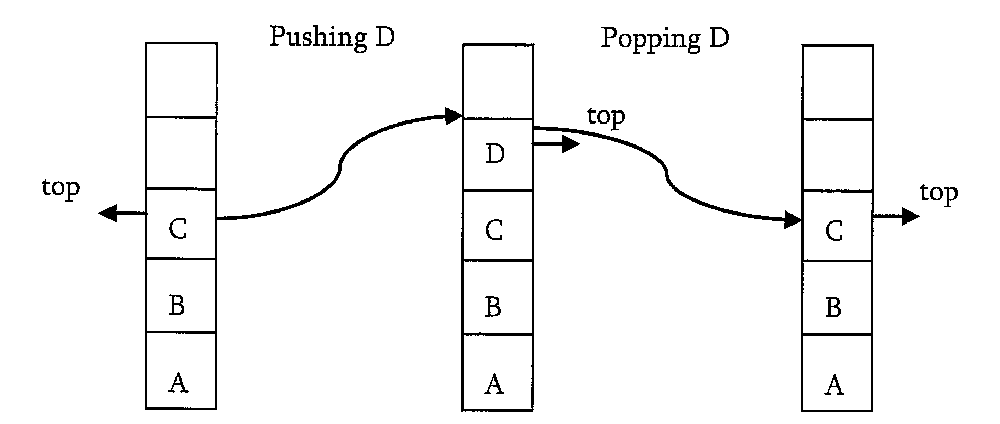
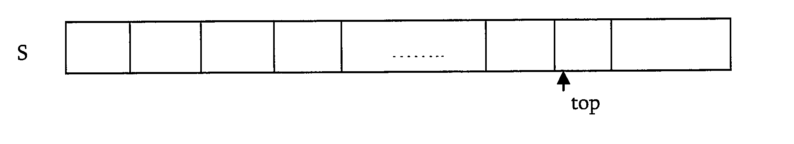

# Stacks

## What is a stack?

A stack is a simple data structure used for storing data. In stack, the order in which the data arrives is important. THe pile of plates of a cafeteria is a good example of stack. The plates are added to the stack as they are cleaned. they are palced on the top. When a plate is required it is taken from the top of the stack. The first plate placed on the stack is the last one to be used.

- Definition: A stack is an ordered list in which insertion and deletion are done at one end, where the end is called as top. The last element inserted is the first one to be deleted. Hence, it is called `Last in First out(LIFO)` or `First in Last out(FILO)` list.



## How stacks are used?

Consider a working day in the office. Let us assume a developer is working on a long-term project. The manager then gives the developer a new task, which is more important. The developer places the long-term project aside and begins work on the new task. The phone then rings, this is the highest priority, as it must be answered imeediately. The develoepr pushes the present task into the pending tray and answers the phone. When the call is compelte the task abandoned top answer the phone is retrieved from the pending tray and work progresses. If another call comes in, it may have to be handled in the same manner, but eventually the new task will be finished, and the developer can draw the long-term project from the pending tray and continue with that.

## Stack ADT

### Operations

- `void Push(int data)`: Inserts data onto stack
- `int Pop()`: Removes and returns the last inserted element from the stack
- `int Top()`: Returns the last inserted element without removing it
- `int Size()`:Returns the number of elemnts stored in stack
- `int isEmptyStack()`: Indicates whether any elements are stored in stack or not
- `int isFullStack()`: INdicates whether the stack if full or not.

### Applications

- Balancing of symbols
- Infix-to-postfix conversion
- Evaluation of postfix expression
- Implementing function calls
- Page-visited history in a web brower
- Undo sequence in text editor
- Matching Tags in HTML and XML

## Implementation

### Simple array



```c
struct ArrayStack{
    int top;
    int capacity;
    int *array;
}

struct ArrayStack*CreateStack(){
    struct ArrayStack*S=malloc(sizeof(struct ArrayStack));
    if(!S) return NULL;
    S->capacity = 1;
    S->top = -1;
    S->array = malloc(S->capacity *sizeof(int));
    if(!S->array) return NULL;
    return S;
}

int isEmptyStack(struct ArrayStack*S){
    return (S->top==-1);
}

int isFullStack(struct ArrayStack*S){
    return (S->top == S->capcacity-1);
}

void push(struct ArrayStack*S,int data){
    if(isFullStack(S)) printf("Stack Overflow");
    else S->array[++S->top]=data;
}

int pop(struct ArrayStack*S){
    if(isEmptyStack(S)){
        printf("Stack is empty");
        return 0;
    }else{
        return (S->arr[S->top--]);
    }
}

void DeleteStack(struct ArrayStack*S){
    if(S){
        if(S->array) free(S->array);
        free(S);
    }
}
```

### Dynamic array

```c
void DoubleStack(struct ArrayStack*S){
    S->capacity*=2;
    S->array=realloc(S->array,S->capcity);
}
```

### Linked List

The other way of implementing stacks is by using linked list. Push operation is implemented by inserting elemtns at the beginning of the list. Pop operation is implemnte by deleting the node from the beginning.

## Comparison of Implemntation

### Comparing incremental strategy and doubling strategy

We compare the incremental strategy and doubling strategy by analyzing the total time T(n) needed to perform a series of n push operations. We start with an empty stack represented by an array of size 1. We called amortized time of a push operaiton is the average time taken by push ove rthe series of operations T(n)/n

`Incremental strategy`: The amortized time of a push operation is O(n)
`Doubling strategy`:In this method, the amortized time of push operation is O(1)

### Comparing array implementation and linked list implementation

#### Array implementation

- Operations take constant time.
- Expensive doubling operation every once in a while
- Any sequence of n operations -- "amortized" bound takes time proportional to n.

#### Linked list implementation

- grows and shrinks gracefully.
- Every operation takes constant time O(1)
- Every operations uses extra space and time to deal with references