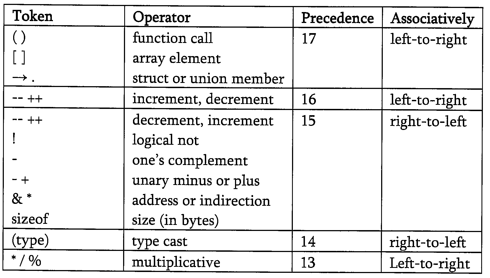
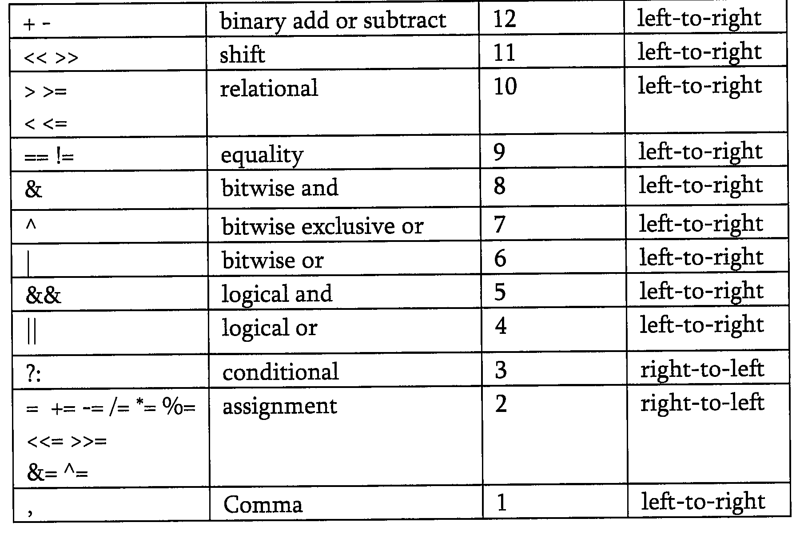
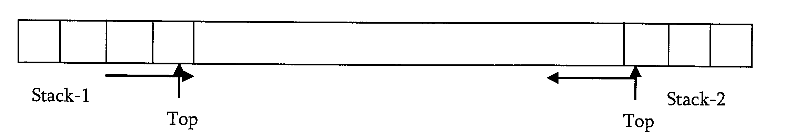
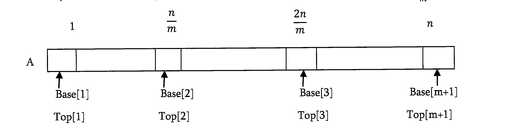
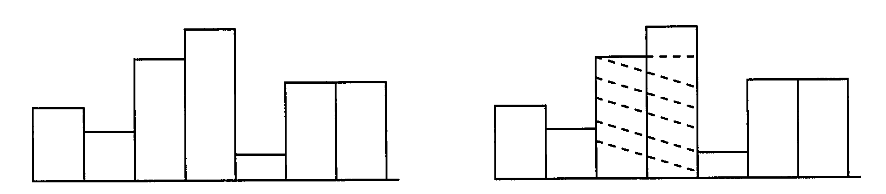

# Problems on stacks

### Q1. Discuss how stacks can be used for checking balancing of symbols?

Stacks can be used to check whether the given expression has balanced symbols or not. This algorithm is very much useful in compliers. Each time parser reads on character at a time. If the character is an opening delimiter then it is written to the stack. When a closing delimiter is encountered the stack is popped. The opening and closing delimiters are then compared. If they match, the parsing of the string continues. If they do not match, the parser indicates that there is an error on the line.

### Q2. Discuss infix to postfix conversion algorithm using stacks?

`Infix`: An indix expression is a single letter, or an operator, proceeded by one infix string and following by another Infix string

- A
- A+B
- (A+B)+(C+D)

`Prefix`: A prefix expression is a single letter, or an operator, followed by two prefix strings. Every prefix string longer than a single variable contains an operator, first operand and second operand

- A
- +AB
- ++AB-CD

`Postfix`: A postfix expression is a single letter or an operator, proceded by two postfix strings. Every postfix string longer than a single variable contains first and second operands followed by an operator.

- A
- AB+
- AB+CD-+

Prefix and postfix notions are methods of writing mathematical expression without parenthesis. Time to evalutae a postfix and prefix expression is O(n), were n is the number of elemnts in the array.

#### Important Properties

- Let us consider the infix expression 2+3*4 and its postfix equivalent 234\*+. Notice that beween infix and postfix the order of the number is unchagned. It is 2 3 4 in both cases. but the order of the operators * and + is affected in the two expressions.
- Only one stack is enough to convert an infix expression to postfix expression. The stack that we use is in the algorithm will be used to change the order of operators from infix to postfix. The stack we use will only contain operators and open paratheses symbol '('. Postfix expressions do not contain paentheses. We shall not output the parentheses in the postfix output.

#### Algorithm

1. Create a stack
2. for each character t in the input stream{
   if(t is an operand) output t
   else if(t is a right parenthesis){
    pop and output tokens untill a left parenthesis is popped (but not output)
   }else{
    pop and output tokens until one of lower priority than t is encountered or a left parenthesis is encountered or the stack is empty
    push t
   }
   }
3. Pop and output tokens until the stack is empty

### Q3. Discuss postfix evalution using stacks?

#### Algorithm

- Scan the postfix string from left to right
- Initialize an empty stack
- Repeat the below steps 4 and 5 till all the characters are scanned
- If the scanned character is an operand, push it onto the stack
- If the scanned character is an operator, and if the operator is unary operator then pop an element from the stack. If the operator is binary operator then pop two elements from the stack. After popping the elements, apply the operator to those popped elements. Let the result of this operation be retVal onto the stack
- After all characters are scanned, we will have only one element in the stack
- Return top of the stack as result

#### Example: 123*+5-

<table>
<tr><th>Stack</th><th>Expression</th></tr>
<tr><td>1 2 3</td><td></td></tr>
<tr><td>1</td><td>2*3=6</td></tr>
<tr><td>1 6</td><td></td></tr>
<tr><td></td><td>1+6=7</td></tr>
<tr><td>7</td><td></td></tr>
<tr><td>7 5</td><td></td></tr>
<tr><td></td><td>7-5=2</td></tr>
<tr><td>2</td><td></td></tr>
</table>

`Result`: 2

### Q4. Can we evaluate the infix expression with stacks in one pass?

Using 2 stacks we can evaluate an infix expression in 1 pass without converting to postfix

#### Algorithm

1. Create an empty operator stack
2. Create an empty operand stack
3. For each token in the input string
   1. Get the next token in the infix string
   2. If next token is an operand, place it on the operand stack
   3. If next token is an operator
      1. Evaluate the operator (next op)
4. While operator stack is not empty, pop operator and operands, evaluate left operator right and push result onto operand stack
5. Pop result from operator stack

### Q5. How to design a stack such that GetMinimum() should be O(1)?

Take an auxiliary stack which maintains the minimum of all values in the stack. Also, assume that, each element of the stack is less then its below elements. For simplicity lets use call the auxiliary stack as min stack.

When we pop the main stack, pop the min stack too. When we push the main stack, push either the new element or the current minimum, whichever is lower. At any point, if we want to get the minimum then we just need to return the top element from the min stack. Let us take some example and trace out. Initially let us assume that we have pushed 2,6,4,1 and 5. Based on above algorithm the min stack will look like:

<table>
    <tr><th>Main stack</th><th>Min stack</th></tr>
    <tr><td>5->top</td><td>1->top</td></tr>
    <tr><td>1</td><td>1</td></tr>
    <tr><td>4</td><td>2</td></tr>
    <tr><td>6</td><td>2</td></tr>
    <tr><td>2</td><td>2</td></tr>
</table>

### Q6. For the Q5 is it possible to improve the space complexity?

Yes. The main problem of previous approach is, for each push operation we are pushing the element on to min stack also (either the new element or existing minimum element). That means, we are pushing the duplicate minimum elements on to the stack.

Now, let us change the above algorithm to improve the space complexity. We still have the min stack, but we only pop from it when the value we pop from the main stack is equal to the one on the min stack. We only push to the min stack when the value being pushed onto the main stack is less than or equal to the current min value. In this modified algorithm also, if we want to get the minimum then we just need to return the top element from the min stack. For example, taking the original version and pushing 1 again, we'd get:

<table>
    <tr><th>Main stack</th><th>Min stack</th></tr>
    <tr><td>1->top</td><td></td></tr>
    <tr><td>5</td><td></td></tr>
    <tr><td>1</td><td></td></tr>
    <tr><td>4</td><td>1->top</td></tr>
    <tr><td>6</td><td>1</td></tr>
    <tr><td>2</td><td>2</td></tr>
</table>

### Q7. Given a stack, how to reverse the elements of stack by using only stack operations?

- First pop all the elements of the stack till it becomes empty.
- For each upward step in recursion, insert the element at the bottom of stack.

### Q8. HOw do we implement 2 stacks using only one array? Our stack routines should not indicate an exception unless every slot in the array is used?

- Start two indexes one at the left end and other at the right end
- The left index simulates the first stack and the right index simulates the second stack
- If we want to push an element into the first then put the element at left index
- Similiarly, if we want to push an element into the second stack then put the element at right index
- First stack gets grows towards right, second stack grows towards left

### Q9. Multiple (m) stacks in one array, what if we want to implement m stacks in one array?

### Q10. Finding Spans: Given an array A the span S[i] of A[i] is the maximum number of consecutive elements A[j] immediately preceding A[i] and such that A[j]<=A[i]?

This is a very common problem in stack markets to find the peaks. Spans have applications to financial analysis. The span of a stocks price on a certain day, i, is the maximum number of consecutive days the price of the stock has been less than or equal to its price on i. As an example, let us consider the following table and the corresponding spans diagram. In the figure teh arrows indicates the length of spans.

### Q11. Largest rectangle under histogram: A histogram is a polygon composed of a sequence of rectangles aligned at a common base line. For simplicity. assume that the rectangles are having equal widths butmay have different heights. For example, the figure on the left shows the histogram that consist of rectangles with the heights 3,2,5,6,1,4,4 measured in units where 1 is the width of the rectangles. here our problem is: given an array with heights of rectangles, we need to find the largest rectangle possible. For the given example of largest rectangle is the shared part.

A straightforward answer is to go for each bar in the histogram and find the maximum possible area in histogram for it. Finally, find the maximum of these values. This will require O(n^2)

### Q12. For Q11, can we improve time complexity?

**LInear search using a stack of incomplete subproblems**: Process the elements in left-to-right order and maintain a stack of information about started but yet unfinished sub histograms

If the stack is empty, open a new subproblem by pushing the element onto the stack. Otherwise compare it to the element on top of the stack. If the new one is greater we again push it. If the new one is equal we skip it. In all these cases, we continue with the next new element. If the new one is less, we finish th eoptmost subproblem by updating the maximum area iwht repsect to the element at the top of the stack. Then, we discard the elemnt at the top, and repeat the procedure keeping the current new element. This way, all subproblems are finished until the stack becomes empty, or its top element is less than or equal to the new element, leading to the actions described above. If all elements have been processed, and the stack is not yet empty, we finish the remaining subproblems by updating the maximum area with respect to the elements at the top.

