# String algorithm

## Introduction

To understand the important of string algorithm let us consider the case of entering the URL. You will observe that after typing the prefix of the URL, a list of all possible URLs is displayed. That means, the browsers are doing some internal processing and giving us the list of matching URLs. This technique is sometimes called auto-completion.

Similarly, consider the case of entering the directory name in the command line interface. After tpying the prefix of directory name, if we press the tab button, we get a list of all matched directory names available. THis is anotehr example of auto completion.

In order to support these kinds of operations, we need a data structure which stores the string data efficiently. In this chapter, we will look at the data structures, the are useful for implementing string algorithms.

We start our discussion with the basic problem of strings: given a string, how do we search a substring? This is called a string matching problem. After discussin various string matching algorithms, we will look at different data structures for storing strings.

## String Matching Algorithms

In this setcion, we concentrate on checking whether a pattern P is a substring of another string T or not. Since we are trying to cehck a fixed string P, sometimes these algorithm are called exact string matching algorithms. To simplify our discussion. let us assume that the length of given text T is n and the length of the pattern P which we are trying to match has the length m. That means, T has the characters from 0 to n-1 and P has the charactesr from 0 to m-1. This algorithm is implemented in c++ as strstr().

In the subsequenct setcions, we start with the brute force method and gradually move towards better algorithms.
- Brute force method
- rabin-karp string matching algorithm
- String matching with finite automata
- KMP algorithm
- Boyer-moore algorithm
- Suffix trees

## Brute force method

In this method, for each possible position in the text T we check whether the pattern P matches or not. Since the length of T is n, we have n-m+1 possible choices for comparisons. This is because we do not need to check the last m-1 locations of T as the pattern length is m. The following algorithm searches for the first occurrence of a pattern string P in a text string T.

### Algorithm

Time complexity: (nm)

## Rabin-Karp String matching algorithm

In this method, we will use the hashing technique and instead of checking for each possible position in T, we check only if the hashing of P and the hashing of m character of T give the same result.

Initially, apply the hash function to the first m characters of T and check whether this result and P's hashing result is the same or not. If they are not the same, then go to the next character of T and again apply the hash function to m characters. If they are the same then we compare those m characters of T with P.

### Selecting Hash function

At each step, since we are finding the hash of m character of T, we need an efficient hash function. If the hash function takes O(m) complexity in every step, then the total complexity is O(nm). This is worse than the brute force method because first we are applying the hash function and also comparing.

Our objective is to select a hash function which takes O(1) complexity for finding the hash of m characters of T every time. Only then can we reduce the total complexity of the algorithm. If the hash function is not good (worst case), the complexity of Rabin-Karp algorithm is O(nm). If we select a good hash function, the complexity of the rabin-karp algorithm complexity is O(m+n). Now let us see how to select a hash function which can compute the hash of m character of T at each step in O(1).

For simplicity, let's assume that the characters used in string T are only integers. That means, all characters in T are digits. Since all of them are integers, we can view a string of m consecutive characters as decimal numbers. For example, string '61815' corresponds to the number 61815. With the above assumption, the pattern P is also a decimal value, and let us assume that the decimal value of P is p. For th given text T[0..n-1], let t(i) denote the decimal value of length-m substring T[i..i+m-1] for i=0,1,....,n-m-1. So, t(i)==p if and only if T[i...i+m-1]==P[0...m-1]

We can compute p in O(m) time using Horner's rule as:

`p = P[m-1]+10(P[m-2]+10(P[m-3]+...+10(P[1]+10P[0])))`

The code for above assumption is:
```c
int value=0;
for(int i=0;i<m-1;i++){
    value*=10;
    value+=P[i];
}
```

### Step by step explanation

First: remove the first digit: 123-100*1=23
Second: multiply by 10 to shift it: 23*10=230
Third: Add last digit: 230+4=234

The algorithm runs by comparing, t(i) with p. When t(i)==p, then we have found the substring P in T, starting from position i.

## String matching with finite automata

In this method we use the finite automata which is the concept of the theory of computation (ToC). Before looking at the algorithm, first let us look at the definition of finite automata.

### Finite automata

A finite automaton F is a 5-tuple (Q,q0,A,sigma,delta) where

- Q is the finite set of states
- q0 subset Q is the start state
- A subset Q is a set of accepting states
- sigma is a finite input alphabet
- delta is the transition function that gives the next state for a given curren state and input

### How does finite automata work?

- The finite automaton F begins in state q0.
- Read charactesr from sigma one at a time
- If F is in state q and reads input character a, F moves to state delta(q,d)
- At the end, if its state is in A, then we say, F accepted the input string read so far
- If the input string is not accepted it is called the rejected string

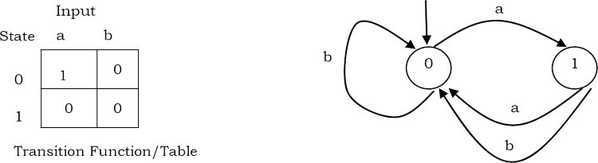

### Important notes for constructing with ifnite automata

For building the automata, first we start with the initial state. The FA will be in state k if k characters of the pattern have been matched. If the next text character is equal to the pattern character c, we have matched k+1 characters and the FA enters state k+1. If the next text character is not equal to the pattern character, then the FA go to a state 0,1,2,...,k depending on how many initial pattern characters match the text characters ending with c.

### Matching algorithm

Now, let us concentrate on the matching algorithm.

- For a given pattern P[0...m-1], first we need to build a finite automaton F
  - The state set is Q={0,1,2,...,m}
  - The start state is 0
  - The only accepting state is m
  - Time to build F can be large if sigma is large
- Scan the text string T[0..n-1] to find all occurrences of the pattern P[0..m-1]
- String matching is efficient: O(n)
  - Each character is examined exactly once
  - Constant time for each character
  - But the time to compute delta is O(m|sigma|). This is because delta has O(m|sigma|) entries. If we assume |sigma| is constant then the complexity becomes O(m).

**Algorithm**:

```c
finiteAutomataStringMatcher(int P[],int m,int F,func delta){
    q=0;
    for(int i=0;i<m;i++)
        q=delta(q,T[i]);
        if(q==m)
            printf("Pattern occurs with shift:%d",i-m);
}
```

Time complexity: O(m)

## KMP Algorithm

As before, let us assume that T is the string to be search and P is the pattern to be matched. This algorithm was presented by Knuth, Morris and Pratt. It takes O(n) time complexity for searching a pattern. To get O(n) time complexity, it avoids the comparisons with elements of T that were previously involved in comparison with some element of the pattern P.

The algorithm uses a table and in general we can it prefix function or prefix table or fail function F. First we will see how to fill this table and later how to search for a pattern using this table. The prefix function F for a pattern stores the knowledge about how the pattern matches against shifts of itself. This information can be used to avoid useless shifts of the pattern P. It means that this table can be used for avoidding backtracking on the string T.

### Prefix Table

```c
int F[];
void prefix_table(int P[],int m){
  int i=1,j=0,F[0]=0;
  while(i<m){
    if(P[i]==P[j]){
      F[i]=j+1;
      i++;
      j++;
    }else if(j>0) j=F[j-1];
    else{
      F[i]=0;
      i++;
    }
  }
}
```

As an example, assume that P = a b a b a c a. For this pattern, let us follow the step-by-step instructions for filling the prefix table F. Initially: m=length[P]=7,F[0]=0 and F[1]=0.

i=1,j=0,F[1]=0
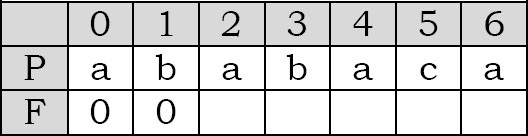
i=2,j=0,F[2]=1
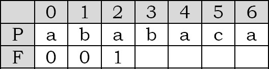
i=3,j=1,F[3]=2
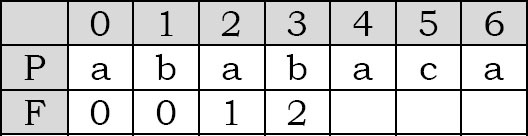
i=4,j=2,F[4]=3
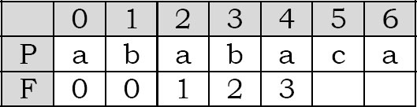
i=5,j=3,F[5]=1
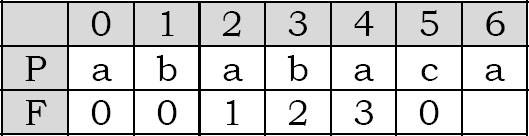
i=6,j=1,F[6]=1
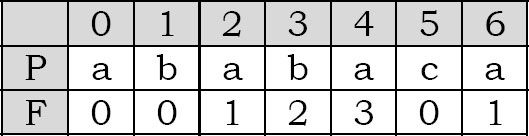

At this step the filling of the prefix table is complete

### Matching algorithm

The KMP algorithm takes pattern P, string T and prefix function F as input, and finds a match of P in T.

```c
int KMP(char T[],int n,int P[],int m){
  int i=0,j=0;
  prefix_table(P,m);
  while(i<n){
    if(T[i]==P[j]){
      if(j==m-1)
        return i-j;
      else{
        i++;
        j++;
      }
    }else if(j>0)
      j=F[j-1];
    else i++;
  }
  return -1;
}
```

Time complexity: O(m+n)

Now, to understand the process let us go through an example. Assume that T = b a c b a b a b a b a c a c a & P = a b a b a c a . Since we have already fiflled the prefix table, let us use it and go to the matching algorithm. Initially: n = size of T = 15; m = size of P = 7.

Step 1: i=0,j=0, comparing P[0] with T[0]. P[0] does not match with T[0]. P will be shifted one position to the right
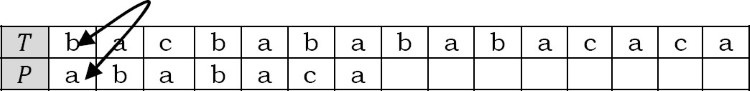
Step 2: i=1,j=0, comparing P[0] with T[1], matches. Since there is a match P, is ont shifted.
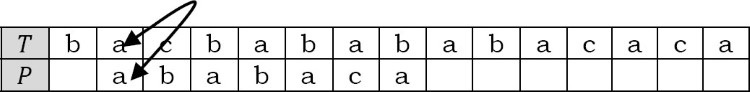
Step 3: i=2,j=1, comparing P[1] with T[2], not matched. Backtracking on P comparing P[0] and T[2].
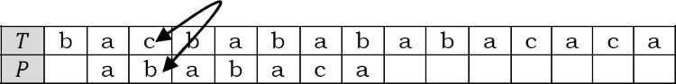
Step 4: i=3,j=0, comparing P[0] with T[3], not matched.
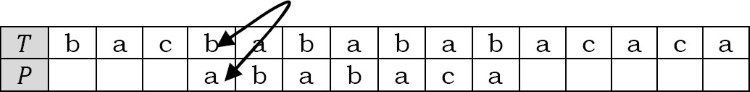
Step 5: i=4,j=0, comparing P[0] with T[4], matches.
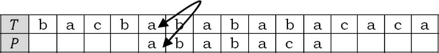
Step 6: i=5,j=1, comparing P[1] with T[5], matches.
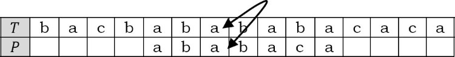
Step 7: i=6,j=2, comparing P[2] with T[6], matches.

Step 8: i=7,j=3, comparing, matches.
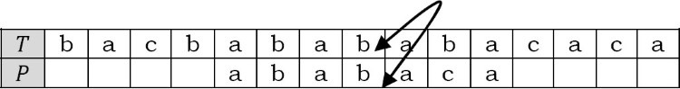
Step 9: i=8,j=4, matches.
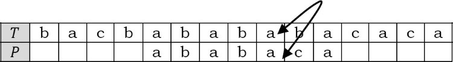
Step 10: i=9,j=5, doesn't back, backtracing
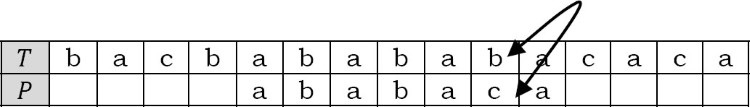
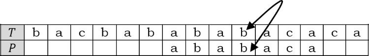
....

Total nnumber of shifts = 6 shifts.

### Boyer-Moore algorithm

Like the KMP algorithm, this also does some pre-processing and we call it last function. The algorithm scans the characters of the pattern from right to left beginning with the rightmost character. During the testing of a possible placemenet of pattern P in T, a mismatch is handlded as follows: Let us assume that the current character being matched is T[i]=c and the corresponding pattern character is P[j]. If c is not contained anywhere in P, then shift the pattern P completely past T[i]. Otherwise, shift P until an occurrence of character c in P gets aligned with T[i]. This technique avoids needles comparisons by shifting the pattern relative to the text.

The last function takes O(m+|sigma|) time and the actual search takes O(nm) time. Therefore the worst case running time of Boyer-Moore algorithm is O(nm+|sigma|). This indicates that the worst-case running time is quadratic, in the case of n==m, the same as the brute force algorithm.

- The boyer-moore algorithm is very fast on the large alphabet
- For the same alphabet, boyer-moore is not preferable
- For binary strings, the KMP algorithm is recommended.
- For the very shortest patterns, the brute force algorithm is better

## Data structures for storings strings

If we have a set of strings and a word which we want to search in that set, in order to perform the search operation faster, we need an efficient way of storing the strings. To store sets of strings we can use any of the following data strcutures.
- Hashing tables
- Binary search trees
- Tries
- Ternary search trees

## Hash tables for strings

As seen in the hashing chapter, we can use hash tables for storing the integers or strings. In this case, the keys are nothing but the strings. The problem with hash table implementation is that we lose the ordering information - after applying the hash function, we do not know where it will map to. As a result, some queries take more time. For example, to find all the words startings with the letter "K", with hash table representation we need to scan the complete hash table. THis is because the hash function takes the complete key, performs hash on it, and we do not know the location of each word.

## Binary search trees for strings

In this representation, every node is used for sorting the strings alpahbetically. This is possible because the strings have a natural ordering: A comes before B, which comes before C, and so on. This is beacuse words can be ordered and we can use a BST to store and retrieve them. For, let us assume that we want to store the following string using BSTs:

this is a career monk string

For the given string there many ways of representing them in BST. One such possibility is shown in the tree blow:
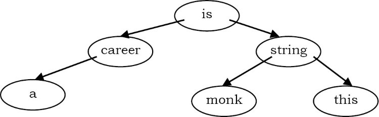

### Issues with binary search tree representation

This method is good in terms of storage efficiency. But the disadvantage of this representation is that, at every node, the search operation performs the complete match of the given key with the node data, and as a result the time complexity of the search oepration increases. So, from this we can say the BST representation of strings is good in terms of storage but not in terms of time.

## Tries

Now, let us see the alternative representation that reduces the time complexity of the search operation. THe name trie is taken from the word re"trie".

### What is a trie?

A trie is a tree and each node in it contains the number of pointers equal to the number of characters of the alphabet. For example, if we assume that all the strings are formed with english alphabet characters "a" to "z" then each node of the trie contians 26 pointers. A trie data structure can be declared as:

```c
struct TrieNode{
  char data;
  int is_end_of_string;
  struct TrieNode*child[26];
}
```

Suppose we want to store the strings "a","all","als", and "as,: trie for these strings will look like:

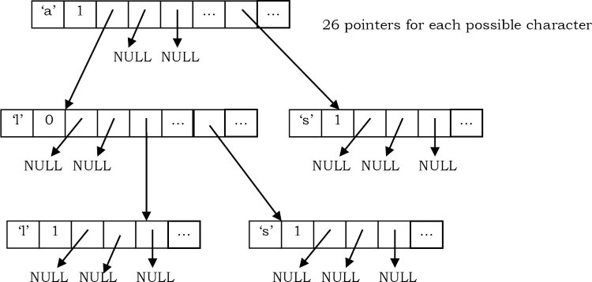

### Why tries?

The tries can insert and find strings in O(L) time (where L represents the length of a single word). THis is much faster then hash table and binary search tree representaitons

### Trie declaration

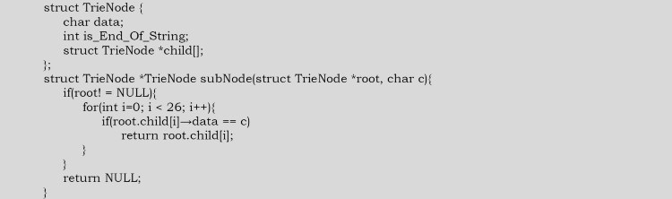

### Inserting a string in trie

To insert a string, we just need to start at the root node and follow the corresponding path. Once we reach the NULL pointer, we just need to create a skew of tail nodes for the remaining characters of the given strings.

```c
void insertInTrie(struct TrieNode*root,char*word){
  if(!*word) return;
  if(!root){
    struct TrieNode*newNode=(struct TrieNode*)malloc(sizeof(struct TrieNode*));
    newNode->data=*word;
    for(int i=0;i<26;i++) newNode->child[i]=NULL;
    if(!*(word+1)) newNode->is_end_of_string=1;
    else newNode->child[*word]=insertInTrie(newNode->child[*word],word+1);
    return newNode;
  }
  root->child[*word]=insertInTrie(root->child[*word],word+1);
  return root;
}
```

Time complexity: O(L), where L is the length of the string to be inserted.

Note: For real dictionary implementation, we may need a few more checks such as checking whether the given string is already there in the dictionary or not.

### Searching a string in Trie

The same is the case with the search operation: we just need to start at the root and follow the pointers. The complexity of the search operation is euqal to the length of the given string that want to search.

```c
int searchInTrie(struct TrieNode*root,char*word){
  if(!root) return -1;
  if(!*word){
    if(root->is_end_of_string) return 1;
    else return -1;
  }
  if(root->data=*word) return searchInTrie(root->child[*word],word+1);
  else return -1;
}
```

Time complexity: O(L), where L is the legnth of the strings to be searched.

### Issues with tries representation

The main disadvantages of tries is that they need lot of memory for stroing the strings. As we have seen above, for each node we have too many node pointers. In many cases, the occupancy of each node is less. The final conclusion regarding tries data structure is that they are faster but require huge memory for storign the stirngs.

Node: there are some improved tries represnetions called trie compression techqniues. But, even with those technique we can reduce the mrmory only at the leaces and not at the internal nodes.

## Ternary search trees

This representation was initially provided by Job Bently and Sedgewick. A ternay search tree takes the advantages of binary search trees and tries. That emans it combines the memory efficiency of BSTs and the time efficiency of tries.

### Ternary search trees declaration

```c
struct TSTNode{
  char data;
  int is_end_of_string;
  struct TSTNode*left;
  struct TSTNode*eq;
  struct TSTNode*right;
}
```

THe ternary search tree (TST) uses three pointers:
- The left pointer poitns to the TST containing all the strings which are alphabeticaly les sthan data.
- The right pointer point to the TST containing all the strings which are alphabetically greater than data.
- The eq pointer points to the TST containing all the strings which are alphabetically equal to data. That means, if we want to search for a string, and if the current character of the input string and the data of current node is TST are the same, then we need to proceed to the next character in the input string and search it in the subtree which is pointed by the eq.

### Inserting strings in Ternary searcht ree

For simplicity let us assume that we want to store the following words in TST: boats, boat, bat and bats. Initially, let us start with boats string

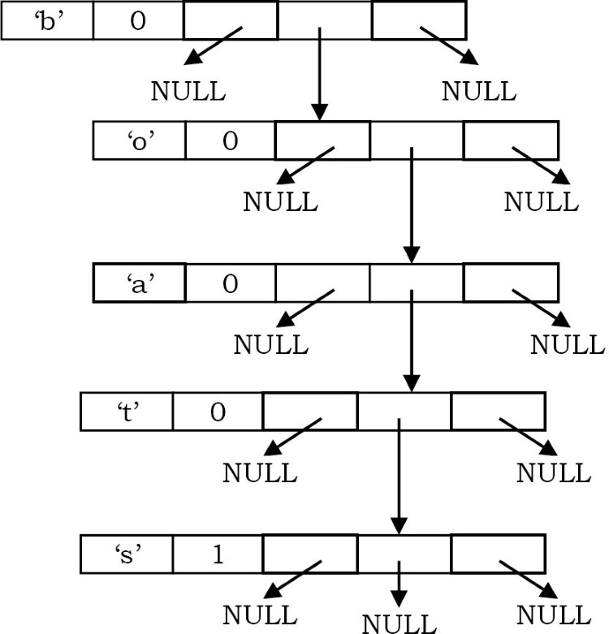

Now, if we want to insert the string boat, then the TST becoems

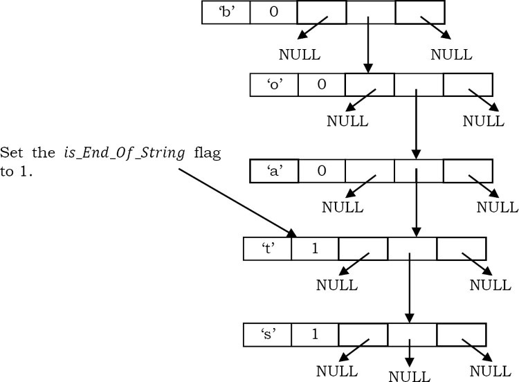

Now, let us insert the enxt string: bat

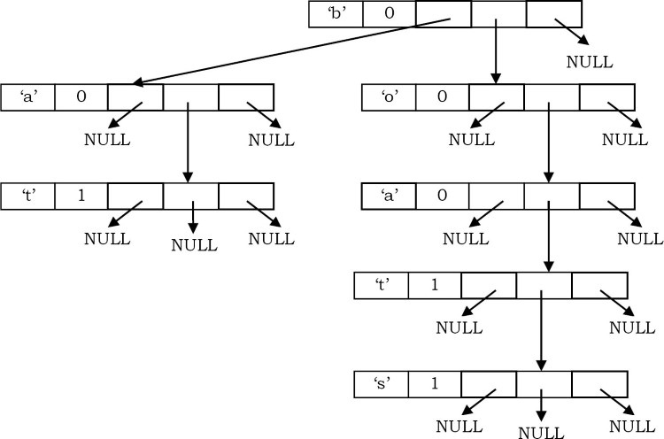

Now, let us insert the final word: bats

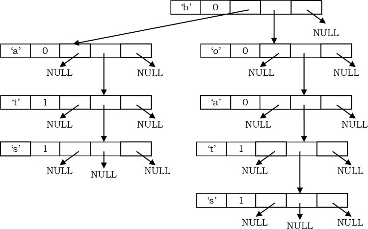

Based on these examples, we can write the insertion algorithm as below. We will combine the insertion operation of BST and tries.