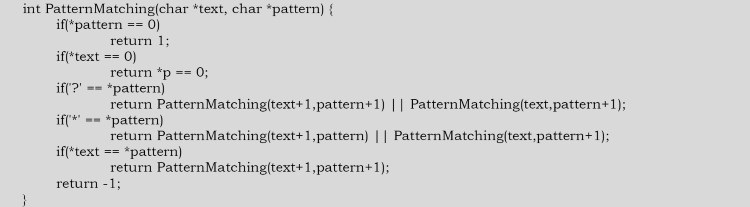
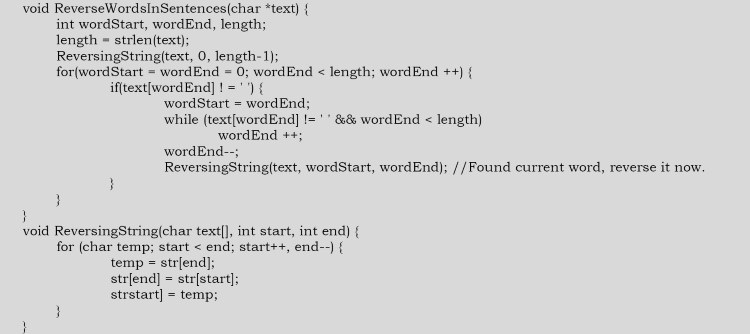
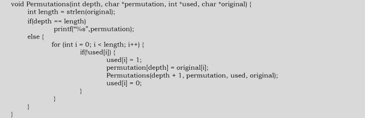
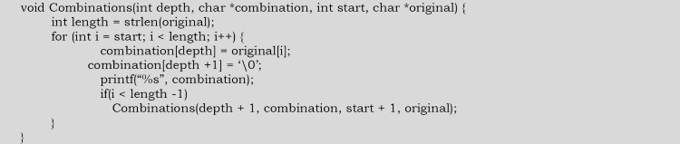
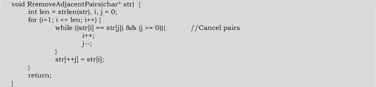
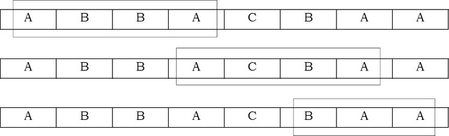
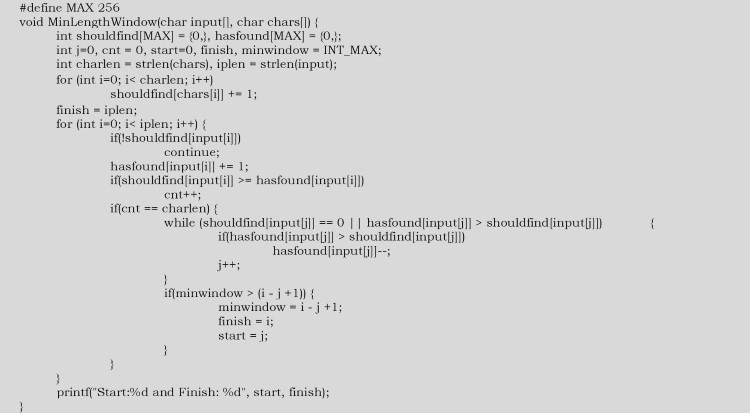
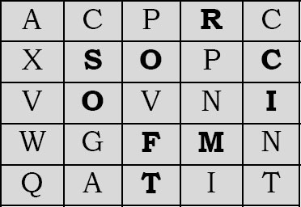
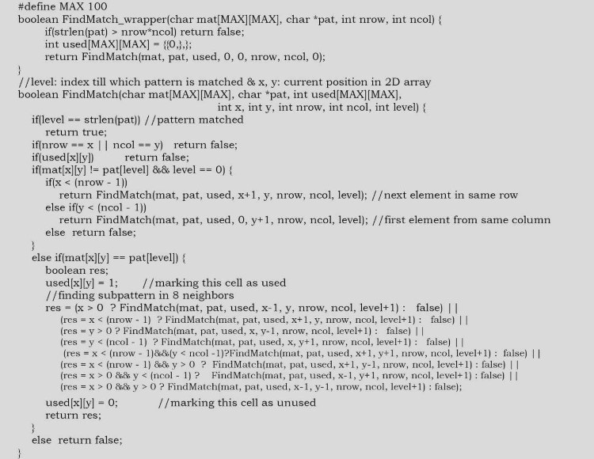

# Problems

### Q1. Given a paragraph of words, give an algorithm for finding the word which appears the maximum numbers of times. If the paragraph is scrolled down, give the maximum occuring word. Thus, it should be dynamic.

For this problem we can use a combination of priority queues and tries. We start by creating a trie in which we insert a word as it appears, and at every leaf of trie. Its node contians that word along with a pointer that points to the node in the heap which we also create. This heap contains nodes whose structure contians a counter. This is its frequency and also apointer to that leaf of trie, which contains that word so that there is no need to store the word tiwce.

### Q2. Given two strings, how can we find the longest common substring?

Let us assume that the given two strings are T_1 and T_2. The longest common substring of two strings, T_1 and T_2, can be found by building a generalized suffix tree for T_1 and T_2. That means we need to build a single suffix tree for both the strings. Each node is marked to indicate if it represnts a suffix of T_1 or T_2 or both. THis indicates that we need to use different marker symbols for both the strings. After constructing the common suffix tree, the deepest node marked for both T_1 and T_2 represnets the longest common substring.

**Another way of doing this is**: We can build a suffix tree for the string T_1$T_2#. This is equivalent to building a common suffix tree for both the strings.

Time complexity: O(m+n)

### Q3. Longest palindrome: Given a text T how do we find the substring of T which is the longest palindrome of T?

The longest palindrome of T[1..n] can be found in O(n) time. The algorithm is: first build a suffix tree for T$reverse(T)# or build a generalized suffix tree for T and reverse(T). After building the suffix tree, find the deepest node marked with both $ and #. Basically it means find the longest common substring.

### Q4. Given a string, give an algorithm for finding the next word in the dictionary.

Let us assume that we are using Trie for storing the dictionary words. TO find the next word in Tries we can follow a simple approach as shown below. Starting from the rightmost chracter, increasement the characters one by one. Once we reach Z, move to the next character on the left Side.

Whenever we increment, check if the word with the icremented character exists in the dictionary or not. If it exists, then return the word, otherwise increment again. If we use TST, then we can ffind the inorder successor for the current word.

### Q5. Given an algorithm for reversing a string

OBV. array.

Time complexity: O(n)

### Q6. If the string is not editable, how do we create a string that is the reverse of the given string?

If the string is not editable, then we need to create an array and return the poitner of that.

### Q7. Can we reverse the string without using any temp variable?

Yes, we can use XOR logic for swapping the variables.

### Q8. Given a text and a apttern, give an algorithm for matching the pattern in the text. Assume ? and * are teh wild card characters.

Brute Force method.

Time complexity: O(mn)

### Q9. Given an algorithm for reversing words in a sentence.

Start from the beginning and keep on reversing the words. The below implementation assumes that space is the delimiter for words in given sentence.

Time complexity: O(n)

### Q10. Permutations of a string [anagrams]: Give an algorithm for printing all possible permutations of the characters in a string. Unlike combinations, two permutations are considered distinct if they contain the same characters but in a different order. FOr simplicity assume that each occurrence of a repeated character is a distinct character. THat is, if the input is "aaa", the output should be six repetitions of "aaa". The permutations may be output in any order.

The solution is reached by generating n factorial strings, each of length n, where n is the lenght of the input string

### Q11. Combinations of a strings: Unlike permutations, two combinations are conssidered to be same if they contain the same charactesr, but may be in a differnet oder. GIven an algorithm that prints all possible combinations of the charactesr in a string. For example, "ac" and "ab" are different combinations from the input string "abc" but "ab" is the same as "ba".

### Q12. Given a string "ABCCBCBA", give an algorithm for recursively removing the adjacent characters if they are the same. For example, ABCCBCBA > ABBCBA > ACBA

First we need to check if we have a characte pair; if yes, then cancel it. Now check for the next character and previous element. Keep canceling the characters until we either reach the start of the array, reach the end of the array, or don't find a pair.

### Q13. Given a set of characters CHARS and a input string INPUT, find the minimum windows in str which will contain all the character in CHARS in complexity O(n). For example, INPUT = ABBACBAA and CHARS = AAB has the minimum windows BAA.

This algorithm is based on the sliding window approach. In this approach, we start from the beginning of the array and move to the right. As soon as we have a window which has all the required elements, try sliding the window as far right as possible with all the required elements. If the current window length is less than the minimum length found until now, update the minimum length. For example, if the input array is ABBACBAA and minimum window should cover characters AAB, then sliding the window will move like this:

**algorithm**: The input is the given array and chars is the array of characters that need to be found.

1. Make an integer array shouldfind[] of len 256. The ith element of this array will have the count of how many times we need to find the element of ASCII value i.
2. make another array hasfound of 256 elements, which will have the counter of required element found until now.
3. Count<=0
4. While input[i]
   - If input[i] elemenet is not to be found -> continue
   - If input[i] elemenet is required => increase count by 1.
   - If count is length of chars[] array, slide the window as much right as possible.
   - If current window length is less than min length found until now, update min length

### Q14. We are given a 2D array of characters and a character pattern. Give an algorithm to find if the pattern is present in the 2D array. The pattern can be in any order but we can't use the same character twice while mathcing. Return 1 if match is found, 0 if not. For example: Find "microsoft" in the below matrix.

**How do we it manually?** First we match the first element, and when it is matched we match the second element in the 8 neighbors of the first match. We do this process recursively, and when the last character of the input apttern matches return true.

During the above process, take care not to use any cell in the 2D array twice. For this purpose, you mark every visited cell with some sign. If your pattern matchign fails at some point, start matchign from in the remaining cells. WHile returning, you unmark the visited cells.

Let's convert the above intuitive method into an algorithm. Since we are doing similar checks fro pattern matching every time, a recursive solution is what we need. In a recursive solution, we need to check if the usbtring passed is matched in the given matrix or not. The condition is not to use the already used cell, and to find the already used cell, we need to add anotehr 2D array to the function. Also, we need to current postion of the input matrix frfom where we need to start. Since we need to pass alot more information then is actually given, we should be having a wrapper function to initialize the extra information to be passed.

**Algorithm**:
- If we are past the last character in the pattern
  - return true
- If we get a used cell again
  - return false is we got past the 2d matrix
  - return false
- if searching for first element and cell doesn't match
  - findmatch with next cell in row-irst order (or column-first order)
- otherwise if character matches
  - mark this cell as used
  - res = findmatch with next position of pattern in 8 neighbors
  - mark this cell as unused
  - return res
- otherwise
  - return false

### Q15. Given two strings str1 and str2, write a functoin that prints all interleavings of the given two strings. We may assume that all characters in both strings are different. Example. Inputs: str1 = "AB", str2="CD" and output: ABCD ACBD ACDB CABD CADB CDAB. An interleaved stirng of given two strings preserves the order of characters in individual strings. For example, in all the interleavings of above first example, "A" comes before "B" and "C bomes before D".