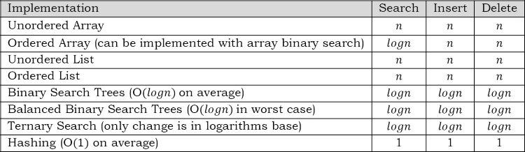

# Symbol Tables

## Introduction

Since childhood, we all have used a dictionary, and many of us have a word processor which comes with a spell checker. The spell checker is also a dictionary but limited in scope. There are many real time examples for dictionaries and a few of them are:

- Spell checker
- The data dictionary found is databse managmenet applications
- Symbol tables generated by loaders, assemblers and compliers
- Routing tables in networking componenets

In computer science, we generally use the term 'symbol table' rather than 'dictionary' when referring to the abstract data type (ADT).

## What are symbol tables?

We can define the symbol table as a data structure that associates a value with a key. It supports the following operation:

- Search whether a particular name is in the table
- Get the attr of that name
- Modify the attr of that name
- Insert a new name and its attr
- delete a name and its attr

There are only three basic oeprations on symbol tables: searching, inserting and deleting 

**Example**: DNS lookup. Let us assume that the key is this case in the URL and the value is an IP address.
- Insert URL with specified IP address
- Given URL, find corresponding IP address

## Symbol table i mplementaitons

Before implementing symbol tables, let us enumerate the possible implementations. Symbol tables can be implemented in many ways and some of them are listed below.

### Unordered array implementation

With this method, just maintaining an array is enough. It needs O(n) time for searching, insertion and deletion in the worst case.

### Ordered array implementaiton

In this we maintain a sorted array of keys and values.

- Store in sorted order by key
- key[i] = ith largest key
- values[i] = value associated with ith largest key

Since the elements are sorted and sorted in arrays, we can use a simple binary search for finding an element. It takes O(logn) tiem for searching and O(n) time for insertion and deletion in the worst case.

### Unordered linked list implementation

Just maintaining a linked list with two data values is enough for this method. It needs O(n) time for searhcing, insertion and deletion in the worst case.

### Ordered linked list implementation

In this method, while inserting the keys, maintain the order of keys in the linked list. Even if the list is sorted, in the worst case it needs O(n) time for searching, insertion and deletion.

### Binary search trees implemetnation

Refer to trees chapter. The advantages of this method are: it does not need much code and it has a fast search.

### Balanced binary search tree implementation

Refer to trees chapter. It is an extension of binary search trees implementaiton and takes O(logn) in worst case for search, insert and delete operations.

### Ternary search implementation

Refer to string algorithms chapter. This is one of the important methods used for implementing dictionaries.

### Hashing implementation

This method is important. For a complete discussion, refer to the hasing chapter.

## Comparison table of symbols for implementations

Let us consider the following comparison table for all the implementations.

