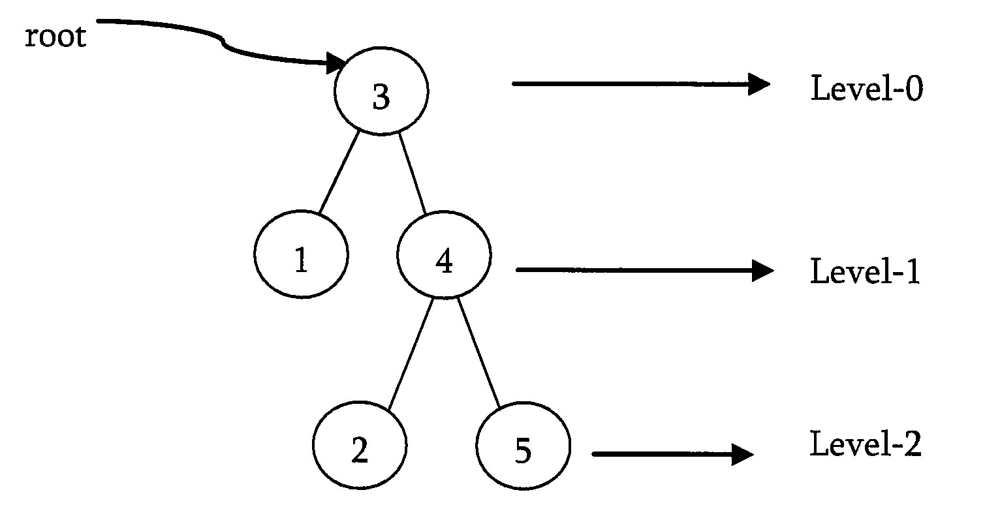
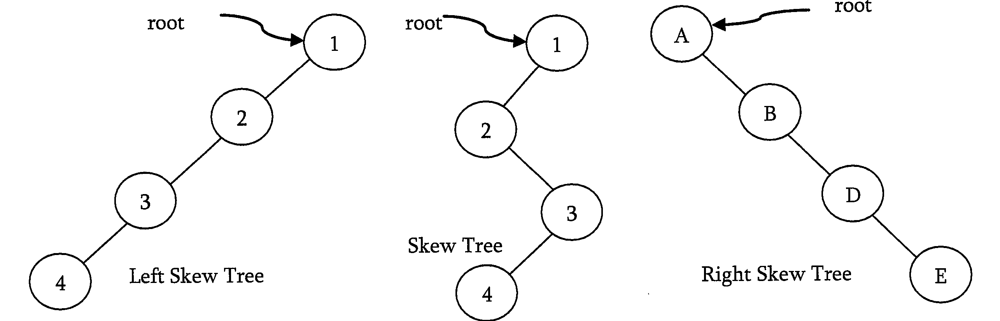
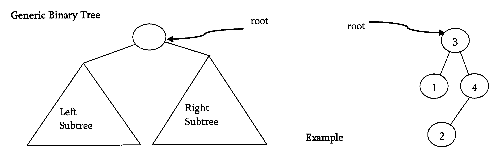
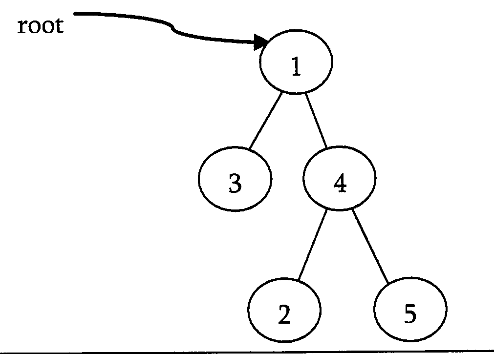
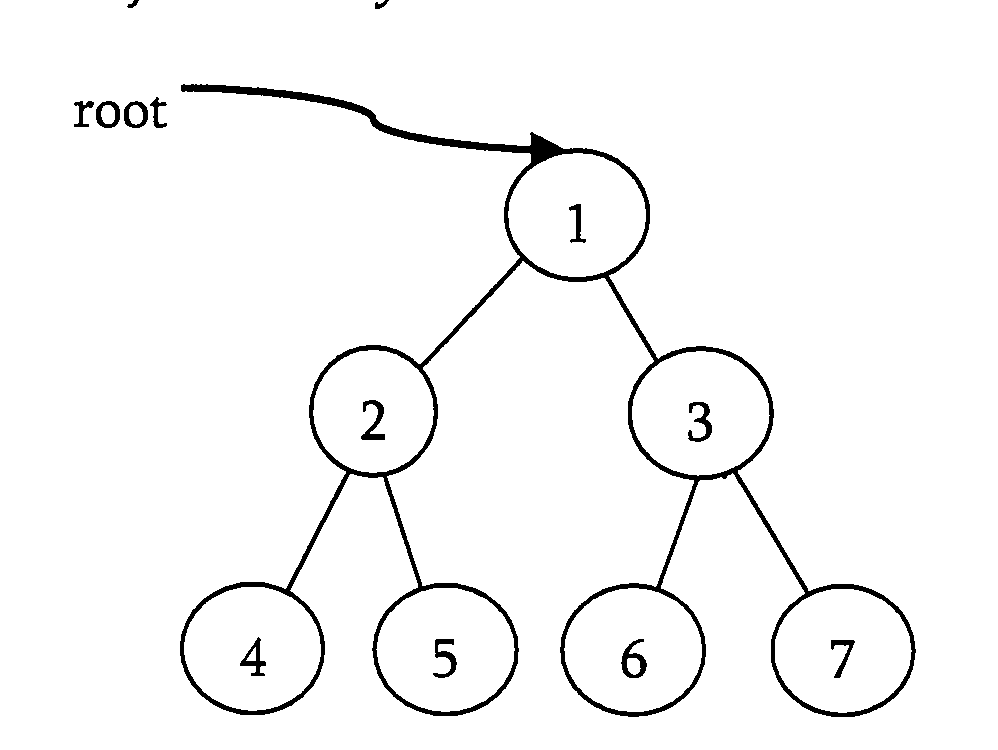
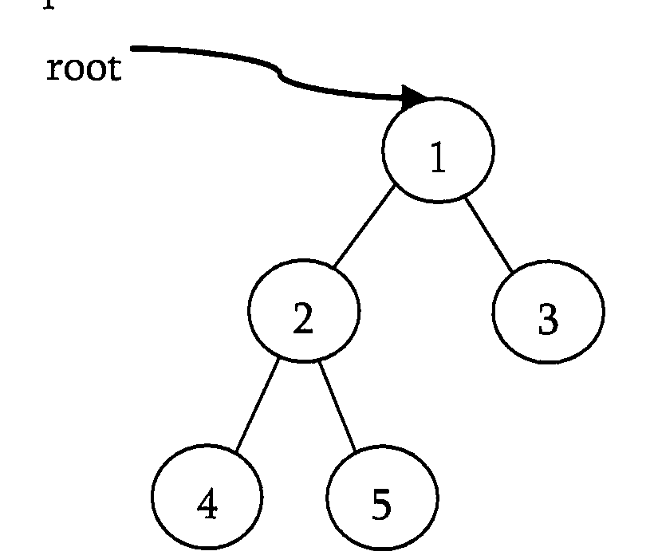
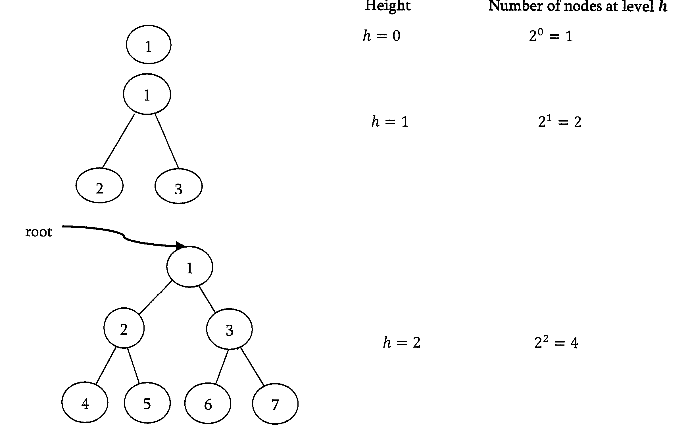

# Trees

A tree is a data structure similar to a linked list but instead of each node pointing simply to the next node in a linear fashion, each node points to a number of nodes. Tree is an example of non-linear data structures. A tree structure is a way of representing the hieranchial nature of a sturcture in a graphical form.

in trees ADT, order of the elements is not important. if we need ordering informaiton linear data sturcutre like linked list, stacks, queues etc can be used.

- THe root of a tree is the node with no parents. There can be at most one root node in a tree
- An edge refers to the link from parent to child
- a node with no child is called leaf node
- Children of same parent are called siblings
- A node p is an ancestor of a node q if there exists a path from root to q and p appears on the path. The node q is called a descendant of p.
- Set of all nodes at a given depth is called level of the tree. The root node is at level zero.
- The depth of a node is the length of path from the root to the node
- The height of a node is the length of the path from that node to the deppest node. A rooted tree with only one node (the root) has a height of zero.
- Height of the tree is maximum height amoung all the nodes in the tree and depth of the tree is the maximum depth amoung all the nodes in the tree. For a given depth and height returns the same value. But for individual nodes we may get different reuslts.
- Size of a node is the number of descendants it has including itself
- If every node in a tree has only one child then we call such trees as skew trees.




## Binary trees

A tree is called binary tree if each node has zero child, one child or two children. Empty tree is also a valid binary tree. We can visualize a binary tree as consisting of a root and two disjoint binary trees, called the left and right subtrees of the root.



## Types of binary trees

**Strict Binary Tree**: A binary tree is called strict binary tree if each node has exactly two children or no children.



**Full Binary Tree**: A binary tree is called full binary tree if each node has exactly two children and all leaf nodes are at same level.



**Complete Binary Tree**:Before defining the complete binary tree, let us assume that the height of the binary tree is h. In compelte binary trees, if we give numbering for the nodes by starting at root then we get a complete sequence from 1 to number of nodes in the tree. While traversing we hsould give numbering for `NULL` pointers also. A binary tree is called complete binary tree if all leaf nodes are at height h or h-1 and also without any missing number in the sequence.



## Properties of binary trees



- The number of nodes n ni a full binary tree is `2^(h+2)-1`
- The number of nodes n in a complete binary tree is between `2^h` or `2^(h+1)-1`
- The number of leaf nodes in a full binary tree are `2^h`
- The number of NULL links in a complete binary tree of n nodes are `n+1`

## Structure of binary tree

```c
struct BinaryTreeNode{
    int data;
    struct BinaryTreeNode*left;
    struct BinaryTreeNode*right;
}
```

## Operaitons on binary trees

- Inserting an element into a tree
- Deleting an element from a tree
- Searching for an element
- Traversing the tree
- Finding size of the tree
- Finding the height of the tree
- Finding the level which has maximum sum
- Finding least common ancestor for a given pair of nodes and many more

## Applications of binary trees

- Expression trees are used in compliers
- Huffman coding trees which are used in data compression algo
- Binary Search Tree, which supports search, insertion and deletion on a collection of items in O(logn)
- Priority Queues, which supports search and deletion of minimum(or max) on a collection of tiems in log time.(in worst case)

## Binary tree traversals

In order to process trees, we need a mechanism for traversing them and that forms the subject of this section. The process of visting all nodes of a tree is called tree traversal. Each of the nodes is processed only once but they may be visited more than once. As we have already seen that in linear data structures, the element are visited in sequential order. But, in tree structures there are many different ways.

Tree traversal is like searching the tree except that in traversal the goal is to move through the tree in some particular order. In addition, all nodes are processed in the traversal but searching stops when the required node is found.

### Traversal possibilites

Starting at the root of a binary tree, there are three main steps that can be performed and the order in which they are performed defines the traversal type. These steps are: performing an action on the current node(D), traversing to the left child node(L), and traversing to the right child node(R). This process can be easily described through recusion. Based on the above defination there are 6 possibilities

1. LDR
2. LRD
3. DLR
4. DRL
5. RDL
6. RLD

## Classifying the traversals

The sequence in which these entities processed defines a particular traversal method. The classification baesd on the order in which current node is processed. That means, if we are classifying based on current node(D) and if D comes in the middle then it does not matter wheather L on left side of D or R is on left side of D. Similarly, it does not matter whether L is on right side of D or R is on right side of D. Due to this, the total 6 possibilities were reduced to 3 and they are:

- Preorder (DLR)
- Inorder(LDR)
- Postorder (LRD)

There is another traversal method which does not depend on above order and it is:

- Level Order Traversal: This method is inspired from Breadth First traversal (BFS of graph algorithms)


## PreOrder Traversal

In pre-order traversal, each node is processed before (pre) either of its sub-trees. This is the simplest traversal to understand. However, even though each node is processed before the subtrees, it still requires that some information must be maintained while moving down the tree. In the example above, the 1 is processed first, then the left sub-tree followed by the right subtree. Therefore, processing must return to the right sub-tree after finishing the processing of the left subtree. To move to right subtree after processing left subtree, we must maintain the root information. The obvious ADT for such information is a stack. because of its LIFO sturcture, it is possible to get the informaiton about the right subtrees back in the reverse order.

Preorder traversal is defined as follows:
- Visit the root
- Traverse the left subtree in preorder
- Traverse the right subtree in preorder

The nodes of tree would be visited in the order: 1 2 4 5 3 6 7

```c
void PreOrder(struct BinaryTreeNodoe*root){
    if(root){
        printf("%d",root->data);
        PreOrder(root->left);
        PreOrder(root->right);
    }
}
```
Time complexity: O(n)
Space complexity: O(n)

### Non-recursive Preorder Traversal

In recursive version a stack is required as we need to rememeber the current node so that after completing the left subtree we can go to right subtree. To simulate the same, first we process the current node and before going to left subtree, we store the current node on stack. After completing the left subtree processing, pop the element and go to its right subtree. Continue this process until stack is nonempty.

```c
void PreOrderNonRecursive(struct BinaryTreeNode*root){
    while(1){
        while(root){
            printf("%d",root->data);
            Push(S,root);
            root=root->left;
        }
        if(isEmptyStack(S)) break;
        root = Pop(S);
        root = root->right;
    }
    DeleteStack(S);
}
```

Time complexity: O(n)
Space complexity: O(n)

## InOrder Traversal

In inorder traversal the root is visited between the subtrees. Inorder traversal is defined as follow:
- Traverse the left subtree in Inorder
- Visit the root
- Traverse the right subtree in Inorder

The nodes of tree would be visited in the order: 4 2 5 1 6 3 7

```c
void InOrder(struct BinaryTreeNode*root){
    if(root){
        InOrder(root->left);
        printf("%d",root->data);
        InOrder(root->right);
    }
}
```

Time complexity: O(n)
Space complexity: O(n)

### Non-recursive Inorder Traversal

Non-recursive version of Inorder traversal is very much similar to Preorder. The only change is, instead of processing the node before going to left subtree, proess it after popping

```c
void InOrderNonRecursive(struct BinaryTreeNode*root){
    struct Stack*S=CreateStack();
    while(1){
        while(root){
            Push(S,root);
            root=root->left;
        }
        if(isEmptyStack(S)) break;
        root = Pop(S);
        printf("%d",root->data);
        root = root ->right;
    }
    DeleteStack(S);
}
```
Time complexity: O(n)
Space complexity: O(n)

## PostOrder Traversal

In postorder traversal, the root is visited after both subtrees. Postorder traversal is defined as follows:
- Traverse the left subtree in Postorder
- Traverse the right subtree in Postorder
- Visit the root

The nodes of tree would be visited in the order: 4 5 2 6 7 3 1

```c
void PostOrder(struct BInaryTreeNode*root){
    if(root){
        PostOrder(root->left);
        PostOrder(root->right);
        printf("%d",root->data);
    }
}
```
Time complexity: O(n)
Space complexity: O(n)

### Non-recursive postorder traversal

In preorder and inorder traversals, after poping the stack element we do not need to visit the same vertex again. But in postorder traversal, each node is visited twice. That means, after processing left subtree we will be visitng the current node and also after processing the right subtree we will be visitng the same current node. But we should be processing the node during the second visit. here the problem is how to differentiate whether we are returning from left subtree or right subtree?

Trick for this problem is: after popping an element from stack, check whether that element and right of top of the stack are same or not. if they are same then we are done with processing of left subtree and right subtree. In this case we just need to pop the stack one more time and print its data.

```c
void PostOrderNonRecursive(struct BinaryTreeNode*root){
    struct Stack*S=CreateStack();
    while(1){
        if(root){
            Push(S,root);
            root=root->left;
        }else{
            if(isEmptyStack(S)){
                return;
            }else if(Top(S)->right == NULL){
                root = Pop(S);
                printf("%d",root->data);
                if(root == Top(S)->right){
                    printf("%d",Top(S)->data);
                    Pop(S);
                }
            }
            if(!isEmptyStack(S)) root = Top(S)->right;
            else root=NULL;
        }
    }
    DeleteStack(S);
}
```

Time complexity: O(n)
Space complexity: O(n)