# Trees

A tree is a data structure similar to a linked list but instead of each node pointing simply to the next node in a linear fashion, each node points to a number of nodes. Tree is an example of non-linear data structures. A tree structure is a way of representing the hieranchial nature of a sturcture in a graphical form.

in trees ADT, order of the elements is not important. if we need ordering informaiton linear data sturcutre like linked list, stacks, queues etc can be used.

- THe root of a tree is the node with no parents. There can be at most one root node in a tree
- An edge refers to the link from parent to child
- a node with no child is called leaf node
- Children of same parent are called siblings
- A node p is an ancestor of a node q if there exists a path from root to q and p appears on the path. The node q is called a descendant of p.
- Set of all nodes at a given depth is called level of the tree. The root node is at level zero.
- The depth of a node is the length of path from the root to the node
- The height of a node is the length of the path from that node to the deppest node. A rooted tree with only one node (the root) has a height of zero.
- Height of the tree is maximum height amoung all the nodes in the tree and depth of the tree is the maximum depth amoung all the nodes in the tree. For a given depth and height returns the same value. But for individual nodes we may get different reuslts.
- Size of a node is the number of descendants it has including itself
- If every node in a tree has only one child then we call such trees as skew trees.


## Binary trees

A tree is called binary tree if each node has zero child, one child or two children. Empty tree is also a valid binary tree. We can visualize a binary tree as consisting of a root and two disjoint binary trees, called the left and right subtrees of the root.


## Types of binary trees

**Strict Binary Tree**: A binary tree is called strict binary tree if each node has exactly two children or no children.


**Full Binary Tree**: A binary tree is called full binary tree if each node has exactly two children and all leaf nodes are at same level.


**Complete Binary Tree**:Before defining the complete binary tree, let us assume that the height of the binary tree is h. In compelte binary trees, if we give numbering for the nodes by starting at root then we get a complete sequence from 1 to number of nodes in the tree. While traversing we hsould give numbering for `NULL` pointers also. A binary tree is called complete binary tree if all leaf nodes are at height h or h-1 and also without any missing number in the sequence.


## Properties of binary trees


- The number of nodes n ni a full binary tree is `2^(h+2)-1`
- The number of nodes n in a complete binary tree is between `2^h` or `2^(h+1)-1`
- The number of leaf nodes in a full binary tree are `2^h`
- The number of NULL links in a complete binary tree of n nodes are `n+1`

## Structure of binary tree

```c
struct BinaryTreeNode{
    int data;
    struct BinaryTreeNode*left;
    struct BinaryTreeNode*right;
}
```

## Operaitons on binary trees

- Inserting an element into a tree
- Deleting an element from a tree
- Searching for an element
- Traversing the tree
- Finding size of the tree
- Finding the height of the tree
- Finding the level which has maximum sum
- Finding least common ancestor for a given pair of nodes and many more

## Applications of binary trees

- Expression trees are used in compliers
- Huffman coding trees which are used in data compression algo
- Binary Search Tree, which supports search, insertion and deletion on a collection of items in O(logn)
- Priority Queues, which supports search and deletion of minimum(or max) on a collection of tiems in log time.(in worst case)

## Binary tree traversals

In order to process trees, we need a mechanism for traversing them and that forms the subject of this section. The process of visting all nodes of a tree is called tree traversal. Each of the nodes is processed only once but they may be visited more than once. As we have already seen that in linear data structures, the element are visited in sequential order. But, in tree structures there are many different ways.

Tree traversal is like searching the tree except that in traversal the goal is to move through the tree in some particular order. In addition, all nodes are processed in the traversal but searching stops when the required node is found.

### Traversal possibilites

Starting at the root of a binary tree, there are three main steps that can be performed and the order in which they are performed defines the traversal type. These steps are: performing an action on the current node(D), traversing to the left child node(L), and traversing to the right child node(R). This process can be easily described through recusion. Based on the above defination there are 6 possibilities

1. LDR
2. LRD
3. DLR
4. DRL
5. RDL
6. RLD

## Classifying the traversals

The sequence in which these entities processed defines a particular traversal method. The classification baesd on the order in which current node is processed. That means, if we are classifying based on current node(D) and if D comes in the middle then it does not matter wheather L on left side of D or R is on left side of D. Similarly, it does not matter whether L is on right side of D or R is on right side of D. Due to this, the total 6 possibilities were reduced to 3 and they are:

- Preorder (DLR)
- Inorder(LDR)
- Postorder (LRD)

There is another traversal method which does not depend on above order and it is:

- Level Order Traversal: This method is inspired from Breadth First traversal (BFS of graph algorithms)


## PreOrder Traversal

In pre-order traversal, each node is processed before (pre) either of its sub-trees. This is the simplest traversal to understand. However, even though each node is processed before the subtrees, it still requires that some information must be maintained while moving down the tree. In the example above, the 1 is processed first, then the left sub-tree followed by the right subtree. Therefore, processing must return to the right sub-tree after finishing the processing of the left subtree. To move to right subtree after processing left subtree, we must maintain the root information. The obvious ADT for such information is a stack. because of its LIFO sturcture, it is possible to get the informaiton about the right subtrees back in the reverse order.

Preorder traversal is defined as follows:
- Visit the root
- Traverse the left subtree in preorder
- Traverse the right subtree in preorder

The nodes of tree would be visited in the order: 1 2 4 5 3 6 7

```c
void PreOrder(struct BinaryTreeNodoe*root){
    if(root){
        printf("%d",root->data);
        PreOrder(root->left);
        PreOrder(root->right);
    }
}
```
Time complexity: O(n)
Space complexity: O(n)

### Non-recursive Preorder Traversal

In recursive version a stack is required as we need to rememeber the current node so that after completing the left subtree we can go to right subtree. To simulate the same, first we process the current node and before going to left subtree, we store the current node on stack. After completing the left subtree processing, pop the element and go to its right subtree. Continue this process until stack is nonempty.

```c
void PreOrderNonRecursive(struct BinaryTreeNode*root){
    while(1){
        while(root){
            printf("%d",root->data);
            Push(S,root);
            root=root->left;
        }
        if(isEmptyStack(S)) break;
        root = Pop(S);
        root = root->right;
    }
    DeleteStack(S);
}
```

Time complexity: O(n)
Space complexity: O(n)

## InOrder Traversal

In inorder traversal the root is visited between the subtrees. Inorder traversal is defined as follow:
- Traverse the left subtree in Inorder
- Visit the root
- Traverse the right subtree in Inorder

The nodes of tree would be visited in the order: 4 2 5 1 6 3 7

```c
void InOrder(struct BinaryTreeNode*root){
    if(root){
        InOrder(root->left);
        printf("%d",root->data);
        InOrder(root->right);
    }
}
```

Time complexity: O(n)
Space complexity: O(n)

### Non-recursive Inorder Traversal

Non-recursive version of Inorder traversal is very much similar to Preorder. The only change is, instead of processing the node before going to left subtree, proess it after popping

```c
void InOrderNonRecursive(struct BinaryTreeNode*root){
    struct Stack*S=CreateStack();
    while(1){
        while(root){
            Push(S,root);
            root=root->left;
        }
        if(isEmptyStack(S)) break;
        root = Pop(S);
        printf("%d",root->data);
        root = root ->right;
    }
    DeleteStack(S);
}
```
Time complexity: O(n)
Space complexity: O(n)

## PostOrder Traversal

In postorder traversal, the root is visited after both subtrees. Postorder traversal is defined as follows:
- Traverse the left subtree in Postorder
- Traverse the right subtree in Postorder
- Visit the root

The nodes of tree would be visited in the order: 4 5 2 6 7 3 1

```c
void PostOrder(struct BInaryTreeNode*root){
    if(root){
        PostOrder(root->left);
        PostOrder(root->right);
        printf("%d",root->data);
    }
}
```
Time complexity: O(n)
Space complexity: O(n)

### Non-recursive postorder traversal

In preorder and inorder traversals, after poping the stack element we do not need to visit the same vertex again. But in postorder traversal, each node is visited twice. That means, after processing left subtree we will be visitng the current node and also after processing the right subtree we will be visitng the same current node. But we should be processing the node during the second visit. here the problem is how to differentiate whether we are returning from left subtree or right subtree?

Trick for this problem is: after popping an element from stack, check whether that element and right of top of the stack are same or not. if they are same then we are done with processing of left subtree and right subtree. In this case we just need to pop the stack one more time and print its data.

```c
void PostOrderNonRecursive(struct BinaryTreeNode*root){
    struct Stack*S=CreateStack();
    while(1){
        if(root){
            Push(S,root);
            root=root->left;
        }else{
            if(isEmptyStack(S)){
                return;
            }else if(Top(S)->right == NULL){
                root = Pop(S);
                printf("%d",root->data);
                if(root == Top(S)->right){
                    printf("%d",Top(S)->data);
                    Pop(S);
                }
            }
            if(!isEmptyStack(S)) root = Top(S)->right;
            else root=NULL;
        }
    }
    DeleteStack(S);
}
```

Time complexity: O(n)
Space complexity: O(n)

## Level Order Traversal

Level order traversal is defined as follows:

- Visit the root
- While traversing level l, keep all the elemnt at level l+1 in queue
- Go to the next level and visit all the nodes at that level
- Repeat this until all levels are completed

The nodes of tree would be visited in the order: 1 2 3 4 5 6 7

```c
void LevelOreder(struct BinaryTreeNode*root){
    struct BinaryTreeNode*temp;
    struct Queue*Q=CreateQueue();
    if(!root) return;
    EnQueue(Q,root);
    while(!isEmptyQueue(Q)){
        temp=DeQueue(Q);
        printf("%d",temp->data);
        if(temp->left) EnQueue(Q,temp->left);
        if(temp->right) EnQueue(Q,temp->right);
    }
    DeleteQueue(Q);
}
```
Time complexity: O(n)
Space complexity: O(n)

## Generic Trees (N-ary trees)

In the previous section we have discussed binary trees where each node can have maximum of two children only and represented them easily with two pointers. But suppose if we have a tree with many children at every node and also if we do not know how many children a node can have, how do we represent them? For example, consider the tree shown.

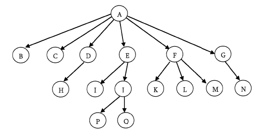

### Representation of generic trees

Since our objective is to reach all nodes of the tree, a posisble to this is as follows:

- At each node link children of same parent from left to right
- Remove the links from parent to all children except the first child

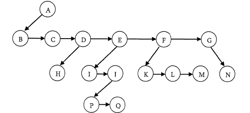

What these above statements say is if we have a link between childrens then we do not need extra links from parent to all children. This is because we can traverse all the elements by starting at the first child of the parent. So if we have link between parent and first child and also links between all children of same parent then it solves our problem. This representaion is sometimes called first child/next sibling representation. First child/next sibling representation of the generic tree is shown above.

```c
struct TreeNode{
    int data;
    struct TreeNode*firstChild;
    struct TreeNode*nextSibling;
}
```

**Note**:- Since we are able to represent any generic tree with binary representation, in practice we use only binary tree.

## Threaded binary tree traversals [Stacks or Queue less traversals]

In earlier sections we have seen that, preorder, inorder and postorder binary tree traversals used stacks and level roder traversal used queues as an auxiliary data structure. In this section we will discuess new traversal algorithms which do not need both stacks and quues and such traversal algorithms are called threaded binary tree traversals or stack/queue less traversals.

### Issues with regular binary tree traversals

- The storage space required for the stack and queue is large
- The majority of pointers in any binary tree are NULL. For example, a binary tree with n nodes has n+1 NULL pointers and these were wasted.
- It is difficult to find succesor node for a given node.

### motivation for threaded binary trees

To solve these problems, one idea is to store some useful information in NULL pointers. If we observe previous traversals carefully, stack/queue is required because we have to record the current position in order to move to right subtree after processing the left subtree. If we store the useful information in NULL pointers, then we don't have to store such information in stack/queue. The binary trees which store such information in NULL pointers are called threaded binary trees. From the above discussion, let us assume that we have decided to store some useful information in NULL pointers. The next question is what to store?

The common convention is put predecessor/successor information. That means, if we are dealing with preorder traversals then for a given node, NULL left pointer will contain preorder predecessor information and NULL right pointer will contain preorder successor information. These special pointers are called threads.

### Classifying Threaded binary trees

The classification is based on whether we are stroing useful information in both NULL pointers or only in one of them.

- If we store predecessor information in NULL left pointers only then we call such binary trees as left threaded binary trees.
- If we store successor information in NULL right pointers only then we call such binary trees as right threaded binary trees.
- If we store predecessor information in NULL left pointers only then we call such binary trees as fully threaded binary trees or simply threaded binary trees (???)

### Types of Threaded Binary Trees

- Preorder threaded binary trees: NULL left pointer will contain PreOrder predecessor information and NULL right pointer will contain PreOrder successor information
- Inorder threaded binary trees: NULL left pointer will contain InOrder predecessor information and NULL right pointer will contain InOrder successor information
- PostOrder thread binary tree: NULL left pointer will contain PostOrder predecessor information and NULL right pointer will contain PostOrder successor information

### Threaded binary tree structre

Any program examining the tree must be able to differentiate between a regular left/right pointer and a thread. To do this, we use two additional fields into each node giving us, for threaded trees, nodes of the following form:

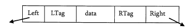

```c
struct ThreadedBinaryTreeNode{
    struct ThreadedBinaryTreeNode*left;
    int LTag;
    int data;
    int RTag;
    struct ThreadedBinaryTreeNode*right;
}
```

### Difference between binary tree and threaded binary tree structure

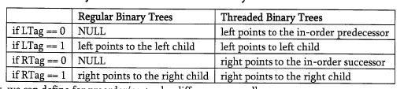

As an example, let us try reprsenting a tree in inorder threaded bnary tree form. That below tree shows how an inorder threaded binary tree will look like. The dotted arrows indicate the threads. If we observe, the left pointer of left most node and right pointer of the right most node are hanging.

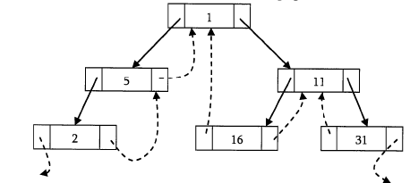

**What should leftmost and rightmost pointers point to?**

In the representation of a threaded binary tree, it is convenient to use a special node Dummy which is always present even for an empty tree. Note that, right tag of dummy node is 1 and its right child points to itself.

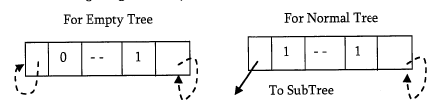

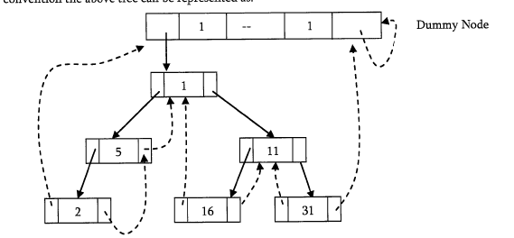

### Finding Inorder successor in InOrder threaded binary tree

To find inorder successor of a given node without using a stack, assume that the node for which we want to find the inorder successor is P.

**Strategy**: If P has a no right subtree, then return the right child of P. If P has right subtree, then return the left of the nearest node whose left subtree contains

```c
struct ThreadedBinaryTreeNode*inorderSuccessor(struct ThreadedBinaryTreeNode*P){
    struct ThreadedBinaryTreeNode*Position;
    if(P->RTag==0) return P->right;
    else{
        Position = P->right;
        while(Position->LTag==1) Position=Position->left;
        return Position;
    }
}
```

Time complexity: O(n)
Space complexity: O(n)

### Inorder traversal in inorder threaded binary tree

we can start with dummy node and call InorderSuccessor() to visit each node until we reach dummy node.

```c
void InorderTraversal(struct ThreadedBinaryTreeNode*root){
    struct ThreadedBinaryTreeNode*P=InorderSuccessor(root);
    while(P!=root){
        P=InorderSuccessor(P);
        printf("%d ",P->data);
    }
}
```

**Other way of coding:**

```c
void InorderTraversal(struct ThreadedBinaryTree*root){
    struct ThreadedBinaryTreeNode*P=root;
    while(1){
        P=InorderSuccessor(P);
        if(P==NULL) return;
        printf("%d ",P->data);
    }
}
```

Time complexity: O(n)
Space complexity: O(1)

### Finding PreOrder successor in InOrder threaded binary tree

**Strategy**: If P has a left subtree, then return the left child of P. If P has no left subtree, then return the right child of the nearest node whose right subtree contains P.

```c
struct ThreadedBinaryTreeNode*preorderSuccessor(struct ThreadedBinaryTreeNode*P){
    struct ThreadedBinaryTreeNode*Position;
    if(P->LTag==1) return P->left;
    else{
        Position=P;
        while(Position->RTag==0) Position=Position->right;
        return Position->right;
    }
}
```

Time complexity: O(n)
Space complexity: O(1)

### PreOrder traversal of InOrder threaded binary tree

As similar to inorder traversal, start with dummy node and call preorderSuccessor() to visit each node until we get dummy node again.

```c
void preorderTraversal(struct ThreadedBinaryTreeNode*root){
    struct ThreadedBinaryTreeNode*p;
    p=preorderSuccessor(root);
    while(p!=root){
        p=preorderSuccessor(p);
        printf("%d ",P->data);
    }
}
```

**Other way of coding:**

```c
void preorderTraversal(struct ThreadedBinaryTreeNode*root){
    struct ThreadedBinaryTreeNode*P=root;
    while(1){
        P=preorderSuccessor(P);
        if(P==root) return;
        printf("%d ",P->data);
    }
}
```

Time complexity: O(n)
Space complexity: O(1)

**Note:** From the above discussion, it should be clear that inorder and preorder successor finding is easy with threaded binary trees. But finding postorder successor is very difficult if we do not use stack.

### Insertion of nodes in InOrder threaded binary trees

For simplicity, let us assume that there are two nodes P and Q and we want to attach Q to right of P. FOr this we will have two cases.

- Node P does not has right child: In this case we just need to attach Q to P and change its left and right pointers. 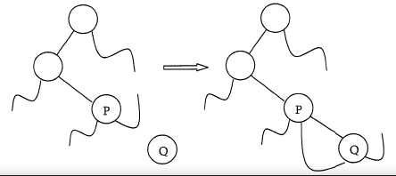
- Node P has right child: In this case we need to traverse R's left subtree and find the left most node and then update the left and right pointer of that node 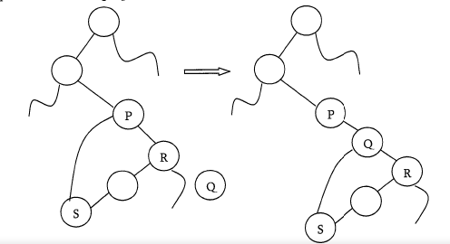

```c
void insertRightInOrderTBT(struct ThreadedBinaryTreeNode*P,struct ThreadedBinaryTreeNode*Q){
    struct ThreadedBinaryTreeNode*temp;
    Q->right=P->right;
    Q->RTag=P->RTag;
    Q->left=P;
    Q->LTag=0;
    P->right=Q;
    P->RTag=1;
    if(Q->RTag==1){
        temp=Q->right;
        while(temp->LTag) temp=temp->left;
        temp->left=Q;
    }
}
```

Time complexity: O(n)
Space complexity: O(1)

## Expression Trees

A tree representing an expression is called as an expression tree. In expression trees leaf nodes are oeprands and non-leaf nodes are opeators. That means, an expression tree is a binary tree where internal nodes are operators and leaves are operands. Expression tree consists of binary expression. But for a unary operator, one subtree will be empty. Below figure shows a simple expression tree for (A+b*c)/d

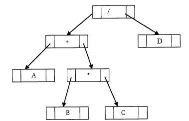

**Algorithm for building expression tree from postfix expression**

```c
struct BinaryTreeNode*buildExprTree(char postfixExpr[],int size){
    struct Stack*S=Stack(size);
    for(int i=0;i<size;i++){
        if(postfixExpr[i] is an operand){
            struct BinaryTreeNode newNode=(struct BinaryTreeNode*)malloc(sizeof(struct BinaryTreeNode));
            if(newNode==NULL) return;
            newNode->data=postFixExpr[i];
            newNode->left=newNode->right=NULL;
            Push(S,newNode);
        }else{
            struct BinaryTreeNode*T2=Pop(S),*T1=Pop(S);
            struct BinaryTreeNode newNode=(struct BinaryTreeNode*)malloc(sizeof(struct BinaryTreeNode));
            if(newNode==NULL) return;
            newNode->data=postFixExpr[i];
            newNode->left=T1;
            newNode->right=T2;
            Push(S,newNode);
        }
    }
    return Pop(S);
}
```

**Example** Assume that oen symbol is read at a time. If the symbol is an operand, we create a tree node and push a pointer to it onto a stack. If the symbol is an operator, pop pointers to two tree T1 and T2 from the stack (T1 is popped first) and form a new tree whose root is the operator and whose left and right children point to T2 and T1 respectively. A pointer to this new tree is then pushed onto the stack.

As an example, assume the input is A B C * + D / . The first tree symbols are operands, so create tree nodes and push pointers to them onto a stack as shown below.

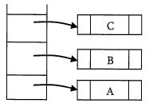

Next, an operator '*' is read, so two pointers to tree are popped, a new node is formed and a pointer to it is pushed onto the stack.

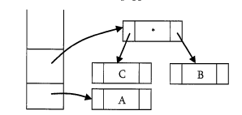

Next, an operator '+' is read, so two pointers to tree are popped, a new tree is formed and a pointer to it is pushed onto the stack.

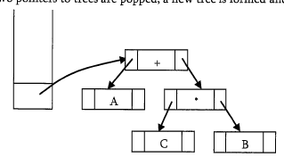

Next, an operand 'D' is read, a one-node tree is created and a pointer to the correspodning tree is pushed onto the stack.

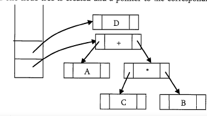

Finally, the last symbol ('/') is read, two trees are merged and a pointer to the final tree is left on the stack

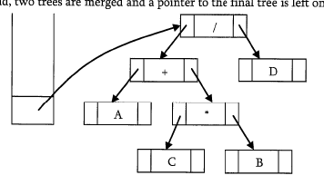

## XOR Trees

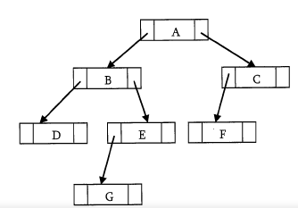

This concept is very much similar to memory efficient doubly linked lists of Linked List chapter. Also, like threaded bniary trees this representation does not need stacks or queues for traverseling the trees. This representation is used for traversing back (to parent) and forth (to child) using XOR operation. To represent the same in XOR tree, for each node below are the rules used for represention:

- Each nodes left will have the XOR of its parent and its left children.
- Each nodes right will have the XOR of its parent and its right children.
- The root nodes parent is NULL and also leaf nodes children are NULL nodes.

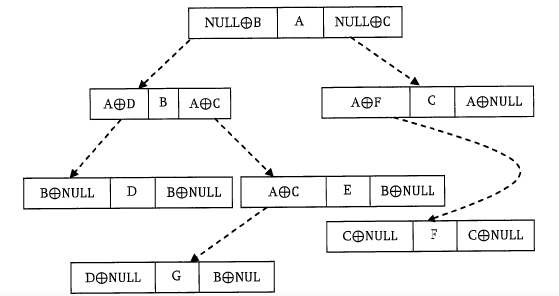

The major objective of this presentation is ability to move to parent as well to children. Now, let us see how to use this representation for traversing the tree. FOr example, if we are at node B and want to move to its parent Node A, then we just need to perform XOR on its left content with its left child address(we can also use right child with right address).

Simmilarly, if we want to move to its child (say, left child D) then we have to perform XOR on its left content with its parent node address. One important point that we need to understand about this representation is: When we are at node B how do we know the address of its children D? Since the traversal starts at node rroot node, we can apply XOR on roots left content with NULL. As a result we get its left child, B. When we are at B, we can apply XOR on its left content with A address.

## Binary Search Trees(BSTs)

### Why Binary Search trees?

In previous sections we have discussed different tree representations and in all of them we did not impose any restriction on the nodes data. As a result, to search for an element we need to check both in left subtree and also right subtree. Due to tihs, the worst case complexity of search operation is O(n).

in this seciton, we will discuess another variant of binary tree. As the name suggests, the main use of this representation is for searching. In this representation we impose restriction on the kind of data a node can contain. As a result, it reduces the worst case avgerage search operation to O(logn).

### Binary Search Tree Property

In binary search trees, all the left subtree elements should be less than root data and all the right subtree elements should be greater tan root data. This is called binary search tree property. Note that, this property should be satisified at every node in the tree.

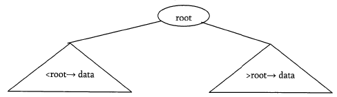

### operations on binary search trees

**Main operations**: The main operation that were supported by binary search trees are:

- Find/Find minimum/Find maximum element in binary search trees
- Inserting an element in binary search trees
- Deleting an element from binary search trees

**Auxiliary operations**: Checking whether the given tree is a binary search tree or not

- Finding kth smallest element in the tree
- Sorting the element of binary search tree and many more

### Important notes on binary search trees

- Since root data is always in between left subtree data and right subtree data, performing inorder traversal on binary search tree produces a sorted list.
- While solving problems on binary search trees, most of the time, first we process left subtree, process root data and then process right subtree. That means, depending on the problem only the intermediate step changes and we will not touch first and steps.
- If we are searching for an element and if the left subtree roots data is left than the element we want to search then skip it. Same is the case with right subtree as well. Because of this binary search trees takes less time for search an element than regular binary trees. In order words, the binary search trees consider only either left or right subtree for searching an element but not both.

### Finding an element in binary search trees

Find operation is straightforward in a BST. Start with the root and keep moving left or right using the BST property. If the data we are searching is same as nodes data then we return current node. If the data we are searching is less than nodes data then search left subtree of current node otherwise search in right subtree of current node. If the data is not present, we end up in a NULL link.

```c
struct BinarySearchTreeNode*find(struct BinarySearchTreeNode*root,int data){
    if(root==NULL) return NULL;
    if(data<root->data) return find(root->left,data);
    else if(data>data->data) return find(root->right,data);
    return root;
}
```

Time complexity: O(n) in worst case
Space complexity: O(n)

*Non recursive* version of the above algorithm can be given as:

```c
struct BinarySearchTreeNode*find(struct BinarySearchTreeNode*root,int data){
    if(root==NULL) return NULL;
    while(root){
        if(data==root->data) return root;
        else if(data>root->data) root=root->right;
        else root=root->left;
    }
    return NULL;
}
```

### Finding minimum element in binary search tree

in BSTs, the minimum element is the left most node which does not has left child. In the below BST, the minimum element is 4.

```c
struct BinarySearchTreeNode*findMin(struct BinarySearchTreeNode*root){
    if(root==NULL) return NULL;
    if(root->left==NULL) return root;
    return findMin(root->left);
}
```

Non recursive version of the above algorithm can be given as:

```c
struct BinarySearchTreeNode*findMin(struct BinarySearchTreeNode*root){
    if(root==NULL) return NULL;
    while(root->left!=NULL) root=root->left;
    return root;
}
```

### Finding maximum element in binary search tree

Replace left to right, same as minimum elemnet

### where is Inorder predecessor and successor?

Where is the inorder predecessor and successor of a node X in a binary search tree assuming all keys are distinct?

If X has two children then its inorder predecessor is the maximum value in its left subtree and its inorder successor the minimum value in its right subtree.

If it does not have a left child a nodes inorder predecessor is its first left ancestor.

### Inserting an element from binary search tree

To insert data into binary search tree, first we need to find the location for the element. We can find the location of insertion by following the same mechanism as that of find operation. While finding the location if the data is already there then we can simply neglect and come out. Otherwise, insert data at the last location on the path traversed. As an example let us consider the following tree. The dooted node indicates the element (5) to be inserted. To insert 5, traverse the tree as using find function. At node with key 4, we need to go right, but there is no subtree, so 5 is not in the tree, and this is the correct location for insertion.

```c
struct BinarySearchTreeNode*insert(struct BinarySearchTreeNode*root,int data){
    if(root==NULL){
        root=(struct BinarySearchTreeNode*)malloc(sizeof(struct BinarySearchTreeNode));
        if(root==NULL) return;
        root->data=data;
        root->left=root->right=NULL;
    }else{
        if(data<root->data) root->left=insert(root->left,data);
        else if(data>root->data) root->right=insert(root->right,data);
    }
    return root;
}
```

In the above code, after inserting an element in subtrees the tree is returned to its parent. As a result, the complete tree will get updated.

### Deleting an element from binary search tree

The delete operation is little complicated than other operations. This is because the element to be deleted may not be the leaf node. In this operation also, first we need to find the location of the element which we want to delete. once we have found the node to be deleted, consider the following cases:

- If the element to be deleted is a leaf node: return NULL to its parent. That means make the correspodning child pointer NULL. In the below tree to delete 5, set NULL to its parent node 2. 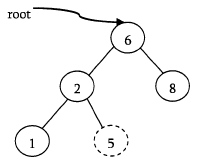
- If the element to be deleted has one child: In this case we just need to send the current nodes child to its parent. In the below tree, to delete 4,4 left subtree is set to its pointer node 2. 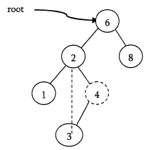
- If the element to be deleted has both children: The general strategy is to replace the ky of this node with the largest element of the left subtree and recursively delete that node. The largest node in the left subtree cannot have a right child, the second delete is an easy one. As an example, let us consider the following tree. In the below tree, to delete 8, it is the right child or root. The key value is 8. It is replaced with the largest key in its left subtree (7), and then that node is deleted as before (second case). 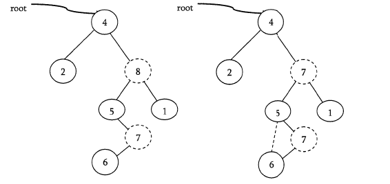

```c
struct BinarySearchTreeNode*delete(struct BinarySearchTreeNode*root,int data){
    struct BinarySearchTreeNode*temp;
    if(root==NULL) return;
    if(data<root->element) root->left=delete(root->left,data);
    else if(data>root->element) root->right=delete(root->left,data);
    else{
        if(root->left && root->right){
            temp=FindMax(root->left);
            root->data=temp->element;
            root->left=delete(root->left,root->right);
        }else{
            temp=root;
            if(root->left==NULL) root=root->right;
            if(root->right==NULL) root=root->left;
            free(temp);
        }
    }
    return root;
}
```

## Balanced Binary Search Trees

In earlier sections we have seen different trees whose worst case compelxity is O(N), where n is the number of nodes in the tree. This happens when the trees are skew trees. In this section we will try to reduce this worst case complexity to O(logn) by imposing restrictions on the heights. In general, the height balanced trees are represented with HB(k) where k is the different between left subtree height and right subtree height. Sometimes k is called balance factor.

### Complete Balanced Binary Search Trees

In HB(k), if k=0, then we call such binary search trees as full balanced binary search trees. That means, in HB(0) binary search tree, the difference between left subtree height and right subtree height should be at most zero. This ensures that the tree is a full binary tree.

## AVL (Adelson-Velskii and Landis) Trees

In HB(k), if k=1 (if balance factor is one), such binary search tree is caleld an AVL tree. That means an AVl tree is a binary search tree with a balance condition: the difference between left subtree height and right subtree height is at most 1.

### Properties of AVL Trees

A binary tree is said to be an AVL tree, if:

- It is a binary search tree, and
- For an node X, the height of left subtree of X and height of right subtree of X differ by at most 1.

### Min/Max number of nodes in AVL trees