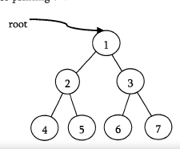
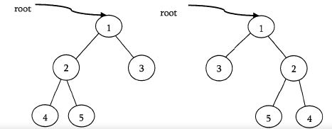
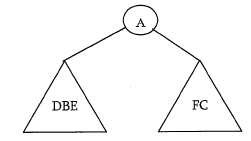
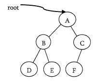
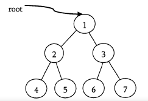
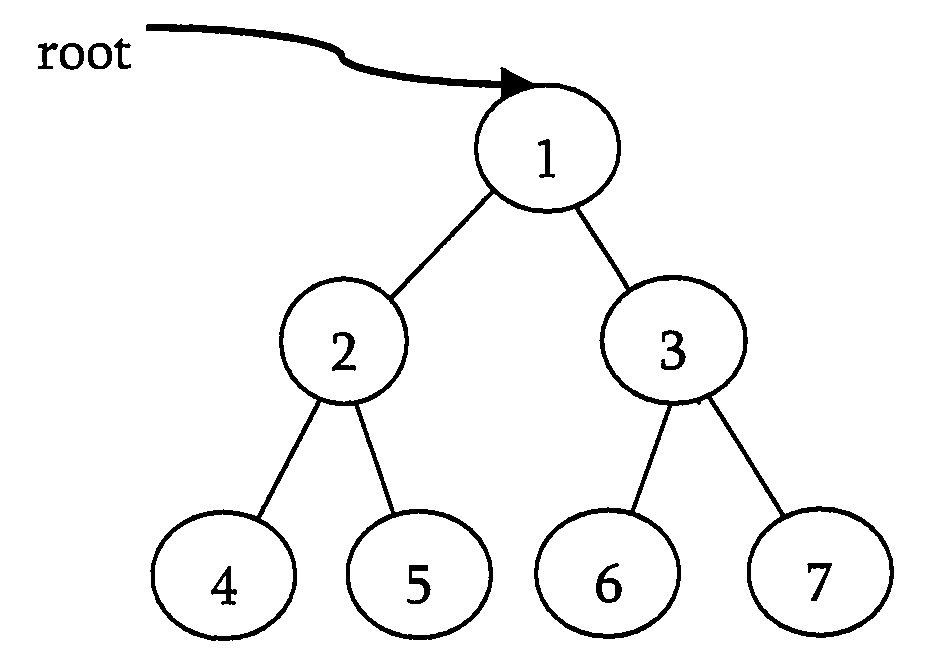
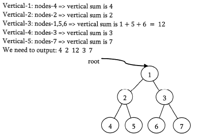
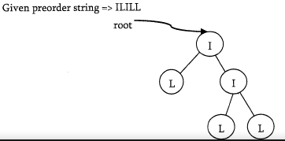
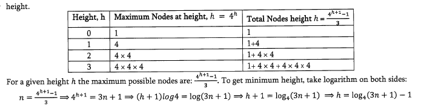
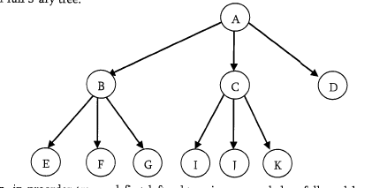

# Problems on Binary Trees

### Q1. Give an algorithm for finding maximum element in binary tree.

One simple way of solving this problem is: find the maximum elemenet in left subtree, find maximum element in right subtree, compare them with root data and select the one which is giving the maximum value.

```c
int FindMax(struct BinaryTreeNode*root){
    int root_val,left,right,max=INT_MIN;
    if(root!=NULL){
        root_val=root->data;
        left=FindMax(root->left);
        right = FindMax(root->right);
        max=max(left,right);
        max=max(max,root_val);
    }
    return max;
}
```
Time complexity: O(n)
Space complexity: O(n)

### Q2. Give an algorithm for finding maximum element in binary tree without recusion

```c
int FindMaxUsingLeveOrder(struct BinaryTreeNode*root){
    struct BinaryTreeNode*temp;
    int max=INT_MIN;
    struct Queue*Q=CreateQueue();
    EnQueue(Q,root);
    while(!isEmptyQueue(S)){
        temp=DeQueue(S);
        max=max(max,temp->data);
        if(temp->left) EnQueue(S,temp->left);
        if(temp->right) EnQueue(S,temp->right);
    }
    DeleteQueue(S);
    return max;
}
```

Time complexity: O(n)
Space complexity: O(n)

### Q3. Give an algorithm for searching an element in binary tree.

```c
int Find(struct BinaryTreeNode*root,int data){
    if(root==NULL) return 0;
    if(data==root->data) return 1;
    return (Find(root->left,data) || Find(root->right,data));
}
```

### Q4. Give an algorithm for searching an element in binary tree withotu recursion

```c
int FindMaxUsingLeveOrder(struct BinaryTreeNode*root){
    struct BinaryTreeNode*temp;
    struct Queue*Q=CreateQueue();
    EnQueue(Q,root);
    while(!isEmptyQueue(S)){
        temp=DeQueue(S);
        if(data=temp->data) return 1;
        if(temp->left) EnQueue(S,temp->left);
        if(temp->right) EnQueue(S,temp->right);
    }
    DeleteQueue(S);
    return 0;
}
```

Time complexity: O(n)
Space complexity: O(n)

### Q5. Give an algorithm for inserting an element in binary tree

```c
void insert(struct BinaryTreeNode*root,int data){
    struct BinaryTreeNode*newNode;
    newNode=(struct BinaryTreeNode*) malloc(sizeof(struct BinaryTreeNode));
    newNode->left=newNode->right=NULL;
    if(!newNode) return;
    if(!root){
        root=newNode;
        return;
    }
    BinaryTreeNode*temp;
    struct Queue*Q=CreateQueue();
    while(!isEmptyQueue(Q)){
        temp=DeQueue(Q);
        if(temp->left) EnQueue(Q,temp->left);
        else{
            temp->left=newNode;
            DeleteQueue(Q);
            return;
        }
        if(temp->right) EnQueue(Q,temp->right);
        else{
            temp->right=newNode;
            DeleteQueue(Q);
            return;
        }
    }
    DeleteQueue(Q);
}
```

Time complexity: O(n)
Space complexity: O(n)

### Q6. Give an algorithm for finding the size of binary tree.

```c
int sizeOfBinaryTree(struct BinaryTreenode*root){
    if(root==NULL) return 0;
    return (SizeOfBinaryTree(root->left) +1 +SizeOfBinaryTree(root->right));
}
```

### Q8. Give an algorithm for printing the level order data in reverse order. For example, the output for the below tree should be: 4 5 6 7 2 3 1



```c
void printInReverse(struct BinaryTreeNode*root){
    struct Queue*Q;
    struct Stack*s=CreateStack();
    struct BinaryTreeNode*temp;
    if(!root) return;
    Q=CreateQueue();
    EnQueue(Q,root);
    while(!isEmptyQueue(Q)){
        temp=DeQueue(Q);
        if(temp->right) EnQueue(Q,temp->right);
        if(temp->left) EnQueue(Q,temp->left);
        Push(S,temp);
    }
    while(!isEmptyStack(s)) printf("%d",Pop(s)->data);
}
```

Time complexity: O(n)
Space complexity: O(n)

### Q9. Give an algorithm for deleting the tree.

Recursively delete the tree

### Q10. Give an algorithm for finding the height of the binary tree

```c
int HeightOfBinaryTree(struct BinaryTree*root){
    if(root==NULL) return 0;
    return max(HeightOfBinaryTree(root->left),HeightOfBinaryTree(root->right)) +1;
}
```

### Q11. Sol the above without cursion

```c
int FindHeightOfBinaryTree(struct BinaryTreeNode*root){
    int level=1;
    struct Queue*Q;
    if(!root) return 0;
    Q=CreateQueue();
    EnQueue(Q,root);
    EnQueue(Q,NULL);
    while(!isEmptyQueue(Q)){
        root=DeQueue(Q)
        if(root==NULL){
            if(!isEmptyQueue(Q)) EnQueue(Q,NULL);
            level++;
        }else{
            if(root->left) EnQueue(Q,root->left);
            if(root->right) EnQueue(Q,root->right);
        }
    }
    return level;
}
```

**I have doubt in this**

### Q12. Give an algorithm for finding the deepest node of the binary tree

```c
struct BinaryTreeNode*DeepestNodeInBinaryTree(struct BinaryTreeNode*root){
    struct BinaryTreeNode*temp;
    struct Queue*Q;
    if(!root) return NULL;
    Q=CreateQueue();
    EnQueue(Q,root);
    while(!isEmptyQueue(Q)){
        temp=DeQueue(Q);
        if(temp->left) EnQueue(Q,temp->left);
        if(temp->right) EnQueue(Q,temp->right);
    }
    DeleteQueue(Q);
    return temp;
}
```

### Q13. GIve an algorithm for deleting an element from binary tree.

```c
struct BinaryTreeNode*delete(struct BinaryTreeNode*root,int data){
    if(root==NULL) return;
    if(root->left){
        if(root->left->data==data){
            root->left=NULL; // i dont know how free() works yet
            return;
        }else delete(root->left,data);
    }
    if(root->right){
        if(root->right->data==data){
            root->right=NULL;
        }
        else delete(root->right,data);
    }
}
```

### Q14. Give an algorithm for finding the number of leaves in binary tree without using recursion

Use level traversal

### Q15. Give an algorithm for finding the number of full nodes in the bniary tree without using recursion

Use level traversal while checking `if(root->left)` and `if(root->right)`

### Q16. Give an algorithm for finding the number of half nodes in the binary tree.

Again use level traversal to check

### Q17. Given two binary trees, return true if they are structurally identical

- If both trees are NULL then return true
- If both tree are not NULL, then compare data and recursively check left and right subtree strucutres.

```c
int isSame(struct BinaryTreeNode*root1,struct BinaryTreeNode*root2){
    if(root1==NULL && root2==NULL) return 1;
    if(root1==NULL || root2==NULL) return 0;
    return(root1->data == root2->data && isSame(root1->left,root2->left) && isSame(root1->right,root2->right));
}
```

### Q18. Give an algorithm for finding the diameter of the binary tree. THe diameter of a tree is the number of nodes on the longest path between two elaves in the tree.

To find the diameter of a tree, first calculate the diameter of tree subtree and right subtree recursively. Among these two values, we need to send maximum along with current leve.

```c
int diameter(struct BinaryTreeNode*root,int *ptr){
    int left,right;
    if(root==NULL) return 0;
    left=diameter(root->left,ptr);
    right=diameter(root->right,ptr);
    if(left+right>*ptr) *ptr=left+right;
    return max(left,right)+1;
    // What is *ptr there for?
}
```

### Q19. Give an algorithm for finding the level which is having maximum sum in the binary tree

The logic is very much similar to finding number of levels. The only change is, we need to keep tracks of sums as well.

### Q20. Given a binary tree, print out all of its root-to-leaf paths.

```c
void PrintPathRecur(struct BinaryTreeNode*root,int path[],int pathLen){
    if(root==NULL) return;
    path[pathLen]=root->data;
    pathLen++;
    if(root->left==NULL && root->right==NULL){
        PrintArray(path,pathLen);
    }else{
        PrintPathRecur(root->left,path,pathLen);
        PrintPathRecur(root->right,path,pathLen);
    }
}

void PrintArray(int ints[],int len){
    for(int i=0;i<len;i++){
        printf("%d ",ints[i]);
    }
}
```

### Q21. Given an algorithm for checking the existence of path with given sum. That means, given a sum check whether there exists path from root to any of the nodes.

```c
int hasSum(struct BinaryTreeNode*root,int targetSum){
    if(root==NULL) return 0;
    targetSum-=root->data;
    if(targetSum==0) return 1;
    if(targetSum<0) return 0;
    return (hasSum(root->left,targetSum) || hasSum(root->right,targetSum));
}
```

### Q22. Give an algorithm for finding the sum of all elements in binary tree.

Recursively

### Q23. Do Q22 without recursion

Do level order traversal

### Q24. Give an algorithm for converting a tree to its mirrior. Mirror of a tree is another tree with left and right children of all non-leaf nodes interchanged



```c
void mirrorTree(struct BinaryTreeNode*root){
    if(root==NULL) return;
    struct BinaryTreeNode*temp=root->left;
    root->left = root->right;
    root->right = temp;
    mirrorTree(root->left);
    mirrorTree(root->right);
}
```

### Q25. Given two trees, give an algorithm for checking whether they are mirrors of each other.

```c
int mirrorCheck(struct BinaryTreeNode*root1,struct BinaryTreeNode*root2){
    if(root1==NULL && root2==NULL) return 1;
    if(root1==NULL || root2==NULL) return 0;
    return ((root1->data == root2->data) && mirrorCheck(root1->left,root2->right) && mirroCheck(root1->right,root2->left));
}
```

### Q26. Give an algorithm for finding LCA(Least common ancestor) of two nodes in a binary tree.

```c
struct BinaryTreeNode*LCA(struct BinaryTreeNode*root,struct BinaryTreeNode*a,struct BinaryTreeNode*b){
    struct BinaryTreeNode*left,*right;
    if(root == NULL) return root;
    if(root == a || root == b) return root;
    left=LCA(root->left,a,b);
    right=LCA(root->right,a,b);
    if(left && right) return root;
    else return (left?left:right);
}
```

#### Dont understand this one yet

### Q27. Give an algorithm for constructing binary tree from given Inorder and Preorde traverals.

Inorder sequence: D B E A F C
Preorder sequence: A B D E C F

In a preorder seq, leftmost element denotes the root of the tree. So we know 'A' is root for given seqs. by searching 'A' in inorder seq we can find out all on left side of 'A' which come under left subtree and element right of 'A' which come under right subtree. So we get the below struct



We recursively follow above steps and get the following tree.



Algorithm: BuildTree()

- Select an element from preorder. increasement a preorder index variable to pick next element in next recursive call.
- Create a new tree node with the data as selected element
- Find the selected elemnts index ini inorder. Let the index be inindex
- call buildbinarytree for elements before inindex and make the built tree as left subtree of newNode
- same as above but for right subtree
- return newNode

```c
struct BinaryTreeNode*BuildBinaryTree(int inOrder[],int preOrder[],int Start,int End){
    static int preIndex=0;
    struct BinaryTreeNode*newNode;
    if(Start>End) return NULL;
    newNode=(struct BinaryTreeNode*)malloc(sizeof(struct BinaryTreeNode));
    if(newNode==NULL) return;
    newNode->data=preOrder[preIndex]; // Get current node from preorder
    preIndex++;
    if(Start==End) return newNode; // if this node has no children then return
    int inIndex=Search(inOrder,Start,End,newNode->data); // else find the index of thsi node in Inorder
    newNode->left=BuildBinaryTree(inOrder,preOrder,Start,End-1);
    newNode->right=BuildBinaryTree(inOrder,preOrder,Start+1,End);
    return newNode;
}
```

#### Don't understand yet.

### Q28. If we are given two traversal seqs, can we construct the binary tree uniquely?

It depends on what traversals are given. If one of the traversal methods is Inorder then the tree can be constructed uniquely, otherwise not.

### Q29. Give an algorithm for printing all the ancestors of a node in a binary tree. for the below tree, for 7 the ancestors are 1 3 7



```c
int printAllAncestors(struct BinaryTreeNode*root,struct BinaryTreeNode*node){
    if(root==NULL) return 0;
    if(root->left==node || root->right == node || printAllAncestors(root->left,node) || printAllAncestors(root->right,node)){
        printf("%d ",root->data);
        return 1;
    }
    return 0;
}
```

### Q30. Zigzag tree traversal: Give an algorithm to traverse a binary tree in zigzag order. For example, the output for the below tree shoudl be : 1 3 2 4 5 6 7



This problem can be solved easily using two stacks. Assume the two stacks are: currentLevel and nextLevel. We should also need a variable to keep track of the current level order.

We pop from currentLevel stack and print the nodes value. Whenever the current level order is from left to right, push the nodes left child, then its right child to stack nextLevel. Since a stack is a Last In First OUT sturcture, next time when nodes are popped off nextLevel, it will be in reverse order. On the other hand, when the current level order is from right to left, we would push the nodes right child first, then its left child. Finally, dont forgot to swap those two stacks at the end of each level.

```c
void ZigZagTraversal(struct BinaryTreeNode*root){
    struct BinaryTreeNode*temp;
    int leftToRight=1;
    if(root==NULL) return;
    struct Stack*currentLevel=CreateStack(),*nextLevel=CreateStack();
    Push(currentLevel,root);
    while(!isEmptyStack(currentLevel)){
        temp = Pop(currentLevel);
        if(leftToRight){
            if(temp->left) Push(nextLevel,temp->left);
            if(temp->right) Push(nextLevel,temp->right);
        }else{
            if(temp->right) Push(nextLevel,temp->right);
            if(temp->left) Push(nextLevel,temp->right);
        }
        if(isEmptyStack(currentLevel)){
            leftToRight=1-leftToRight;
            swap(currentLevel,nextLevel);
        }
    }
}
```

### Q31. Give an algorithm for finding the vertical sum of a binary tree. For example, The tree has 5 vertical lines



We can do an inorder traversal and hash the column. We can VerticalSumInBinaryTree(root,0) which means the root is at column 0. While doing the traversal, hash the column and increase its value by root->data.

```c
void VerticalSumInBinaryTree(struct BinaryTreeNode*root,int column){
    if(root==NULL) return;
    VerticalSumInBinaryTree(root->left,column-1);
    Hash[column]+=root->data;
    VerticalSumInBinaryTree(root->right,column+1);
}
```

### Q32. How many different binary trees are possible with n nodes?

For example, consider a tree with 3 nodes, it will have maximum combination of 5 different trees.

In general, if there are n nodes, there exists `2^n - n` different trees.

### Q33. Given a tree with a special property where leaves are represented with 'L' and internal node with 'T'. Also, assume that each node has either 0 or 2 children. Given preorder traversal of this construct the tree



First, we should see how preorder traversal is arranged. Pre-order traversal means first put root node, then pre-order traversal of left subtree and then pre-order traversal of right subtree. In normal scenario, it's not possible to dectect where left subtree ends and right subtree starts using only preorder. Since every node has either 2 children or no child, we can surely say that if a node exists then its sibling also exists. So every time we are computing a subtree, we need to compute its sibling subtree as well.

Secondly, whenever we get 'L' in the input string, that is a leaf and we can stop for a particular subtree at that point. After this 'L' in the input string, that is a leaf and we can stop for a particular subtree at that point. After this 'L' node, its sibling starts. If 'L' node is right child of its parent, then we need to go up in the hierachy to find next subtree to compute. Keeping above invariant in mind, we can easily determine when a subtree ends and next start. It means that we can give any start node to our method and it can easily compelte the subtree it generates going outside of its nodes. We just need to take care of passing correct start nodes to different sub-trees.

```c
struct BinaryTreeNode*BuildTreeFromPreOrder(char*A,int*i){
    struct BinaryTreeNode*newNode=(struct BinaryTreeNode*)malloc(sizeof(struct BinaryTreeNode));
    newNode->data=A[*i];
    newNode->left=newNode->right=NULL;
    if(A==NULL){
        free(newNode);
        return NULL;
    }
    if(A[*i]=='L') return newNode;
    *i=*i=1;
    newNode->left=BuildTreeFromPreOrder(A,i);
    *i=*i+1;
    newNode->right=BuildTreeFromPreOrder(A,i);
    return newNode;
}
```

#### Make this yourself.

### Q34. Given a binary tree with three pointers (left,right & nextSibling), give an algorithm for filling the nextSibling pointers assuming theny are NULL initially

```c
struct BinaryTreeNode{
    struct BinaryTreeNode*left;
    struct BinaryTreeNode*right;
    struct BinaryTreeNode*nextSibling;
}

int fillNextSiblings(struct BinaryTreeNode*root){
    struct BinaryTreeNode*temp;
    struct Queue*Q;
    if(root==NULL) return 0;
    Q=CreateQueue();
    EnQueue(Q,root);
    EnQueue(Q,NULL);
    while(!isEmptyQueue(Q)){
        temp=DeQueue(Q)
        if(temp==NULL){
            if(!isEmptyQueue(Q)) EnQueue(Q,NULL);
        }else{
            temp->nextSibling=QueueFront(Q);
            if(root->left) EnQueue(Q,temp->left);
            if(root->right) EnQueue(Q,temp->right);
        }
    }
}
```

#### Need to understand.

### Q35. Do Q34 with some other way.

The trick is to re-use the populated nextSibling pointers. As mentioned earlier, we just need one more step for it to work. Before we passed the left and right to the recursion function itself, we connect the rigth childs nextSibling to the current nodes nextSibling left child. In order for this to work, the current node nextSibing pointer must be populated, which is true in this case.

```c
void fillNextSiblings(struct BinaryTreeNode*root){
    if(root==NULL) return;
    if(root->left) root->left->nextSibling=root->right;
    if(root->right) root->right->nextSibling = (root->nextSibling) ? root->nextSibling->left : NULL;
    fillNextSiblings(root->left);
    fillnextSiblings(root->right);
}
```

### Q36. Given a tree, give an algorithm for finding the sum of all the elements of the tree.

The solution is similar to what we have done for simple binary trees. That means, traverse the complete list and keep on adding the values. We can either use level order traversal or simple recursion.

```c
int findSum(struct TreeNode*root){
    if(root==NULL) return 0;
    return root->data + findSum(root->firstChild) + findSum(root->sibling);
}
```

### Q37. For a 4-ary tree (each node can contain maximum of 4 children), what is the maximum possible height with 100 nodes? Assume height of a single node is 0.

In 4-ary tree each node can contain 0 to 4 children and to get maximum height, we need to keep only one child for each parent. With 100 nodes the maximum possible height we can get is 99. If we have a restriction that at least one node is having 4 children, then we keep one node with 4 children and remaining all nodes with 1 child.

### Q38. For a 4-ary tree, what is the minimum possible height with n nodes?

Siimilar to above discussion, if we want to get minimum height, then we need to fill all nodes with maximum children. Now let's see the following table, which indicates the maximum number of nodes for a given heigt



### Q39. Given a parent array P, where P[i] indicates the parents of ith node in the tree. GIve an algorithm for finding the height or depth of the tree.

### Q40. Given a node in the genric tree, give an algorithm for counting the number of siblings for that node.

```c
int siblingCount(struct TreeNode*current){
    int count=0;
    while(current){
        count++;
        current=current->nextSibling;
    }
    return current;
}
```

### Q41. Given a node in the generic tree, give an algorithm for counting the number of children for that node.

```c
int childCount(struct TreeNode*current){
    int count=0;
    current=current->firstChild;
    while(current){
        count++;
        current=current->nextSibling;
    }
    return count;
}
```

### Q42. Given two trees how do we check whether the trees are isomorphic to each other or not?

Two binary trees root1 and root2 are isomorphic if they have the same sturcutre. THe value of the nodes does not affect two trees are isomorphic or not.

```c
int isomorphic(BinaryTreeNode*root1,BinaryTreeNode*root2){
    if(root1==NULL && root2==NULL) return 1;
    if(root!==NULL || root2==NULL) return 0;
    return (isomorphic(root1->left,root2->left) && isomorphic(root1->right,root2->right));
}
```

### Q43. Given two trees how do we check whether they are quassi-isomorphic to each other or not?

Two trees root1 and root2 are quassi-isomorphic if root1 can be transformed into root2 by swapping left and right child of some of the nodes of root1. The data in the nodes are not important in determining quassi-isomorphism, only the shape is important. 

```c
int quassiIso(struct BinaryTreeNode*root1,struct BinaryTreeNode*root2){
    if(root1==NULL && root2==NULL) return 1;
    if(root1==NULL || root2==NULL) return 0;
    return (
        (quassiIso(root1->left,root2->left) && quassiIso(root1->right,root2->right)) ||
        (quassiIso(root1->left,root2->right) && quassiIso(root1->right,root2->left))
    )
}
```

### Q44. A full k-ary tree is a tree where each node has either 0 or k children. Given an array which contains the preorder traversal of full k-ary tree, give an algorithm for constructing the full k-ary tree.

In k-ary tree, for a node at ith position its chilren will be at k*i+1 to k\*i+1. For example, the below is an example for full 3-ary tree



